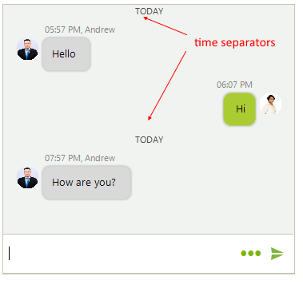
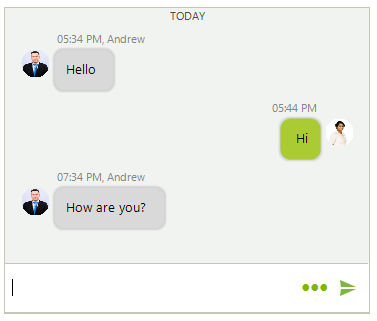
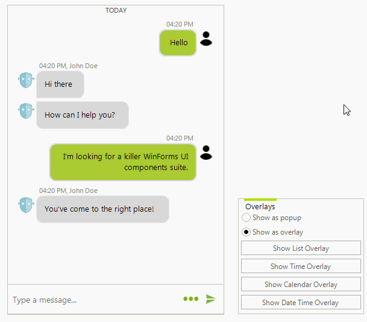
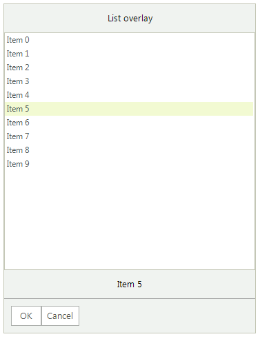
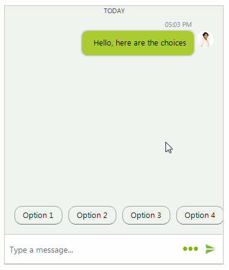

# Messages

**ChatMessage** is the basic message unit in **RadChat**. It contains information about the author and time of message. Depending on the specific information that a message stores, the available message types are listed below. 

By default, when you type in the text box and confirm the message, it is automatically added to **RadChat**. This behavior can be controlled by the **AutoAddUserMessages** property. In addition, the **SendMessage** is fired each time a new message is about to be added to the chat UI. It is allowed to modify the message itself. 

>tip Since **R3 2018** it is exposed a **UserData** property in all message types. Thus, along with all other parameters when adding a message, you can pass some useful data that can store any information.

## ChatTimeSeparatorMessage

A **ChatTimeSeparatorMessage** visually separates the messages according to a certain period of time. The **TimeSeparatorInterval** property specifies this interval. **RadChat** will automatically add the time separators when the interval between the messages exceeds the specified **TimeSeparatorInterval**.

>caption Figure 1: ChatTimeSeparatorMessage

 

#### Setting TimeSeparatorInterval

{{source=..\SamplesCS\Chat\ChatMessages.cs region=TimeSeparatorInterval}} 
{{source=..\SamplesVB\Chat\ChatMessages.vb region=TimeSeparatorInterval}}

````C#
            
this.radChat1.ChatElement.MessagesViewElement.TimeSeparatorInterval = TimeSpan.FromHours(1);

````
````VB.NET
Me.radChat1.ChatElement.MessagesViewElement.TimeSeparatorInterval = TimeSpan.FromHours(1)

```` 


{{endregion}}

When a new message is added, the **TimeSeparatorAdding** event is fired. It gives you the opportunity to control whether to add a time separator or not no matter the already specified **TimeSeparatorInterval**. The following example adds a time separator if the interval between messages is more than 20 seconds:

#### Handling TimeSeparatorAdding

{{source=..\SamplesCS\Chat\ChatMessages.cs region=TimeSeparatorAdding}} 
{{source=..\SamplesVB\Chat\ChatMessages.vb region=TimeSeparatorAdding}}

````C#
        
private void radChat1_TimeSeparatorAdding(object sender, TimeSeparatorEventArgs e)
{
    if (e.Item != null && e.PreviousItem != null)
    {
        e.ShouldAddSeparator = e.Item.Message.TimeStamp - e.PreviousItem.Message.TimeStamp > new TimeSpan(0, 0, 20);
    }
}

````
````VB.NET
Private Sub radChat1_TimeSeparatorAdding(ByVal sender As Object, ByVal e As TimeSeparatorEventArgs)
    If e.Item IsNot Nothing AndAlso e.PreviousItem IsNot Nothing Then
        e.ShouldAddSeparator = e.Item.Message.TimeStamp - e.PreviousItem.Message.TimeStamp > New TimeSpan(0, 0, 20)
    End If
End Sub

```` 


{{endregion}}

>caption Figure 2: ChatTimeSeparatorMessage

 

## ChatTextMessage

A **ChatTextMessage** represents a single text message by a certain author and sent at certain time.

>caption Figure 3: ChatTextMessages

 


#### Adding Text Messages

{{source=..\SamplesCS\Chat\ChatMessages.cs region=AddTextMessage}} 
{{source=..\SamplesVB\Chat\ChatMessages.vb region=AddTextMessage}}

````C#
            
this.radChat1.Author = new Author(Properties.Resources.nancy1, "Nancy");
Author author2 = new Author(Properties.Resources.andrew1,"Andrew");
 
ChatTextMessage message1 = new ChatTextMessage("Hello", author2,DateTime.Now.AddHours(1));
this.radChat1.AddMessage(message1);
            
ChatTextMessage message2 = new ChatTextMessage("Hi", this.radChat1.Author,DateTime.Now.AddHours(1).AddMinutes(10));
this.radChat1.AddMessage(message2);
            
ChatTextMessage message3 = new ChatTextMessage("How are you?", author2,DateTime.Now.AddHours(3));
this.radChat1.AddMessage(message3);

````
````VB.NET
Me.radChat1.Author = New Author(My.Resources.nancy1, "Nancy")
Dim author2 As Author = New Author(My.Resources.andrew1, "Andrew")
Dim message1 As ChatTextMessage = New ChatTextMessage("Hello", author2, DateTime.Now.AddHours(1))
Me.radChat1.AddMessage(message1)
Dim message2 As ChatTextMessage = New ChatTextMessage("Hi", Me.radChat1.Author, DateTime.Now.AddHours(1).AddMinutes(10))
Me.radChat1.AddMessage(message2)
Dim message3 As ChatTextMessage = New ChatTextMessage("How are you?", author2, DateTime.Now.AddHours(3))
Me.radChat1.AddMessage(message3)

```` 


{{endregion}}

## ChatMediaMessage

A **ChatMediaMessage** represents an image message by a certain author and sent at certain time.


>caption Figure 4: ChatMediaMessage

 


#### Adding Media Message

{{source=..\SamplesCS\Chat\ChatMessages.cs region=AddMediaMessage}} 
{{source=..\SamplesVB\Chat\ChatMessages.vb region=AddMediaMessage}}

````C#
            
ChatMediaMessage mediaMessage = new ChatMediaMessage(Properties.Resources.TV_car1, new Size(300, 200), null, this.radChat1.Author, DateTime.Now);
this.radChat1.AddMessage(mediaMessage);

````
````VB.NET
Dim mediaMessage As ChatMediaMessage = New ChatMediaMessage(My.Resources.TV_car1, New Size(300, 200), Nothing, Me.radChat1.Author, DateTime.Now)
Me.radChat1.AddMessage(mediaMessage)

```` 


{{endregion}}

## ChatCardMessage

A **ChatCardMessage** stores a message that visualizes a card element, a descendant of **BaseChatCardElement**. In the [Cards]() help article you can find additional information about the different card types and how to add card messages. 

## ChatCarouselMessage

A **ChatCarouselMessage** allows adding and visualizing multiple [card elements](). You can also add different actions to the cards. 

>caption Figure 5: ChatCarouselMessage

 


#### Adding Carousel Message with Cards

{{source=..\SamplesCS\Chat\ChatMessages.cs region=AddCarouselMessage}} 
{{source=..\SamplesVB\Chat\ChatMessages.vb region=AddCarouselMessage}}

````C#
            
Telerik.WinControls.UI.ChatImageCardDataItem imageCard = new ChatImageCardDataItem(Properties.Resources.architect, "Benjamin Vilanders", "Senior Architect",
                                                                                                                                                            "As a Senior Architect his experience in the industry allows him to take on increased responsibility. Like other architects, he design buildings " +
                                                                                                                                                            "and makes sure they are structurally sound. Due to his track record of quality performance, Benjamin also serves as a manager, a mentor, an advisor and coordinator.",
    null , null);
            
ChatProductCardDataItem productCard = new ChatProductCardDataItem(Properties.Resources.TV_car1,"Arrive & Drive","Rating 7/10",
                                                                                                                              "With our Arrive & Drive Packages, the only thing you will have to think about is driving. We make it simple for you to get more of what you love. We streamline the " +
                                                                                                                              "entire process and have everything ready for you when you arrive at the track so you can get straight to racing.", "Packages from $340", null, null); 
            
ChatWeatherCardDataItem weatherCard = new ChatWeatherCardDataItem("Florence", Properties.Resources.sunny , "33°C", "Humidity: 76%", "Dew: 31°C",
    "Pressure: 1031 mb", "Wind Speed: 15 km/h NW");
            
List<FlightInfo> flights = new List<FlightInfo>();
flights.Add(new FlightInfo("Los Angelis", "LAX", DateTime.Now.AddDays(7), "New York", "JFK", DateTime.Now.AddDays(7).AddHours(5.5)));
flights.Add(new FlightInfo("New York", "JFK", DateTime.Now.AddDays(14).AddHours(3), "Los Angelis", "LAX", DateTime.Now.AddDays(14).AddHours(9.1)));
ChatFlightCardDataItem flightCard = new ChatFlightCardDataItem("Andrew Fuller", flights, Properties.Resources.CardPlane, "$341", null);
            
List<BaseChatCardDataItem> cards = new List<BaseChatCardDataItem>();
cards.Add(imageCard);
cards.Add(productCard);
cards.Add(weatherCard);
cards.Add(flightCard);
Author author = new Author(Properties.Resources.architect, "Ben");
            
ChatCarouselMessage carouselMessage = new ChatCarouselMessage(cards, author, DateTime.Now);
this.radChat1.AddMessage(carouselMessage);

````
````VB.NET
Dim imageCard As Telerik.WinControls.UI.ChatImageCardDataItem = New ChatImageCardDataItem(My.Resources.architect, "Benjamin Vilanders", "Senior Architect", "As a Senior Architect his experience in the industry allows him to take on increased responsibility. Like other architects, he design buildings " & "and makes sure they are structurally sound. Due to his track record of quality performance, Benjamin also serves as a manager, a mentor, an advisor and coordinator.", Nothing, Nothing)
Dim productCard As ChatProductCardDataItem = New ChatProductCardDataItem(My.Resources.TV_car1, "Arrive & Drive", "Rating 7/10", "With our Arrive & Drive Packages, the only thing you will have to think about is driving. We make it simple for you to get more of what you love. We streamline the " & "entire process and have everything ready for you when you arrive at the track so you can get straight to racing.", "Packages from $340", Nothing, Nothing)
Dim weatherCard As ChatWeatherCardDataItem = New ChatWeatherCardDataItem("Florence", My.Resources.sunny, "33°C", "Humidity: 76%", "Dew: 31°C", "Pressure: 1031 mb", "Wind Speed: 15 km/h NW")
Dim flights As List(Of FlightInfo) = New List(Of FlightInfo)()
flights.Add(New FlightInfo("Los Angelis", "LAX", DateTime.Now.AddDays(7), "New York", "JFK", DateTime.Now.AddDays(7).AddHours(5.5)))
flights.Add(New FlightInfo("New York", "JFK", DateTime.Now.AddDays(14).AddHours(3), "Los Angelis", "LAX", DateTime.Now.AddDays(14).AddHours(9.1)))
Dim flightCard As ChatFlightCardDataItem = New ChatFlightCardDataItem("Andrew Fuller", flights, My.Resources.CardPlane, "$341", Nothing)
Dim cards As List(Of BaseChatCardDataItem) = New List(Of BaseChatCardDataItem)()
cards.Add(imageCard)
cards.Add(productCard)
cards.Add(weatherCard)
cards.Add(flightCard)
Dim author As Author = New Author(My.Resources.architect, "Ben")
Dim carouselMessage As ChatCarouselMessage = New ChatCarouselMessage(cards, author, DateTime.Now)
Me.radChat1.AddMessage(carouselMessage)

```` 


{{endregion}}

## ChatOverlayMessage

A **ChatOverlayMessage** represents a **ChatMessage** that displays an [overlay element]() either as a popup, or over the messages container. It requires some action by the user, e.g. pick a date or select an item. Once the action is performed, a message is inserted in the chat view.

>caption Figure 6: ChatOverlayMessage

 

#### Adding a ChatListOverlay Message 

{{source=..\SamplesCS\Chat\ChatMessages.cs region=AddOverlayMessage}} 
{{source=..\SamplesVB\Chat\ChatMessages.vb region=AddOverlayMessage}}

````C#
            
ChatListOverlay chatListOverlay = new ChatListOverlay("List overlay");
for (int i = 0; i < 10; i++)
{
    chatListOverlay.ListView.Items.Add("Item " + i);
}
bool showAsPopup = false;
Author author = new Author(Properties.Resources.andrew1, "Andrew");
ChatOverlayMessage overlayMessage = new ChatOverlayMessage(chatListOverlay, showAsPopup, author, DateTime.Now);
this.radChat1.AddMessage(overlayMessage);

````
````VB.NET
Dim chatListOverlay As ChatListOverlay = New ChatListOverlay("List overlay")
For i As Integer = 0 To 10 - 1
    chatListOverlay.ListView.Items.Add("Item " & i)
Next
Dim showAsPopup As Boolean = False
Dim author As Author = New Author(My.Resources.andrew1, "Andrew")
Dim overlayMessage As ChatOverlayMessage = New ChatOverlayMessage(chatListOverlay, showAsPopup, author, DateTime.Now)
Me.radChat1.AddMessage(overlayMessage)

```` 


{{endregion}}

>caption Figure 7: ChatListOverlay

 

The **ChatOverlayMessage** can host any **BaseChatOverlay**: **ChatCalendarOverlay**, **ChatDateTimeOverlay**, **ChatListOverlay**, **ChatTimeOverlay**.

## ChatSuggestedActionsMessage

A **ChatSuggestedActionsMessage** represents a message offering a list of **SuggestedActionDataItem** to the user. Once an action is selected, the **SuggestedActionClicked** event is fired. Then, you can choose how to proceed further, e.g. adding a message with the user's choice.

>caption Figure 8: ChatSuggestedActionsMessage

 

#### Adding a ChatSuggestedActionsMessage Message 

{{source=..\SamplesCS\Chat\ChatMessages.cs region=AddSuggestedActionsMessage}} 
{{source=..\SamplesVB\Chat\ChatMessages.vb region=AddSuggestedActionsMessage}}

````C#
        
private void AddSuggestedActions()
{
    this.radChat1.AddMessage(new ChatTextMessage("Hello, here are the choices", this.radChat1.Author, DateTime.Now)); 
    
    List<SuggestedActionDataItem> actions = new List<SuggestedActionDataItem>();
    for (int i = 0; i < 7; i++)
    {
        actions.Add(new SuggestedActionDataItem("Option " + (i + 1)));
    }
    Author author = new Author(Properties.Resources.andrew1, "Andrew");
    ChatSuggestedActionsMessage suggestionActionsMessage = new ChatSuggestedActionsMessage(actions, author, DateTime.Now);
    this.radChat1.AddMessage(suggestionActionsMessage);
    this.radChat1.SuggestedActionClicked += radChat1_SuggestedActionClicked;
}
        
private void radChat1_SuggestedActionClicked(object sender, SuggestedActionEventArgs e)
{
    this.radChat1.AddMessage(new ChatTextMessage("You have chosen " + e.Action.Text, this.radChat1.Author, DateTime.Now)); 
}

````
````VB.NET
Private Sub AddSuggestedActions()
    Me.radChat1.AddMessage(New ChatTextMessage("Hello, here are the choices", Me.radChat1.Author, DateTime.Now))
    Dim actions As List(Of SuggestedActionDataItem) = New List(Of SuggestedActionDataItem)()
    For i As Integer = 0 To 7 - 1
        actions.Add(New SuggestedActionDataItem("Option " & (i + 1)))
    Next
    Dim author As Author = New Author(My.Resources.andrew1, "Andrew")
    Dim suggestionActionsMessage As ChatSuggestedActionsMessage = New ChatSuggestedActionsMessage(actions, author, DateTime.Now)
    Me.radChat1.AddMessage(suggestionActionsMessage)
    AddHandler  Me.radChat1.SuggestedActionClicked , AddressOf  radChat1_SuggestedActionClicked
End Sub
Private Sub radChat1_SuggestedActionClicked(ByVal sender As Object, ByVal e As SuggestedActionEventArgs)
    Me.radChat1.AddMessage(New ChatTextMessage("You have chosen " & e.Action.Text, Me.radChat1.Author, DateTime.Now))
End Sub

```` 


{{endregion}}

 
# See Also

* [Overlays]()
* [Cards]()
* [Getting Started]()
 
        
