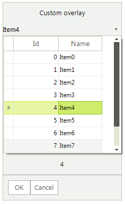

# Custom Overlays

**RadChat** presents a selection of choices to the user via overlays which are displayed until the user selects a certain choice. Depending on the information that is displayed (date, date and time, time, list options), different overlays can be used. It is possible to construct your own overlay hosting the control which is most appropriate for your custom scenario. 

This article demonstrates a sample approach how to host a [RadMultiColumnComboBox]() in a custom overlay item. 

>caption Figure 1: Custom overlay with a RadMultiColumnComboBox

 

To achieve this goal, you need to create a derivative of the **BaseChatItemOverlay** class:

#### Constructing a custom overlay with RadMultiColumnComboBox

{{source=..\SamplesCS\Chat\ChatOverlaysActions.cs region=CustomOverlay}} 
{{source=..\SamplesVB\Chat\ChatOverlaysActions.vb region=CustomOverlay}}

````C#
public class CustomBaseChatItemOverlay : BaseChatItemOverlay
{
    public CustomBaseChatItemOverlay(string title)
        : base(title)
    {
        this.mccb.SelectedValueChanged += mccb_SelectedValueChanged; 
    } 
    public RadMultiColumnComboBox Mccb
    {
        get
        {
            return this.mccb;
        }
    }
    private void mccb_SelectedValueChanged(object sender, EventArgs e)
    {
        if (this.mccb.SelectedItem != null)
        {
            this.CurrentValue = this.mccb.SelectedValue;
        }
    }
    RadMultiColumnComboBox mccb;
    protected override Telerik.WinControls.RadElement CreateMainElement()
    {
        mccb = new RadMultiColumnComboBox();
        return new RadHostItem(this.mccb);
    }
    protected override void DisposeManagedResources()
    {
        this.mccb.SelectedValueChanged -= mccb_SelectedValueChanged;
        base.DisposeManagedResources();
    }
}

````
````VB.NET
Public Class CustomBaseChatItemOverlay
    Inherits BaseChatItemOverlay
    Public Sub New(ByVal title As String)
        MyBase.New(title)
        AddHandler Me.Mccb.SelectedValueChanged, AddressOf mccb_SelectedValueChanged
    End Sub
    Public ReadOnly Property Mccb As RadMultiColumnComboBox
        Get
            Return Me._mccb
        End Get
    End Property
    Private Sub mccb_SelectedValueChanged(ByVal sender As Object, ByVal e As EventArgs)
        If Me.Mccb.SelectedItem IsNot Nothing Then
            Me.CurrentValue = Me.Mccb.SelectedValue
        End If
    End Sub
    Private _mccb As RadMultiColumnComboBox
    Protected Overrides Function CreateMainElement() As Telerik.WinControls.RadElement
        Me._mccb = New RadMultiColumnComboBox()
        Return New RadHostItem(Me._mccb)
    End Function
    Protected Overrides Sub DisposeManagedResources()
        RemoveHandler Me.Mccb.SelectedValueChanged, AddressOf mccb_SelectedValueChanged
        MyBase.DisposeManagedResources()
    End Sub
End Class

```` 


{{endregion}}

Then, you just need to add your overlay to the **Chat UI** when it is necessary to present the user the options from which to choose:

#### Adding a custom overlay to the Chat UI

{{source=..\SamplesCS\Chat\ChatOverlaysActions.cs region=UseOverlay}} 
{{source=..\SamplesVB\Chat\ChatOverlaysActions.vb region=UseOverlay}}

````C#
CustomBaseChatItemOverlay customOverlay = new CustomBaseChatItemOverlay("Custom overlay");
DataTable dt = new DataTable();
dt.Columns.Add("Id", typeof(int));
dt.Columns.Add("Name", typeof(string));
for (int i = 0; i < 10; i++)
{
    dt.Rows.Add(i, "Item" + i);
}
customOverlay.Mccb.DisplayMember = "Name";
customOverlay.Mccb.ValueMember = "Id";
customOverlay.Mccb.DataSource = dt;
bool showAsPopup = false;
Author author = new Author(Properties.Resources.andrew1, "Andrew");
this.radChat1.Author = author;
ChatOverlayMessage overlayMessage = new ChatOverlayMessage(customOverlay, showAsPopup, author, DateTime.Now);
this.radChat1.AddMessage(overlayMessage);

````
````VB.NET
```` 


{{endregion}}


# See Also

* [Overview]()
* [Overlays]()
* [ChatElementFactory]()

 
        
