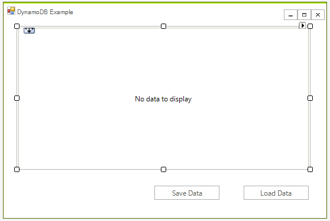
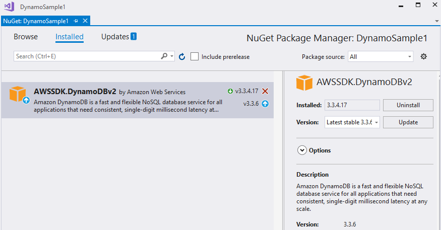
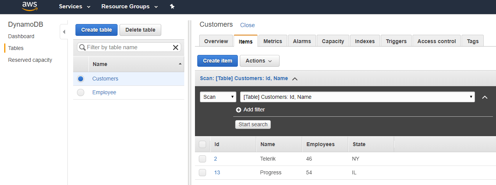
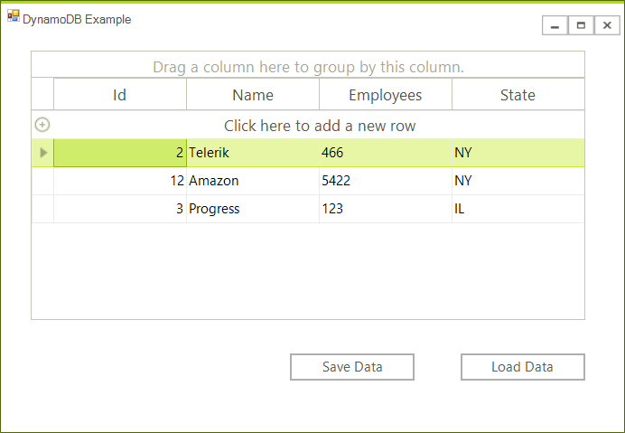

# Dynamo DB

This article will show you how to create a WinForms application and access data stored in a DynamoDB table. It shows how you can connect to the **AWS DynamoDB** service from a blank WinForms project as well. 

Please note that you can use the local version of DynamoDB to setup and test your application. This article shows a real example.  


## Step 1: Create a WinForms project.

First create the WinForms project, to do that create a blank [Telerik UI for WinForms]() project and add a [RadGridView]() and two buttons to it. The application design should look like this:




## Step 2: Install the NuGet package

In Visual Studio open the NuGet package manager and install the **DynamoDB** module:



Another option is to to type the following command in the **NuGet Package Manager Console**: *PM> Install-Package AWSSDK.DynamoDBv2*

In addition you need to add the following to your App.config file:

````XML

<?xml version="1.0" encoding="utf-8" ?>
<configuration>
  <appSettings>
    <add key="AWSProfileName" value="Telerik"/>
    <add key="AWSRegion" value="eu-west-3" />
  </appSettings>
</configuration>

````

>note If you do not have a AWS account in Visual Studio please check the [Getting Started]() article.

## Step 3: Create the AWS manager class

Add a class called **AWS_Manager** to the example. You will use this class to add all functionality for managing the DynamoDB database. For now you can create the method that crates the table:

````C#

class AWS_Manager
{
    AmazonDynamoDBClient client;
    public AWS_Manager()
    {
        try
        {
            client = new AmazonDynamoDBClient();
        }
        catch (Exception ex)
        {
            RadMessageBox.Show("Error: failed to create a DynamoDB client; " + ex.Message);
        }
    }

    public void CreateTable() 
    {
        List<string> currentTables = client.ListTables().TableNames;

        if (!currentTables.Contains("Customers"))
        {
            CreateTableRequest createRequest = new CreateTableRequest
            {
                TableName = "Customers",
                AttributeDefinitions = new List<AttributeDefinition>()
        {
            new AttributeDefinition
            {
                AttributeName = "Id",
                AttributeType = "N"
            },
            new AttributeDefinition
            {
                AttributeName = "Name",
                AttributeType = "S"
            }
        },
                KeySchema = new List<KeySchemaElement>()
        {
            new KeySchemaElement
            {
                AttributeName = "Id",
                KeyType = "HASH"
            },
            new KeySchemaElement
            {
                AttributeName = "Name",
                KeyType = "RANGE"
            }
        },
            };

            createRequest.ProvisionedThroughput = new ProvisionedThroughput(1, 1);

            CreateTableResponse createResponse;
            try
            {
                createResponse = client.CreateTable(createRequest);
            }
            catch (Exception ex)
            {
                RadMessageBox.Show("Error: failed to create the new table; " + ex.Message);

                return;
            }
        }
    }
}
````
````VB.NET
Friend Class AWS_Manager
    Private client As AmazonDynamoDBClient
    Public Sub New()
        Try
            client = New AmazonDynamoDBClient()
        Catch ex As Exception
            RadMessageBox.Show("Error: failed to create a DynamoDB client; " & ex.Message)
        End Try
    End Sub

    Public Sub CreateTable()
        Dim currentTables As List(Of String) = client.ListTables().TableNames

        If Not currentTables.Contains("Customers") Then
            Dim createRequest As CreateTableRequest = New CreateTableRequest With {.TableName = "Customers", .AttributeDefinitions = New List(Of AttributeDefinition)() _
                From {
                    New AttributeDefinition With {
                        .AttributeName = "Id",
                        .AttributeType = "N"
                    },
                    New AttributeDefinition With {
                        .AttributeName = "Name",
                        .AttributeType = "S"
                    }
                }, .KeySchema = New List(Of KeySchemaElement)()
                From {
                    New KeySchemaElement With {
                        .AttributeName = "Id",
                        .KeyType = "HASH"
                    },
                    New KeySchemaElement With {
                        .AttributeName = "Name",
                        .KeyType = "RANGE"
                    }
                }}

            createRequest.ProvisionedThroughput = New ProvisionedThroughput(1, 1)

            Dim createResponse As CreateTableResponse
            Try
                createResponse = client.CreateTable(createRequest)
            Catch ex As Exception
                RadMessageBox.Show("Error: failed to create the new table; " & ex.Message)

                Return
            End Try
        End If
    End Sub
End Class
````


Now when the table is ready you can add some data, add the following method to the **AWS_Manager** class:

````C#
public void AddData()
{
    Table table = Table.LoadTable(client, "Customers");
    if (table.Keys.Count == 0)
    {
        Document dataObj1 = new Document();
        dataObj1["Name"] = "Telerik";
        dataObj1["Id"] = 2;
        dataObj1["Employees"] = 46;
        dataObj1["State"] = "NY";
        table.PutItem(dataObj1);

        Document dataObj2 = new Document();
        dataObj2["Name"] = "Progress";
        dataObj2["Id"] = 13;
        dataObj2["Employees"] = 54;
        dataObj2["State"] = "IL";
        table.PutItem(dataObj2);
    }
}
````
````VB.NET
Public Sub AddData()
    Dim table As Table = Table.LoadTable(client, "Customers")
    If table.Keys.Count = 0 Then
        Dim dataObj1 As New Document()
        dataObj1("Name") = "Telerik"
        dataObj1("Id") = 2
        dataObj1("Employees") = 46
        dataObj1("State") = "NY"
        table.PutItem(dataObj1)

        Dim dataObj2 As New Document()
        dataObj2("Name") = "Progress"
        dataObj2("Id") = 13
        dataObj2("Employees") = 54
        dataObj2("State") = "IL"
        table.PutItem(dataObj2)
    End If
End Sub

````


If you run the code at this point you will be able to see the data in your AWS console:



## Step 4: Get the Data from DynamoDb

Now you are ready to populate the grid with the data. Although you can directly populate the grid from the data I believe that is better to have a local business object to store the data.

First you need to get the data. The following method will return a  `List<Document>`, each document represents an entry from the database.

````C#
public List<Document> GetData()
{
    Table table = Table.LoadTable(client, "Customers");
    ScanFilter scanFilter = new ScanFilter();
    ScanOperationConfig config = new ScanOperationConfig()
    {
        Filter = scanFilter,
        Select = SelectValues.AllAttributes,
    };
    Search search = table.Scan(config);

    List<Document> documentList = new List<Document>();
    do
    {
        documentList.AddRange(search.GetNextSet());

    } while (!search.IsDone);

    return documentList;
}
````
````VB.NET
Public Function GetData() As List(Of Document)
    Dim table As Table = Table.LoadTable(client, "Customers")
    Dim scanFilter As New ScanFilter()
    Dim config As New ScanOperationConfig() With {
        .Filter = scanFilter,
        .Select = SelectValues.AllAttributes
    }
    Dim search As Search = table.Scan(config)

    Dim documentList As New List(Of Document)()
    Do
        documentList.AddRange(search.GetNextSet())

    Loop While Not search.IsDone

    Return documentList
End Function
````

We can use the above method to iterate the documents and get the data. Here is the code along with the business object.

````C#
private void radButton1_Click(object sender, EventArgs e)
{
    var data = manager.GetData();
    var gridData = new List<Customer>();

    foreach (Document doc in data)
    {
        var customer = new Customer();
        foreach (var attribute in doc.GetAttributeNames())
        {
            var value = doc[attribute];
            if (attribute == "Id")
            {
                customer.Id = Convert.ToInt32(value.AsPrimitive().Value);
            }
            else if (attribute == "Name")
            {
                customer.Name = value.AsPrimitive().Value.ToString();
            }
            else if (attribute == "Employees")
            {
                customer.Employees = Convert.ToInt32(value.AsPrimitive().Value);
            }
            else if (attribute == "State")
            {
                customer.State = value.AsPrimitive().Value.ToString();
            }
        }
        gridData.Add(customer);
    }
    radGridView1.DataSource = gridData;
}
class Customer
{
    public int Id { get; set; }
    public string Name { get; set; }

    public int Employees { get; set; }

    public string State { get; set; }
}

````
````VB.NET
Private Sub radButton1_Click(ByVal sender As Object, ByVal e As EventArgs)
    Dim data = manager.GetData()
    Dim gridData = New List(Of Customer)()

    For Each doc As Document In data
        Dim customer = New Customer()
        For Each attribute In doc.GetAttributeNames()
            Dim value = doc(attribute)
            If attribute Is "Id" Then
                customer.Id = Convert.ToInt32(value.AsPrimitive().Value)
            ElseIf attribute Is "Name" Then
                customer.Name = value.AsPrimitive().Value.ToString()
            ElseIf attribute Is "Employees" Then
                customer.Employees = Convert.ToInt32(value.AsPrimitive().Value)
            ElseIf attribute Is "State" Then
                customer.State = value.AsPrimitive().Value.ToString()
            End If
        Next attribute
        gridData.Add(customer)
    Next doc
    radGridView1.DataSource = gridData
End Sub
Friend Class Customer
    Public Property Id() As Integer
    Public Property Name() As String

    Public Property Employees() As Integer

    Public Property State() As String
End Class
````

The grid is now populated.



## Step: 5 Save the Changes

The final steps is to save the changes. Upon a button click we will iterate all rows and update the items in the database. We will need a function that updates an item in the manager class. Here is the code.

````C#

// Main form class
private void radButton2_Click(object sender, EventArgs e)
{
    foreach (GridViewDataRowInfo item in radGridView1.Rows)
    {
        manager.UpdateCustomerEntry(item.DataBoundItem as Customer);
    }
}

// AWS_Manager class
public void UpdateCustomerEntry(Customer customer)
{
    Table table = Table.LoadTable(client, "Customers");
    var entry = new Document();
    entry["Id"] = customer.Id;
    entry["Name"] = customer.Name;
    entry["Employees"] = customer.Employees;
    entry["State"] = customer.State;
    table.UpdateItem(entry);
}
````
````VB.NET
' Main form class
Private Sub radButton2_Click(ByVal sender As Object, ByVal e As EventArgs)
    For Each item As GridViewDataRowInfo In radGridView1.Rows
        manager.UpdateCustomerEntry(TryCast(item.DataBoundItem, Customer))
    Next item
End Sub

' AWS_Manager class
Public Sub UpdateCustomerEntry(ByVal customer As Customer)
    Dim table As Table = Table.LoadTable(client, "Customers")
    Dim entry = New Document()
    entry("Id") = customer.Id
    entry("Name") = customer.Name
    entry("Employees") = customer.Employees
    entry("State") = customer.State
    table.UpdateItem(entry)
End Sub
````


# See Also

* [Relational Database Service]()
* [Storage]() 
* [Simple Email Service]()
