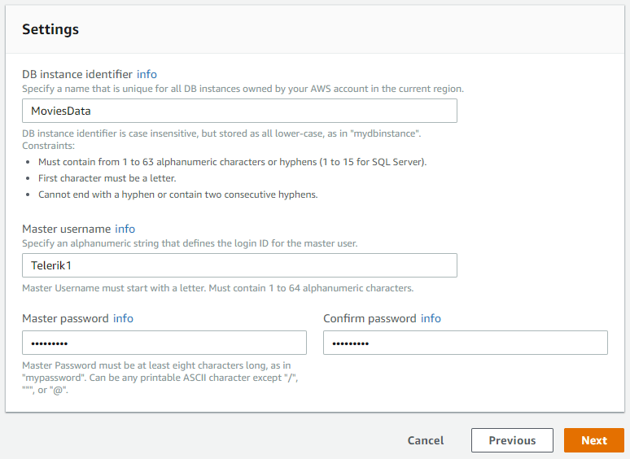
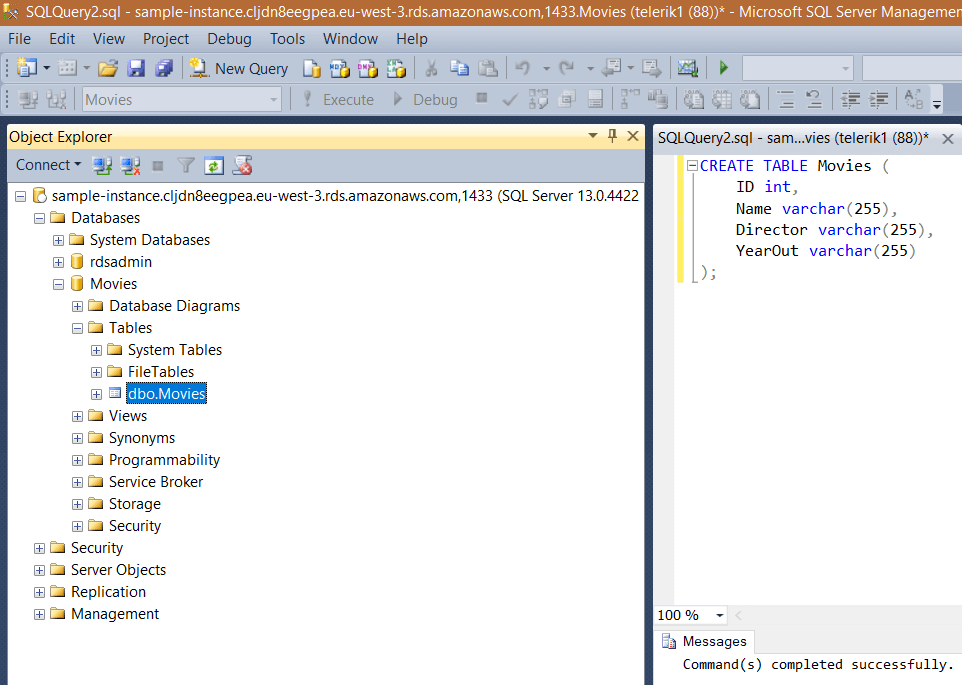
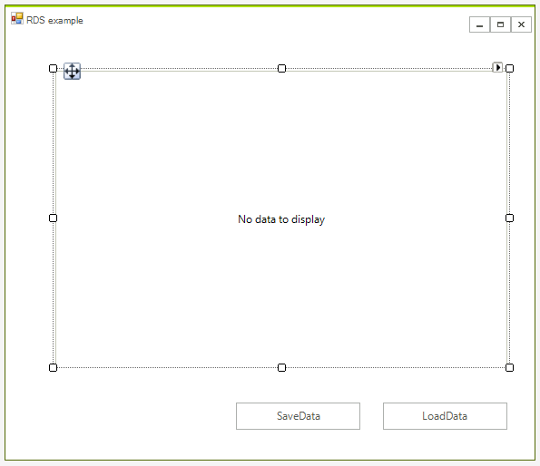
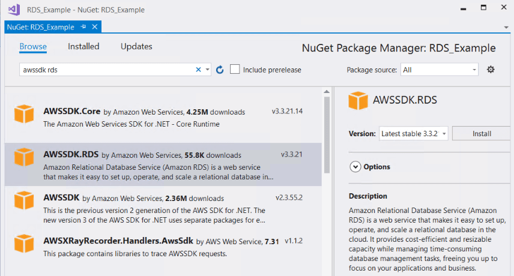

# Relational Database Service (RDS)

This article will show you to create a WinForms application and access data stored in the cloud. 

It shows how you can connect to the __AWS RDS__ instance from a blank WinForms project as well. 

## Step 1: Setup a Database

Go to the AWS console and click the RDS link and then click the __Get Started Now__. 


This will lead you to the **Select Engine** page. Select *SQL server Express Edition* and click Next. 


On the next screen choose any options you want. For this example we are using the free tier options. Make sure that **Publicly Accessible** option is set to *Yes*.  At the bottom of the page choose database name and specify the user name an password.



Click next and choose any options. Then click __Launch DB Instance__ and wait until the database is created. More information can be found [here](https://docs.aws.amazon.com/AmazonRDS/latest/UserGuide/CHAP_GettingStarted.CreatingConnecting.SQLServer.html).


At this point you are ready to connect to the instance using Microsoft SQL Server Management Studio. Detailed information is available [here](https://docs.aws.amazon.com/AmazonRDS/latest/UserGuide/USER_ConnectToMicrosoftSQLServerInstance.html). 




## Step 2: Create a WinForms project.

First create the WinForms project, to do that create a blank [Telerik UI for WinForms]() project and add a [RadGridView]() and two buttons to it. The application design should look like this:



## Step 3: Install the NuGet package

In Visual Studio open the NuGet package manager and install the RDS module:



## Step 4: Connect from the application

In this example we will use __Entity Framework__. In order to download Entity Framework you can follow this MSDN article - [Get Entity Framework](https://msdn.microsoft.com/en-us/data/ee712906.aspx)  

Now you will need a business object. In this example we will use the following class:

````C#

public class MoviesModel
{
    public int Id { get; set; }

    public string Name{ get; set; }

    public string Director { get; set; }

    public string YearOut { get; set; }
}
````
````VB
Public Class MoviesModel
    Public Property Id() As Integer

    Public Property Name() As String

    Public Property Director() As String

    Public Property YearOut() As String
End Class
````

The main part is creating a DbContext class. For this example you need to inherit the class and create a method that returns the connection string and a property that resembles the data. Here is a sample implementation:

````C#

public class RadGridViewMoviesContext : DbContext
{
    public RadGridViewMoviesContext() : base(GetRDSConnectionString())
    {
       
    }

    public static string GetRDSConnectionString()
    {
        string dbname = "Movies";
        if (string.IsNullOrEmpty(dbname)) return null;

        string username = "user";
        string password = "pass";
        string hostname = "sample-instance.************rds.amazonaws.com";
        string port = "1433";

        return "Data Source=" + hostname + ";Initial Catalog=" + dbname + ";User ID=" + username + ";Password=" + password + ";";
    }

    public IDbSet<MoviesModel> Movies { get; set; }
    public new IDbSet<T> Set<T>() where T : class
    {
        return base.Set<T>();
    }
}

````
````VB.NET
Public Class RadGridViewMoviesContext
    Inherits DbContext

    Public Sub New()
        MyBase.New(GetRDSConnectionString())

    End Sub

    Public Shared Function GetRDSConnectionString() As String
        Dim dbname As String = "Movies"
        If String.IsNullOrEmpty(dbname) Then
            Return Nothing
        End If

        Dim username As String = "user"
        Dim password As String = "pass"
        Dim hostname As String = "sample-instance.************rds.amazonaws.com"
        Dim port As String = "1433"

        Return "Data Source=" & hostname & ";Initial Catalog=" & dbname & ";User ID=" & username & ";Password=" & password & ";"
    End Function

    Public Property Movies() As IDbSet(Of MoviesModel)
    Public Shadows Function [Set](Of T As Class)() As IDbSet(Of T)
        Return MyBase.Set(Of T)()
    End Function
End Class
````

Now you are ready to add some data:

````C#

RadGridViewMoviesContext dbContext = new RadGridViewMoviesContext();

dbContext.Movies.Add(new MoviesModel() { Director = "John Francis Daley", Id = 0, Name = "Game Night", YearOut = "2018" });
dbContext.Movies.Add(new MoviesModel() { Director = "Will Gluck", Id = 0, Name = "Peter Rabbit", YearOut = "2018" });


dbContext.SaveChanges();

````
````VB.NET
Dim dbContext As New RadGridViewMoviesContext()

dbContext.Movies.Add(New MoviesModel() With {
    .Director = "John Francis Daley",
    .Id = 0,
    .Name = "Game Night",
    .YearOut = "2018"
})
dbContext.Movies.Add(New MoviesModel() With {
    .Director = "Will Gluck",
    .Id = 0,
    .Name = "Peter Rabbit",
    .YearOut = "2018"
})


dbContext.SaveChanges()
````


Once this is done you can bind the grid.

````C#
private void loadDataButton_Click(object sender, EventArgs e)
{
    RadGridViewMoviesContext dbContext = new RadGridViewMoviesContext();
    dbContext.Movies.Load();
    this.radGridView1.DataSource = dbContext.Movies.Local.ToBindingList();
}

````
````VB.NET
Private Sub loadDataButton_Click(ByVal sender As Object, ByVal e As EventArgs)
    Dim dbContext As New RadGridViewMoviesContext()
    dbContext.Movies.Load()
    Me.radGridView1.DataSource = dbContext.Movies.Local.ToBindingList()
End Sub
````

Saving the data is easy just call the __SaveChanges__ method:

````C#
private void saveDataButton_Click(object sender, EventArgs e)
{
    dbContext.SaveChanges();
}
````
````VB.NET
Private Sub saveDataButton_Click(ByVal sender As Object, ByVal e As EventArgs)
    dbContext.SaveChanges()
End Sub
````

You can now view and edit the data from the grid:


# See Also

* [DynamoDB]()
* [Storage]() 
* [Simple Email Service]()