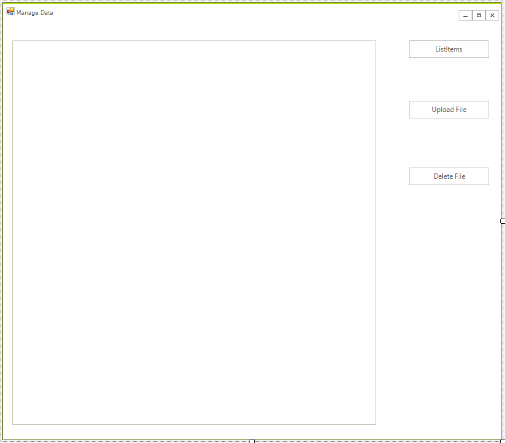

# Blob Storage

The Azure Blob Storage allows you to store any type of unstructured data: images, videos, audio, documents, and more. This article will show you how you can create a small application that allows you to manage the the data uploaded to the storage. 


## Step 1: Create the WinForms Application

Create a standard [Telerik WinForms]() application and add 3 buttons and a [RadListView]() to it. The layout should look like this:



## Step 2: Install the NuGet package

Open the NuGet Package Manager and install the **Windows.Azure.Storage** package.


## Step 3: Create the Storage Account Objects 

We will use the following objects in order to manage the storage. Add tre the following code to your form class.  

````C#
CloudStorageAccount storageAccount = null;
CloudBlobContainer cloudBlobContainer = null;
````

>tip You can add the necessary namespaces by pressing __Ctrl + .__

## Step 4: Create a Storage Account

The following article explains how you can create a storage account: [Create a Storage Account](https://docs.microsoft.com/en-us/azure/storage/common/storage-create-storage-account#create-a-storage-account).

THe process is straightforward and easy it should take no more than 10 minutes. Once this is completed you need to get the connection string. You can find it under the __Access Keys__ page.


When you have a connection string copy it to your application:

````C#
string connectionString "your connection string form the account goes here";
````


You are ready to create a storage container and initialize the storage container. Add the following code.

````C#
public RadForm1()
{
    InitializeComponent();
    this.CreateAccountObjects();
}
public async void CreateAccountObjects()
{
    if (CloudStorageAccount.TryParse(connectionString, out storageAccount))
    {
        CloudBlobClient cloudBlobClient = storageAccount.CreateCloudBlobClient();

        cloudBlobContainer = cloudBlobClient.GetContainerReference("myFiles");
        if (cloudBlobContainer != null)
        {
            return;
        }
        //if the container do not exists create it. 
        cloudBlobContainer = cloudBlobClient.GetContainerReference("myFiles" + Guid.NewGuid().ToString());
        await cloudBlobContainer.CreateAsync();

        BlobContainerPermissions permissions = new BlobContainerPermissions
        {
            PublicAccess = BlobContainerPublicAccessType.Blob
        };
        await cloudBlobContainer.SetPermissionsAsync(permissions);
    }
}
````

## Step 5: Add the handlers to manage the data.


