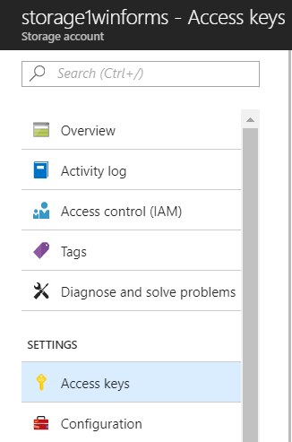

# Blob Storage

The Azure Blob Storage allows you to store any type of unstructured data: images, videos, audio, documents, and more. This article will show you how you can create a small application that allows you to manage the the data uploaded to the storage. 


## Step 1: Create the WinForms Application

Create a standard [Telerik WinForms]() application and add 3 buttons and a [RadListView]() to it. The layout should look like this:


## Step 2: Install the NuGet package

Open the NuGet Package Manager and install the **Windows.Azure.Storage** package.


## Step 3: Create the Storage Account Objects 

We will use the following objects in order to manage the storage. Add tre the following code to your form class.  

````C#
CloudStorageAccount storageAccount = null;
CloudBlobContainer cloudBlobContainer = null;
````
```` VB.NET
Dim storageAccount As CloudStorageAccount = Nothing
Dim cloudBlobContainer As CloudBlobContainer = Nothing
````

>tip You can add the necessary namespaces by pressing __Ctrl + .__

## Step 4: Create a Storage Account

The following article explains how you can create a storage account: [Create a Storage Account](https://docs.microsoft.com/en-us/azure/storage/common/storage-create-storage-account#create-a-storage-account).

The process is straightforward and easy it should take no more than 10 minutes. Once this is completed you need to get the connection string. You can find it under the __Access Keys__ page.



When you have a connection string copy it to your application:

````C#
string connectionString "your connection string form the account goes here";
````
```` VB.NET
String connectionString "your connection string form the account goes here"
````

You are ready to create a storage container and initialize the storage container. Add the following code.

````C#
public RadForm1()
{
    InitializeComponent();
    this.CreateAccountObjects();
}
public async void CreateAccountObjects()
{
    if (CloudStorageAccount.TryParse(connectionString, out storageAccount))
    {
        CloudBlobClient cloudBlobClient = storageAccount.CreateCloudBlobClient();

        cloudBlobContainer = cloudBlobClient.GetContainerReference("myFiles");
        if (cloudBlobContainer != null)
        {
            return;
        }
        //if the container do not exists create it. 
        cloudBlobContainer = cloudBlobClient.GetContainerReference("myFiles" + Guid.NewGuid().ToString());
        await cloudBlobContainer.CreateAsync();

        BlobContainerPermissions permissions = new BlobContainerPermissions
        {
            PublicAccess = BlobContainerPublicAccessType.Blob
        };
        await cloudBlobContainer.SetPermissionsAsync(permissions);
    }
}
````
```` VB.NET
Public Sub New()
    InitializeComponent()
    Me.CreateAccountObjects()
End Sub
Public Async Sub CreateAccountObjects()
    If CloudStorageAccount.TryParse(connectionString, storageAccount) Then
        Dim cloudBlobClient As CloudBlobClient = storageAccount.CreateCloudBlobClient()

        cloudBlobContainer = cloudBlobClient.GetContainerReference("myFiles")
        If cloudBlobContainer IsNot Nothing Then
            Return
        End If
        'if the container do not exists create it. 
        cloudBlobContainer = cloudBlobClient.GetContainerReference("myFiles" & Guid.NewGuid().ToString())
        Await cloudBlobContainer.CreateAsync()

        Dim permissions As BlobContainerPermissions = New BlobContainerPermissions With {.PublicAccess = BlobContainerPublicAccessType.Blob}
        Await cloudBlobContainer.SetPermissionsAsync(permissions)
    End If
End Sub

````

## Step 5: Add the handlers to manage the data.

There is nothing complex in this example and the API is really intuitive. You just need to call the appropriate methods and you will easily get the results.

````C#
private void radButtonListItems_Click(object sender, EventArgs e)
{
    ListItems();
}
public void ListItems()
{
    radListView1.Items.Clear();

    BlobContinuationToken blobContinuationToken = null;
    do
    {
        var results = cloudBlobContainer.ListBlobsSegmented(null, blobContinuationToken);

        blobContinuationToken = results.ContinuationToken;
        foreach (IListBlobItem item in results.Results)
        {
            radListView1.Items.Add(item.Uri);
        }
    } while (blobContinuationToken != null);
}
private async void radButtonUpload_ClickAsync(object sender, EventArgs e)
{
    OpenFileDialog dlg = new OpenFileDialog();
    if (dlg.ShowDialog() == DialogResult.OK)
    {
        string file = dlg.FileName;
        CloudBlockBlob cloudBlockBlob = cloudBlobContainer.GetBlockBlobReference(Path.GetFileName(file));
        await cloudBlockBlob.UploadFromFileAsync(file);
        ListItems();
    }
}

private void radButtonDelete_Click(object sender, EventArgs e)
{
    if (radListView1.SelectedIndex != -1)
    {
        var fileName = radListView1.SelectedItem.Text;
        var blob = this.cloudBlobContainer.GetBlockBlobReference(Path.GetFileName(fileName));
        var result = blob.DeleteIfExists();
        if (result == false)
        {
            RadMessageBox.Show("Cannot Find File");
        }
        ListItems();
    }

}
````
```` VB.NET
Private Sub radButtonListItems_Click(ByVal sender As Object, ByVal e As EventArgs)
    ListItems()
End Sub
Public Sub ListItems()
    radListView1.Items.Clear()

    Dim blobContinuationToken As BlobContinuationToken = Nothing
    Do
        Dim results = cloudBlobContainer.ListBlobsSegmented(Nothing, blobContinuationToken)

        blobContinuationToken = results.ContinuationToken
        For Each item As IListBlobItem In results.Results
            radListView1.Items.Add(item.Uri)
        Next item
    Loop While blobContinuationToken IsNot Nothing
End Sub
Private Async Sub radButtonUpload_ClickAsync(ByVal sender As Object, ByVal e As EventArgs)
    Dim dlg As New OpenFileDialog()
    If dlg.ShowDialog() = DialogResult.OK Then
        Dim file As String = dlg.FileName
        Dim cloudBlockBlob As CloudBlockBlob = cloudBlobContainer.GetBlockBlobReference(Path.GetFileName(file))
        Await cloudBlockBlob.UploadFromFileAsync(file)
        ListItems()
    End If
End Sub

Private Sub radButtonDelete_Click(ByVal sender As Object, ByVal e As EventArgs)
    If radListView1.SelectedIndex <> -1 Then
        Dim fileName = radListView1.SelectedItem.Text
        Dim blob = Me.cloudBlobContainer.GetBlockBlobReference(Path.GetFileName(fileName))
        Dim result = blob.DeleteIfExists()
        If result = False Then
            RadMessageBox.Show("Cannot Find File")
        End If
        ListItems()
    End If

End Sub
````

You are now ready to manage the files in the cloud.


# See Also

* [Cosmos DB]()
* [Image Analysis]()
* [Text Analysis]()
* [SQL Database]()