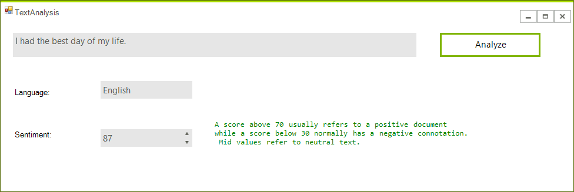

# Text Analysis

This article will guide you through the process of integrating Azure's [Text Analytics API](https://azure.microsoft.com/en-us/services/cognitive-services/text-analytics/) with the controls from the Telerik UI for WinForms suite.  

## Step 1: Create a Text Analytics API Account

Before you start, you need to create a new Text Analytics API account through the Azure portal. This is explained in great detail [here](https://docs.microsoft.com/en-us/azure/cognitive-services/cognitive-services-apis-create-account).


Once you've created the account, you have to obtain the subscription keys that were generated for you. You will require them later on in order to make API calls from your application.

## Step 2: Create the Application

Create a standard [Telerik WinForms]() application and add two [RadTextBoxes]() a [RadButton]() three [RadLabels]() and a [RadSpinEditor]() to it. The layout should look like this:


## Step 3: Add the Microsoft.Azure.CognitiveServices.Language NuGet Package

You can now add the **Microsoft.Azure.CognitiveServices.Language** NuGet package corresponding which provides access to the Microsoft Cognitive Services Language APIs.

>tip Mark the __Include Prerelease__ checkbox.

>tip The package requires a .NET Framework version equal or higher than **4.5.2**. If you're using a lower version, you will need to call the HTTP endpoints directly from C# and serialize and deserialize the requests and responses similarly to the example found in the [Image Analysis]() article.


## Step 4: Use the Text Analytics API

The following code demonstrates how to handle the button's **Click** event and use the Text Analytics API to analyze the text input in the RadTextBox.


````C#
const string subscriptionKey = "Add your key here.";
public ITextAnalyticsAPI client;

public RadForm1()
{
    InitializeComponent();
    client = new TextAnalyticsAPI();
    client.AzureRegion = AzureRegions.Westeurope;
    client.SubscriptionKey = subscriptionKey;

}
private async void MakeAnalysisRequest(string text)
{
    LanguageBatchResult languageResult = await client.DetectLanguageAsync(
            new BatchInput(new List<Input>() { new Input("1", text) }));

    var language = languageResult.Documents.First().DetectedLanguages.First();

    SentimentBatchResult sentimentResult = await client.SentimentAsync(
        new MultiLanguageBatchInput(new List<MultiLanguageInput>(){
        new MultiLanguageInput(language.Iso6391Name, "1", text) }));

    var sentiment = sentimentResult.Documents.First();

    this.languageTextBox.Text = language.Name;
    this.sentimentEditor.Value = (decimal)sentiment.Score.Value * 100;
}
private void radButton1_Click(object sender, EventArgs e)
{
     MakeAnalysisRequest(radTextBoxInput.Text);
}

````

This is all, you are ready to test the application.



# See Also

* [Cosmos DB]()
* [Image Analysis]()
* [SQL Database]()
* [Blob Storage]()