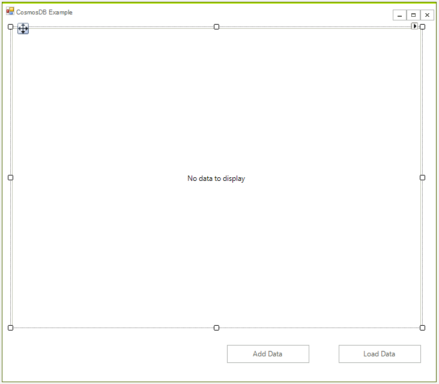
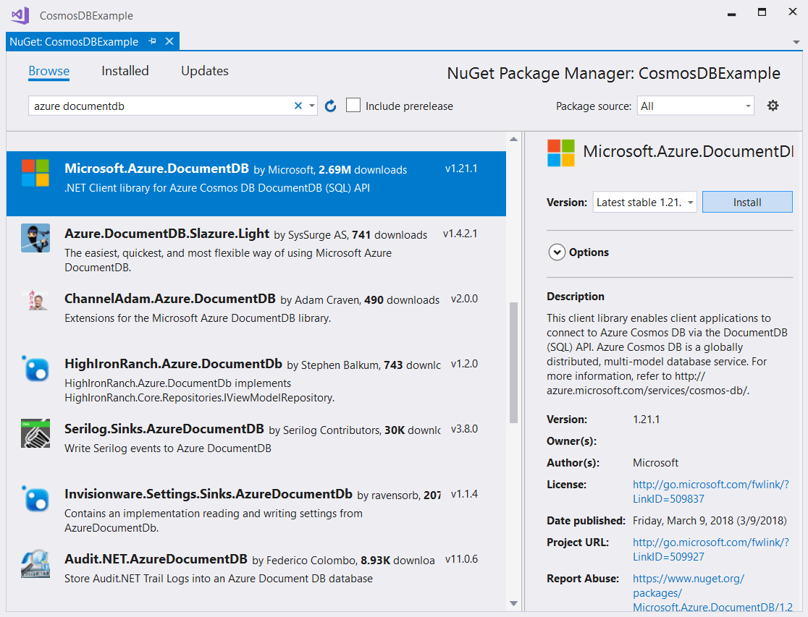
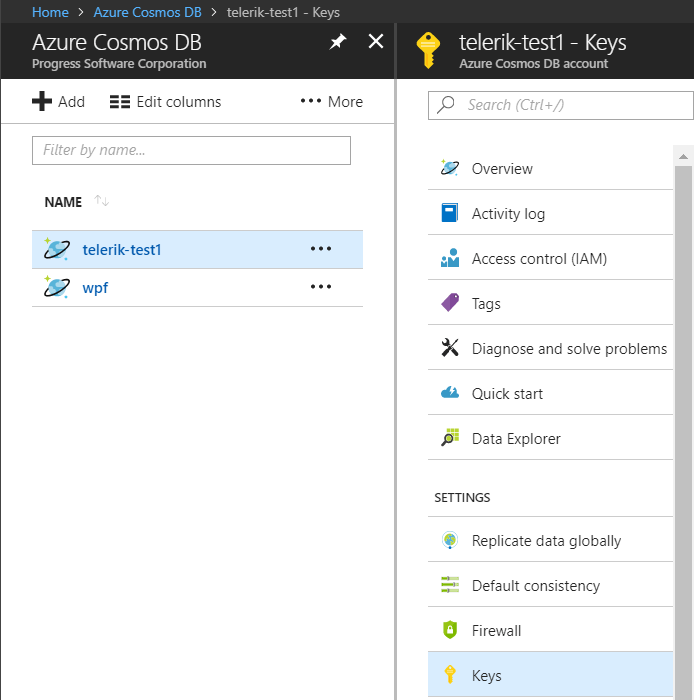
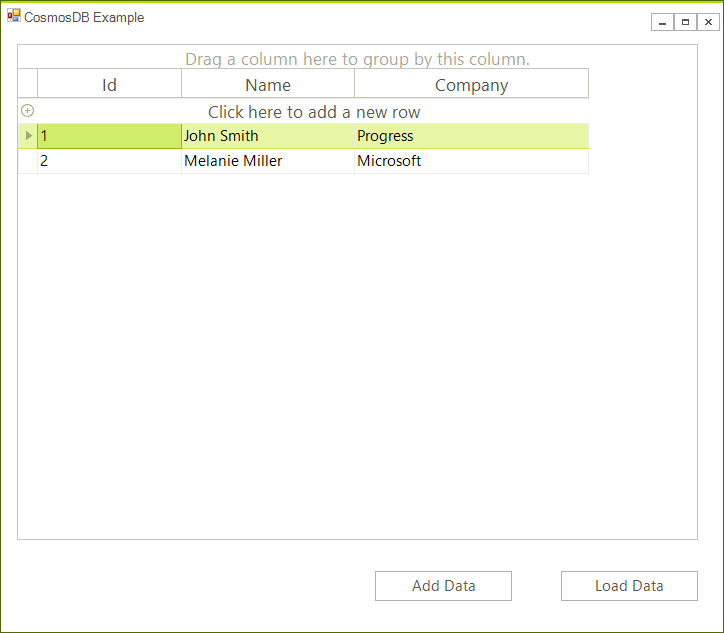

# CosmosDB

Azure Cosmos DB is a globally distributed, multi-model database service which enables you to develop document, key-value, wide-column, and graph databases by using popular APIs and programming models. This article will show you how to integrate the [RadGridView]() control to work with your remote database.

This article shows the steps for creating a database along with the application that uses it. More detailed information about creating the database is available in the following tutorial: [SQL API Getting Started Tutorial](https://docs.microsoft.com/en-us/azure/cosmos-db/sql-api-get-started).


## Step 1: Create a WinForms project.

First create the WinForms project, to do that create a blank [Telerik UI for WinForms]() project and add a [RadGridView]() and two buttons to it. The application design should look like this:




## Step 2: Install the NuGet package

In Visual Studio open the NuGet package manager and install the **Microsoft.Azure.DocumentDB** module:




## Step 3: Create the Database

Go to your Azure console, click **Create Resource** the select __Cosmos DB__ and populate the required information:
* ID - choose any name you want
* API - select SQL
* Resource Group - select __Create New__ and use the same name as your ID
* Enable geo-redundancy - leave blank


## Step 4: Connect to an Azure Cosmos DB account

First add the following namespaces:

````C#
using System.Net;
using Microsoft.Azure.Documents;
using Microsoft.Azure.Documents.Client;
using Newtonsoft.Json;
````
````VB.NET
Imports System.Net
Imports Microsoft.Azure.Documents
Imports Microsoft.Azure.Documents.Client
Imports Newtonsoft.Json
````

Add the following variables to the form's class:

````C#
private const string EndpointUrl = "<your endpoint URL>";
private const string PrimaryKey = "<your primary key>";
private DocumentClient client;
````
````VB.NET
Private Const EndpointUrl As String = "<your endpoint URL>"
Private Const PrimaryKey As String = "<your primary key>"
Private client As DocumentClient
````

You need to take the endpoint URL and primary key from the Azure Portal. In the Azure portal, navigate to your Azure Cosmos DB account, and then click Keys:




Initialize the client in the and create the database. This can be done in the form's constructor:

````C#
this.client = new DocumentClient(new Uri(EndpointUrl), PrimaryKey);
this.client.CreateDatabaseIfNotExistsAsync(new Database { Id = "EmployeeDB" });
````
````VB.NET
Me.client = New DocumentClient(New Uri(EndpointUrl), PrimaryKey)
Me.client.CreateDatabaseIfNotExistsAsync(New Database With {.Id = "EmployeeDB"})
````

>important CreateDocumentCollectionIfNotExistsAsync will create a new collection with reserved throughput, which has pricing implications. 

## Step 5: Create JSON documents

Documents are user defined (arbitrary) JSON content. We can now insert one or more documents. First, we need to create a the class that will represent the business object:

````C#
public class Employee
{
    [JsonProperty(PropertyName = "id")]
    public string Id { get; set; }
    public string Name { get; set; }
    public string Company { get; set; }
    public override string ToString()
    {
        return JsonConvert.SerializeObject(this);
    }
}
````
````VB.NET
Public Class Employee
    <JsonProperty(PropertyName := "id")>
    Public Property Id() As String
    Public Property Name() As String
    Public Property Company() As String
    Public Overrides Function ToString() As String
        Return JsonConvert.SerializeObject(Me)
    End Function
End Class
````

Now we are ready to add some data. For this we need to add a collection first. Call the following code once from your application (from the add event handler for example): 

````C#
private async void AddData()
{
    var employee1 = new Employee() { Id = "1", Name = "John Smith", Company = "Progress" };
    var employee2 = new Employee() { Id = "2", Name = "Melanie Miller", Company = "Microsoft" };

    await this.client.CreateDocumentCollectionIfNotExistsAsync(UriFactory.CreateDatabaseUri("EmployeeDB"), new DocumentCollection { Id = "EmployeeCollection" });
    await this.client.CreateDocumentAsync(UriFactory.CreateDocumentCollectionUri("EmployeeDB", "EmployeeCollection"), employee1);
    await this.client.CreateDocumentAsync(UriFactory.CreateDocumentCollectionUri("EmployeeDB", "EmployeeCollection"), employee2);
}

````
````VB.NET
Private Async Sub AddData()
    Dim employee1 = New Employee() With {
        .Id = "1",
        .Name = "John Smith",
        .Company = "Progress"
    }
    Dim employee2 = New Employee() With {
        .Id = "2",
        .Name = "Melanie Miller",
        .Company = "Microsoft"
    }

    Await Me.client.CreateDocumentCollectionIfNotExistsAsync(UriFactory.CreateDatabaseUri("EmployeeDB"), New DocumentCollection With {.Id = "EmployeeCollection"})
    Await Me.client.CreateDocumentAsync(UriFactory.CreateDocumentCollectionUri("EmployeeDB", "EmployeeCollection"), employee1)
    Await Me.client.CreateDocumentAsync(UriFactory.CreateDocumentCollectionUri("EmployeeDB", "EmployeeCollection"), employee2)
End Sub

````

You should be able to see the data in the Azure console:


## Step 6: Load the data in the grid

The following snippet shows how you can get a list of object that can be used as data source for the grid:

````C#
private void radButtonLoad_Click(object sender, EventArgs e)
{
    FeedOptions queryOptions = new FeedOptions { MaxItemCount = -1 };

    IQueryable<Employee> query = this.client.CreateDocumentQuery<Employee>(
            UriFactory.CreateDocumentCollectionUri("EmployeeDB", "EmployeeCollection"), queryOptions);

    radGridView1.DataSource = query.ToList();          
}
````
````VB.NET
Private Sub radButtonLoad_Click(ByVal sender As Object, ByVal e As EventArgs)
    Dim queryOptions As FeedOptions = New FeedOptions With {.MaxItemCount = -1}

    Dim query As IQueryable(Of Employee) = Me.client.CreateDocumentQuery(Of Employee)(UriFactory.CreateDocumentCollectionUri("EmployeeDB", "EmployeeCollection"), queryOptions)

    radGridView1.DataSource = query.ToList()
End Sub
````

Now you can see the data in the grid:



## Step 7: Save the data

Our grid allows us to track any changes an this is why we can save them directly. In this case you will use the **RowsChanged** event to update the records in the database:

````C#
private void RadGridView1_RowsChanged(object sender, Telerik.WinControls.UI.GridViewCollectionChangedEventArgs e)
{
    if (e.Action == Telerik.WinControls.Data.NotifyCollectionChangedAction.ItemChanged)
    {
        var item = e.NewItems[0] as GridViewDataRowInfo;
        var employee = item.DataBoundItem as Employee;
        this.client.ReplaceDocumentAsync(UriFactory.CreateDocumentUri("EmployeeDB", "EmployeeCollection", employee.Id), employee);
    }
}
````
````VB.NET
Private Sub RadGridView1_RowsChanged(ByVal sender As Object, ByVal e As Telerik.WinControls.UI.GridViewCollectionChangedEventArgs)
    If e.Action = Telerik.WinControls.Data.NotifyCollectionChangedAction.ItemChanged Then
        Dim item = TryCast(e.NewItems(0), GridViewDataRowInfo)
        Dim employee = TryCast(item.DataBoundItem, Employee)
        Me.client.ReplaceDocumentAsync(UriFactory.CreateDocumentUri("EmployeeDB", "EmployeeCollection", employee.Id), employee)
    End If
End Sub
````

Now the changes made in the grid will be automatically reflected in the database.
 
# See Also

* [SQL Database]()
* [Image Analysis]()
* [Text Analysis]()
* [Blob Storage]()
