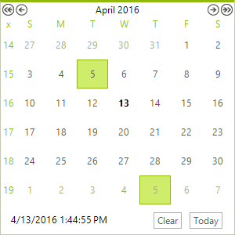

# Repeating Events


A __RadCalendarDay__ object can be configured as a repeating event by setting the __Recurring__ property to one of the following __RecurringEvents__ enumeration values.

* __DayInMonth__ - Only the day part of the date is taken into account. That gives the ability to serve events repeated every month on the same day.
            

* __DayAndMonth__ - The month and the day part of the date are taken into account. That gives the ability to serve events repeated in specific month on the same day.
            

* __Week__ - The week day is taken into account. That gives the ability to serve events repeated in a specific day of the week.
            

* __WeekAndMonth__ - The week day and the month are taken into account. That gives the ability to serve events repeated in a specific week day in a specific month.
            

* __Today__ - Gives the ability to control the visual appearance of today's day.
            

* __None__ - Default value - means that the day in question is a single point event, no recurrence.
            

The example below creates a __RadCalendarDay__ and assigns the __Date__. The __Recurring__ value of __DayInMonth__ causes the day to show for the 5th of every month.



__Configuring a recurring event__

{{source=..\SamplesCS\Calendar\Calendar1.cs region=calendarDays}} 
{{source=..\SamplesVB\Calendar\Calendar1.vb region=calendarDays}} 

````C#
RadCalendarDay day = new RadCalendarDay();
day.Date = new DateTime(2011, 2, 5, 0, 0, 0, 0);
day.Recurring = RecurringEvents.DayInMonth;
day.Selectable = false;
radCalendar1.SpecialDays.Add(day);

````
````VB.NET
Dim day As New RadCalendarDay()
day.Date = New DateTime(2011, 2, 5, 0, 0, 0, 0)
day.Recurring = RecurringEvents.DayInMonth
day.Selectable = False
RadCalendar1.SpecialDays.Add(day)

````

{{endregion}} 

## See Also

* [Header]()
* [Footer]()
* [Keyboard Navigation]()
* [MultiView]()
* [Navigation]()
* [Column and Row Headers]()
* [Selecting Dates]()
* [Zoom]()


