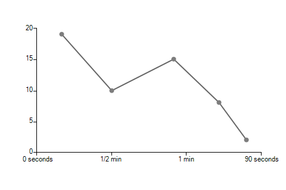

# Custom labels text

__RadChartView__ allows you to easily change the axes labels text by using a custom format provider class. This class must implement the [IFormatProvider](http://msdn.microsoft.com/en-us/library/system.iformatprovider.aspx) and [ICustomFormatter](http://msdn.microsoft.com/en-us/library/system.icustomformatter(v=vs.110).aspx) interfaces. The key point in this class is that the __Format__ method is called for each label and its "arg" parameter contains the current label text. The returned value will represent the new label.   

## Example 1: Changing the labels' texts to more human readable ones

#### Label Format

{{source=..\SamplesCS\ChartView\Customization\CustomLabels.cs region=FormatProvider}} 
{{source=..\SamplesVB\ChartView\Customization\CustomLabels.vb region=FormatProvider}} 

````C#
public class MyFormatProvider : IFormatProvider, ICustomFormatter
{
    public object GetFormat(Type formatType)
    {
        return this;
    }
    public string Format(string format, object arg, IFormatProvider formatProvider)
    {
        string s = arg.ToString();
        switch (s)
        {
            case "0":
                return "0 seconds";
            case "30":
                return "1/2 min";
            case "60":
                return "1 min";
            case "90":
                return "90 seconds";
        }
        return null;
    }
}

````
````VB.NET
Class MyFormatProvider
    Implements IFormatProvider
    Implements ICustomFormatter
    Public Function GetFormat(formatType As Type) As Object Implements IFormatProvider.GetFormat
        Return Me
    End Function
    Public Function Format(format__1 As String, arg As Object, formatProvider As IFormatProvider) As String Implements ICustomFormatter.Format
        Dim s As String = arg.ToString()
        Select Case s
            Case "0"
                Return "0 seconds"
            Case "30"
                Return "1/2 min"
            Case "60"
                Return "1 min"
            Case "90"
                Return "90 seconds"
        End Select
        Return Nothing
    End Function
End Class

````

{{endregion}}

Then you can just change the horizontal axis __LabelFormatProvider__ by using the corresponding property. 

#### Assign Format Provider

{{source=..\SamplesCS\ChartView\Customization\CustomLabels.cs region=propertyChange}} 
{{source=..\SamplesVB\ChartView\Customization\CustomLabels.vb region=propertyChange}} 

````C#
LinearAxis horizontalAxis = radChartView1.Axes.Get<LinearAxis>(0);
horizontalAxis.LabelFormatProvider = new MyFormatProvider();

````
````VB.NET
Dim horizontalAxis As LinearAxis = RadChartView1.Axes.[Get](Of LinearAxis)(0)
horizontalAxis.LabelFormatProvider = New MyFormatProvider()

````

{{endregion}}

>caption Figure 1: Format Provider


##  Example 2: Showing the date part of a label only on day changes 

#### DateTime Format Provider

{{source=..\SamplesCS\ChartView\Customization\CustomLabels.cs region=FormatProvider2}} 
{{source=..\SamplesVB\ChartView\Customization\CustomLabels.vb region=FormatProvider2}} 

````C#
public class DateTimeFormatProvider : IFormatProvider, ICustomFormatter
{
    public object GetFormat(Type formatType)
    {
        return this;
    }
    public string Format(string format, object arg, IFormatProvider formatProvider)
    {
        DateTime val = (DateTime)arg;
        if (val.Hour == 0)
        {
            return val.ToShortDateString();
        }
        else
        {
            return val.ToString("H\\h");
        }
    }
}

````
````VB.NET
Class DateTimeFormatProvider
    Implements IFormatProvider
    Implements ICustomFormatter
    Public Function GetFormat(formatType As Type) As Object Implements IFormatProvider.GetFormat
        Return Me
    End Function
    Public Function Format(format__1 As String, arg As Object, formatProvider As IFormatProvider) As String Implements ICustomFormatter.Format
        Dim val As DateTime = DirectCast(arg, DateTime)
        If val.Hour = 0 Then
            Return val.ToShortDateString()
        Else
            Return val.ToString("H\h")
        End If
    End Function
End Class

````

{{endregion}}  

Again you can just change the horizontal axis __LabelFormatProvider__ by using the corresponding property.  

#### Assign DateTime Format Provider

{{source=..\SamplesCS\ChartView\Customization\CustomLabels.cs region=PropertyChange2}} 
{{source=..\SamplesVB\ChartView\Customization\CustomLabels.vb region=PropertyChange2}} 

````C#
DateTimeContinuousAxis dateTimeAxis = new DateTimeContinuousAxis();
dateTimeAxis.LabelFormatProvider = new DateTimeFormatProvider();

````
````VB.NET
Dim dateTimeAxis As New DateTimeContinuousAxis()
dateTimeAxis.LabelFormatProvider = New DateTimeFormatProvider()

````

{{endregion}}

>caption Figure 2: DateTime Format Provider


>note The above provider implementation is applicable only to axes working with __DateTime__ objects  ( __DateTimeContinuousAxis__ and __DateTimeCategoricalAxis__ ).
>

# See Also

* [Series Types]()
* [Axes]()
