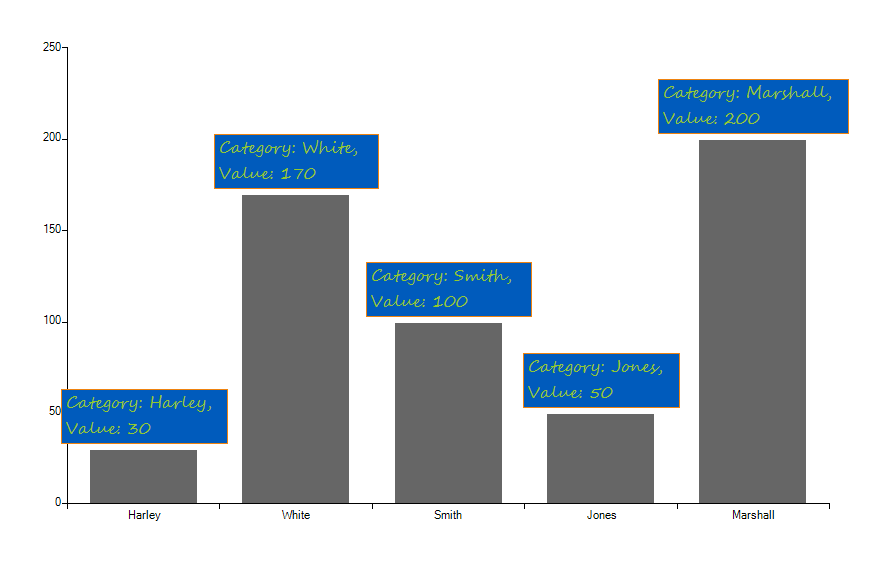

# Formatting Series Labels

This article demonstrates how to change the labels styles and text. The series labels can be customized in the __LabelFormatting__ event of __RadChartView__. This event is fired for each label, which allows you to customize all labels, depending on your goals.

>caption Figure 1: Formatting Labels


1\. In order this event to fire, you should set the __ShowLabels__ property to *true* for at least one series. For example, you can set this property for all series with the following code. 

#### Show Labels

{{source=..\SamplesCS\ChartView\Customization\FormattingSeriesAndTrackballLabels.cs region=ShowLabels}} 
{{source=..\SamplesVB\ChartView\Customization\FormattingSeriesAndTrackballLabels.vb region=ShowLabels}} 

````C#
foreach (var series in radChartView1.Series)
{
    series.ShowLabels = true;
}

````
````VB.NET
For Each series In RadChartView1.Series
    series.ShowLabels = True
Next

````

{{endregion}} 
 

2\. Now you can change the labels styles and text. 

#### LabelFormatting Event

{{source=..\SamplesCS\ChartView\Customization\FormattingSeriesAndTrackballLabels.cs region=LabelFormatting}} 
{{source=..\SamplesVB\ChartView\Customization\FormattingSeriesAndTrackballLabels.vb region=LabelFormatting}} 

````C#
private Font font1 = new Font("Segoe Script", 12, FontStyle.Regular);
private void radChartView1_LabelFormatting(object sender, ChartViewLabelFormattingEventArgs e)
{
    e.LabelElement.BackColor = ColorTranslator.FromHtml("#005BBc");
    e.LabelElement.ForeColor = ColorTranslator.FromHtml("#91c930");
    e.LabelElement.BorderColor = ColorTranslator.FromHtml("#ee8310");
    e.LabelElement.Font = font1;
    CategoricalPointElement element = (CategoricalPointElement)e.LabelElement.Parent;
    CategoricalDataPoint dataPoint = (CategoricalDataPoint)element.DataPoint;
    e.LabelElement.Text = string.Format("Category: {0}, Value: {1}", dataPoint.Category, dataPoint.Value);
}

````
````VB.NET
Private font1 As New Font("Segoe Script", 12, FontStyle.Regular)
Private Sub radChartView1_LabelFormatting(sender As Object, e As ChartViewLabelFormattingEventArgs)
    e.LabelElement.BackColor = ColorTranslator.FromHtml("#005BBc")
    e.LabelElement.ForeColor = ColorTranslator.FromHtml("#91c930")
    e.LabelElement.BorderColor = ColorTranslator.FromHtml("#ee8310")
    e.LabelElement.Font = font1
    Dim element As CategoricalPointElement = DirectCast(e.LabelElement.Parent, CategoricalPointElement)
    Dim dataPoint As CategoricalDataPoint = DirectCast(element.DataPoint, CategoricalDataPoint)
    e.LabelElement.Text = String.Format("Category: {0}, " & vbLf & "Value: {1}", dataPoint.Category, dataPoint.Value)
End Sub

````

{{endregion}}

>note Since **R2 2017 SP1** you can control the label's text alignment by the newly introduced property ChartViewLabelFormattingEventArgs.LabelElement.**TextAlignment**.

>important The code for getting the current data point can depend on the used series type. For example if you use pie chart you should cast to __PiePointElement__ , and __PieDataPoint__ types.
>

# See Also

* [Summary Labels on Stacked Bars]()
* [Series Types]()
* [Axes]()


