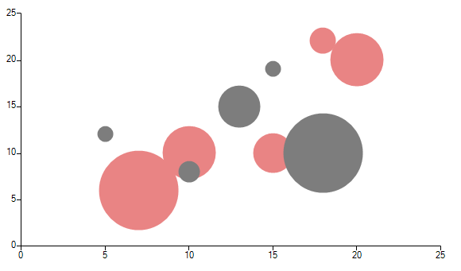

# Bubble

__BubbleSeries__ are used to visualize data points as points with coordinates and size defined by their items' values. You might think of a Bubble chart as a variation of the Scatter chart, in which the data points are replaced with bubbles. 

#### Initial Setup
 
{{source=..\SamplesCS\ChartView\Series\BubbleSeriesForm.cs region=Bubble}} 
{{source=..\SamplesVB\ChartView\Series\BubbleSeriesForm.vb region=Bubble}} 

````C#
            
BubbleSeries bubbleSeries = new BubbleSeries();
bubbleSeries.Name = "Q1";
bubbleSeries.DataPoints.Add(new BubbleDataPoint(15, 19,3));
bubbleSeries.DataPoints.Add(new BubbleDataPoint(18, 10,15));
bubbleSeries.DataPoints.Add(new BubbleDataPoint(13, 15,8));
bubbleSeries.DataPoints.Add(new BubbleDataPoint(10, 8,4));
bubbleSeries.DataPoints.Add(new BubbleDataPoint(5, 12,3)); 
this.radChartView1.Series.Add(bubbleSeries);
            
BubbleSeries bubbleSeries2 = new BubbleSeries();
bubbleSeries2.Name = "Q2";
bubbleSeries2.DataPoints.Add(new BubbleDataPoint(20, 20,4));
bubbleSeries2.DataPoints.Add(new BubbleDataPoint(15, 10,3));
bubbleSeries2.DataPoints.Add(new BubbleDataPoint(7, 6,6));
bubbleSeries2.DataPoints.Add(new BubbleDataPoint(18, 22,2));
bubbleSeries2.DataPoints.Add(new BubbleDataPoint(10, 10,4));
this.radChartView1.Series.Add(bubbleSeries2);

````
````VB.NET
Dim bubbleSeries As New BubbleSeries()
bubbleSeries.Name = "Q1"
bubbleSeries.DataPoints.Add(New BubbleDataPoint(15, 19, 3))
bubbleSeries.DataPoints.Add(New BubbleDataPoint(18, 10, 15))
bubbleSeries.DataPoints.Add(New BubbleDataPoint(13, 15, 8))
bubbleSeries.DataPoints.Add(New BubbleDataPoint(10, 8, 4))
bubbleSeries.DataPoints.Add(New BubbleDataPoint(5, 12, 3))
Me.RadChartView1.Series.Add(bubbleSeries)
Dim bubbleSeries2 As New BubbleSeries()
bubbleSeries2.Name = "Q2"
bubbleSeries2.DataPoints.Add(New BubbleDataPoint(20, 20, 4))
bubbleSeries2.DataPoints.Add(New BubbleDataPoint(15, 10, 3))
bubbleSeries2.DataPoints.Add(New BubbleDataPoint(7, 6, 6))
bubbleSeries2.DataPoints.Add(New BubbleDataPoint(18, 22, 2))
bubbleSeries2.DataPoints.Add(New BubbleDataPoint(10, 10, 4))
Me.RadChartView1.Series.Add(bubbleSeries2)

````

{{endregion}}

>caption Figure 1: Initial Setup

 
Here are some of the important properties of __BubbleSeries__:

* __XValueMember:__ If a DataSource is set, the property determines the name of the field that holds the XValue.

* __YValueMember:__ If a DataSource is set, the property determines the name of the field that holds the YValue. 

* __ValueMember:__ If a DataSource is set, the property determines the name of the field that holds the Value.

* __AutoScale:__ Defines whether the size of the bubbles is calculated automatically by the chart engine or by the __Scale__ property.

* __Scale:__ Specifies a fixed scale for the relation between the size of the bubbles and their value when the __AutoScale__ property is set to *false*.

* __AutoScaleMaxWidth:__ The maximum size in pixels of a single bubble when __AutoScale__ is *true*.
            
# See Also

* [Series Types]()
* [Populating with Data]()
