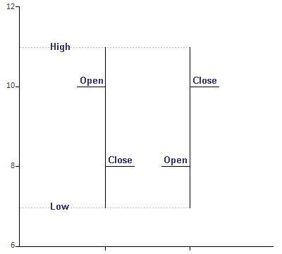
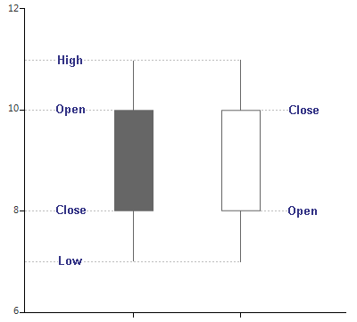
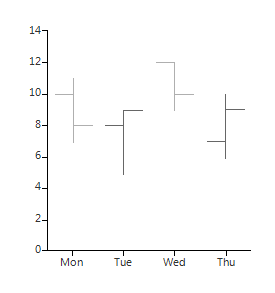
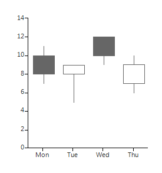

# Ohlc and Candlestick

__RadChartView__ introduces support for stock series – both __Ohlc (Open-High-Low-Close)__ and __Candlestick__. These series operate with special data points which hold information about each the following parameters: *open, high, low, close*. As members of the __Categorical__ series, stock series plot their data upon a categorical (or __DateTimeCategorical__) axis.

__Ohlc__ and __Candlestick__ series are indeed two alternative ways to visualize the same data. Here is how to read the values of an __Ohlc__ and __Candlestick__ point:
 

|  __Ohlc__  |  __Candlestick__  |
| ------ | ------ |
|||

Here is how to setup Ohlc series: 

#### Initial Setup OhlcSeries

{{source=..\SamplesCS\ChartView\Series\OhlcAndCandlestick\OhlcSeriesForm.cs region=ohlc}} 
{{source=..\SamplesVB\ChartView\Series\OhlcAndCandlestick\OhlcSeriesForm.vb region=ohlc}} 

````C#
OhlcSeries ohlcSeries = new OhlcSeries();
ohlcSeries.DataPoints.Add(new OhlcDataPoint(10, 11, 7, 8, DateTime.Now));
ohlcSeries.DataPoints.Add(new OhlcDataPoint(8, 9, 5, 9, DateTime.Now.AddDays(1)));
ohlcSeries.DataPoints.Add(new OhlcDataPoint(12, 12, 9, 10, DateTime.Now.AddDays(2)));
ohlcSeries.DataPoints.Add(new OhlcDataPoint(7, 10, 6, 9, DateTime.Now.AddDays(3)));
this.radChartView1.Series.Add(ohlcSeries);

````
````VB.NET
Dim ohlcSeries As New OhlcSeries()
ohlcSeries.DataPoints.Add(New OhlcDataPoint(10, 11, 7, 8, DateTime.Now))
ohlcSeries.DataPoints.Add(New OhlcDataPoint(8, 9, 5, 9, DateTime.Now.AddDays(1)))
ohlcSeries.DataPoints.Add(New OhlcDataPoint(12, 12, 9, 10, DateTime.Now.AddDays(2)))
ohlcSeries.DataPoints.Add(New OhlcDataPoint(7, 10, 6, 9, DateTime.Now.AddDays(3)))
Me.RadChartView1.Series.Add(ohlcSeries)

````

{{endregion}} 

>caption Figure 1: Initial Setup OhlcSeries


Here is how to setup Candlestick series:

#### Initial Setup CandlestickSeries

{{source=..\SamplesCS\ChartView\Series\OhlcAndCandlestick\OhlcSeriesForm.cs region=candlestick}} 
{{source=..\SamplesVB\ChartView\Series\OhlcAndCandlestick\OhlcSeriesForm.vb region=candlestick}} 

````C#
CandlestickSeries candlestickSeries = new CandlestickSeries();
candlestickSeries.DataPoints.Add(new OhlcDataPoint(10, 11, 7, 8, DateTime.Now));
candlestickSeries.DataPoints.Add(new OhlcDataPoint(8, 9, 5, 9, DateTime.Now.AddDays(1)));
candlestickSeries.DataPoints.Add(new OhlcDataPoint(12, 12, 9, 10, DateTime.Now.AddDays(2)));
candlestickSeries.DataPoints.Add(new OhlcDataPoint(7, 10, 6, 9, DateTime.Now.AddDays(3)));
this.radChartView1.Series.Add(candlestickSeries);

````
````VB.NET
Dim candlestickSeries As New CandlestickSeries()
candlestickSeries.DataPoints.Add(New OhlcDataPoint(10, 11, 7, 8, DateTime.Now))
candlestickSeries.DataPoints.Add(New OhlcDataPoint(8, 9, 5, 9, DateTime.Now.AddDays(1)))
candlestickSeries.DataPoints.Add(New OhlcDataPoint(12, 12, 9, 10, DateTime.Now.AddDays(2)))
candlestickSeries.DataPoints.Add(New OhlcDataPoint(7, 10, 6, 9, DateTime.Now.AddDays(3)))
Me.RadChartView1.Series.Add(candlestickSeries)

````

{{endregion}} 

>caption Figure 2: Initial Setup CandlestickSeries


# See Also

* [Series Types]()
* [Populating with Data]()
