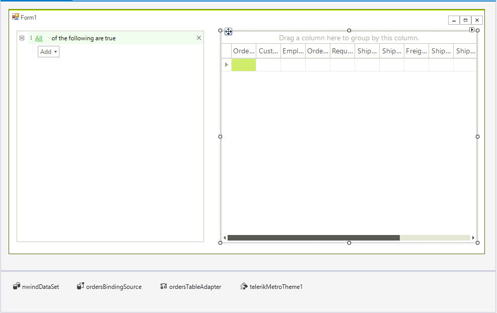
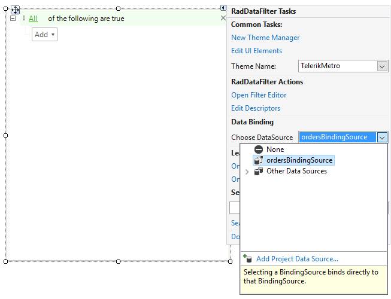
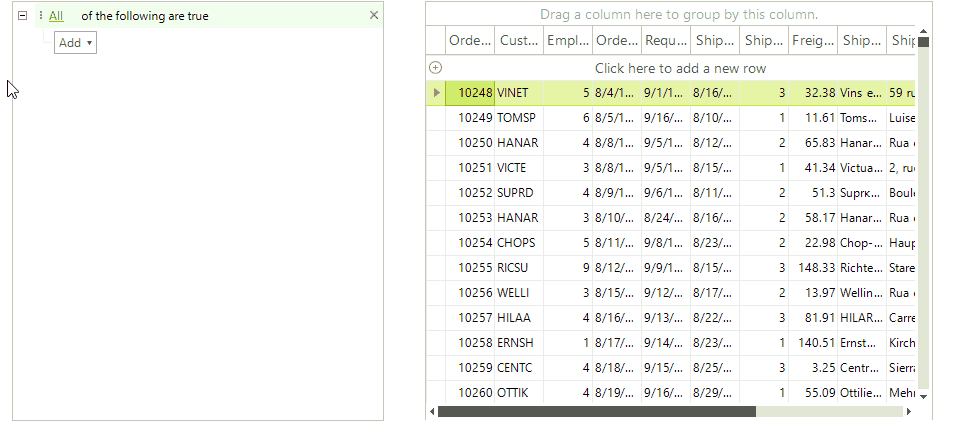

# Getting Started

__RadDataFilter__ is a control that allows you to filter your data. It allows you to create complex filter criteria by using unlimited number of filter conditions combined by logical operators. This article will show you how to start using this control.

1\. Add a __RadGridView__, a __RadDataFilter__ and the __TelerikMetro__ theme to a form. Set the theme of all controls to TelerikMetro.

2\. Populate the grid using the Nwind database, use the __Orders__ table as a data source. More information is available [here](). This way the binding source will be automatically created.

At this point your form should look like this:
    



3\. Open the **Smart Tag** of the **RadDataFilter** control and select the "ordersBindingSource".



4\. When the user adds his filtering criteria, the control automatically produces a filter expression available in its Expression property. To apply this filter to the underlying BindingSource, the __ApplyFilter__ method should be invoked. We can use the control events to call the method when new filter is added by the user for example when an item is applied and when removed. Since the RadDataFilter control is build on top of RadTreeView we can use the NodeRemoved and the Edited events for the purpose. 

{{source=..\SamplesCS\DataFilter\DataFilterGettingStarted.cs region=Events}} 
{{source=..\SamplesVB\DataFilter\DataFilterGettingStarted.vb region=Events}}
````C#
private void RadDataFilter1_NodeRemoved(object sender, RadTreeViewEventArgs e)
{
    radDataFilter1.ApplyFilter();
}
private void RadDataFilter1_Edited(object sender, TreeNodeEditedEventArgs e)
{
    radDataFilter1.ApplyFilter();
}

````
````VB.NET
Private Sub RadDataFilter1_NodeRemoved(ByVal sender As Object, ByVal e As RadTreeViewEventArgs)
    RadDataFilter1.ApplyFilter()
End Sub
Private Sub RadDataFilter1_Edited(ByVal sender As Object, ByVal e As TreeNodeEditedEventArgs)
    RadDataFilter1.ApplyFilter()
End Sub

```` 


{{endregion}}


5\. Start the application and add some filters.



# See Also 

* [End-user functionality]()