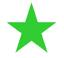
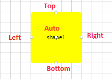
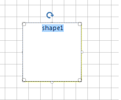
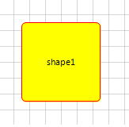
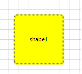

# Shapes

This tutorial will walk you through the functionality and the main features of __RadDiagramShape__.

>note Before proceeding with this topic, it is recommended to get familiar with the [visual structure]() of the __RadDiagram__ .
>

## RadDiagramShape

__RadDiagramShape__ is an object that describes the nodes of the diagram. You can configure its form using the __Shape__ property as it allows you to define a custom shape:

  


{{source=..\SamplesCS\Diagram\DiagramItems.cs region=SetAShape}} 
{{source=..\SamplesVB\Diagram\DiagramItems.vb region=SetAShape}} 

````C#
            
RadDiagramShape shape1 = new RadDiagramShape()
{
    Text = "",
    Shape = new AShape(),
    BackColor = Color.LimeGreen
};
shape1.Position = new Telerik.Windows.Diagrams.Core.Point(100, 100);
radDiagram1.AddShape(shape1);

````
````VB.NET
Dim shape1 As New RadDiagramShape() With { _
    .Text = "", _
    .Shape = New AShape(), _
    .BackColor = Color.LimeGreen _
}
shape1.Position = New Telerik.Windows.Diagrams.Core.Point(100, 100)
RadDiagram1.AddShape(shape1)

````

{{endregion}}  

{{source=..\SamplesCS\Diagram\DiagramItems.cs region=AShape}} 
{{source=..\SamplesVB\Diagram\DiagramItems.vb region=AShape}} 

````C#
    
public class AShape : ElementShape
{ 
    public override GraphicsPath CreatePath(Rectangle bounds)
    {
        GraphicsPath path = new GraphicsPath();
        path.AddString("A", new FontFamily("Arial"), 0, 122, Point.Empty, StringFormat.GenericTypographic);
        return path;
    }
}

````
````VB.NET
Public Class AShape
Inherits ElementShape
    Public Overrides Function CreatePath(bounds As Rectangle) As GraphicsPath
        Dim path As New GraphicsPath()
        path.AddString("A", New FontFamily("Arial"), 0, 122, Point.Empty, StringFormat.GenericTypographic)
        Return path
    End Function
End Class

````

{{endregion}} 


or to use one of the predefined shapes:

 

{{source=..\SamplesCS\Diagram\DiagramItems.cs region=StarShape}} 
{{source=..\SamplesVB\Diagram\DiagramItems.vb region=StarShape}} 

````C#
            
RadDiagramShape starShape = new RadDiagramShape()
{
    Text = "",
    Shape = new StarShape(),
    BackColor = Color.LimeGreen
};
starShape.Position = new Telerik.Windows.Diagrams.Core.Point(400, 100);
radDiagram1.AddShape(starShape);

````
````VB.NET
Dim starShape As New RadDiagramShape() With { _
    .Text = "", _
    .Shape = New StarShape(), _
    .BackColor = Color.LimeGreen _
}
starShape.Position = New Telerik.Windows.Diagrams.Core.Point(100, 100)
RadDiagram1.AddShape(starShape)

````

{{endregion}} 

 
## Setting the Position of a Shape

The RadDiagramShape. __Position__ property is of type __Telerik.Windows.Diagrams.Core.Point__ and it gets or sets the coordinates of the top left point of a shape. By default, its value is a Point with coordinates (0,0).
        

## Content

You can add content in the __RadDiagramShape__ using its __Text__ property. It allows you to define the content as a string.
        

## Connectors

Each __RadDiagramShape__ has 5 default connectors - Top, Right, Bottom, Left and Auto. Those are the predefined points where you can connect a __RadDiagramConnection__ to the shape.
>caption Fig.3 Connectors



* __Top__- the connector point positioned in the middle of the top border of a shape
            

* __Bottom__- the connector point positioned in the middle of the bottom border of a shape
            

* __Right__- the connector point positioned in the middle of the right border of a shape
            

* __Left__- the connector point positioned in the middle of the left border of a shape
            

* __Auto__- the connector positioned at the center of a shape. If you attach a RadDiagramConnection to this point, the connector point of the connection will dynamically change based on the shortest path to the shape.
            

All connector points of a shape can be accessed through the RadDiagramShape.__Connectors__ property. It is a collection of __RadDiagramConnector__ items. Each item represents a __RadDiagramShape__ connector and can give you information about the coordinates of each connector point, its position and if the connector is active. A connector is active when the connection tool activates it in order to prepare it to start drawing a connection.

## Common Properties

The __RadDiagramShape__ class exposes multiple properties that allow you to control the state and appearance of a shape.
        

* __Shape Bounds__

	* __Bounds__- this property is of type Rect and it gets the width, height and location of the shape's bounds.
                

	* __ActualBounds__ - this property is of type Rect and it gets the width, height and location of a rotated shape's bounds.
                

* __Shape Connections__ - you can get all incoming and outgoing connections related to the shape through the following properties:

	* __IncomingLinks__- this property is an enumeration that gets all incoming connections. It gives you information about the connections type, starting and ending points as well as the related connector positions.
                

	* __OutgoingLinks__- this property is an enumeration that gets all outgoing connections. It gives you information about the connections type, starting and ending points as well as the related connector positions.
                

* __Rotation Angle__ - __RadDiagramShape__ supports rotation. You can get or set the rotation angle of a shape using the __RotationAngle__ property.

* __Edit Mode__ - you can set the __RadDiagramShape__ in edit mode using the __IsInEditMode__ property. By default, when a shape enters edit mode, the RadDiagramShape.__Text__ is displayed inside a __TextBox__ control so that you can change its value. 
>caption Fig.4 Edit mode



* __Shape Selection State__ - the __IsSelected__ property allows you to track and control the selection state of a shape.

* __Shape ZIndex__ - you can get or set the z-order rendering behavior of the __RadDiagramShape__ through the __ZIndex__ property.

## Customize the Shape Appearance

You can easily customize the visual appearance of the __RadDiagramShape__ by using the following properties:

* __BackColor__ - gets or sets the RadDiagramShape background color.
            

* __BorderBrush__- gets or sets the brush that specifies the __RadDiagramShape__ border color if the __DrawBorder__ property is set to *true*. 

{{source=..\SamplesCS\Diagram\DiagramItems.cs region=ShapeBorder}} 
{{source=..\SamplesVB\Diagram\DiagramItems.vb region=ShapeBorder}} 

````C#
            
shape1.BorderBrush = new System.Drawing.SolidBrush(System.Drawing.Color.Red);
shape1.DrawBorder = true;

````
````VB.NET
shape1.BorderBrush = New System.Drawing.SolidBrush(System.Drawing.Color.Red)
shape1.DrawBorder = True

````

{{endregion}} 


>caption Fig.5 Shape border



* __StrokeDashArray__ - gets or sets a collection of Double values that indicate the pattern of dashes and gaps that is used to outline the __RadDiagramShape__.
            
{{source=..\SamplesCS\Diagram\DiagramItems.cs region=BorderStroke}} 
{{source=..\SamplesVB\Diagram\DiagramItems.vb region=BorderStroke}} 

````C#
            
shape.StrokeDashArray = new Telerik.WinControls.UI.Diagrams.DoubleCollection(new List<float> { 2, 2, 2, 2 });

````
````VB.NET
        
shape.StrokeDashArray = New Telerik.WinControls.UI.Diagrams.DoubleCollection(New List(Of Single)() From { _
    2, _
    2, _
    2, _
    2 _
})

````

{{endregion}} 

>caption Fig.6 StrokeDashArray



* __StrokeThickness__- gets or sets the width of the __RadDiagramShape__ outline.
            
>caption Fig.7 StrokeThickness


# See Also
 
* [ContainerShapes]()	
* [Connections]()	 