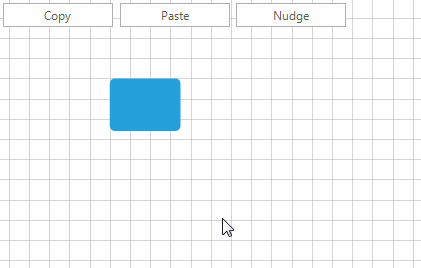

# Commands
 
__RadDiagram__ provides a powerful set of __RoutedUICommands__ that help you work with your __RadDiagram__ and its items easily and build better MVVM applications.

## RadDiagram Commands

The static __DiagramCommands__ class defines the following __RoutedUICommands__:

* __Align__- Aligns the selected shapes.
            

* __Snap__- Snaps the selected shapes.
            

* __Layout__- Organizes the diagram automatically.
            

* __Copy__- Copies selected diagram items.
            

* __Paste__- Pastes selected diagram items.
            

* __Delete__- Deletes selected diagram items.
            

* __Cut__- Cut selected diagram items.
            

* __Duplicate__- Duplicates selected item/s.
            

* __Undo__- Undoes the last action.
            

* __Redo__- Redoes the last action.
            

* __BringToFront__- Brings to front selected diagram items.
            

* __BringForward__- Brings forward selected diagram items.
            

* __SendToBack__- Sends to back selected diagram items.
            

* __SendBackward__- Sends backward selected diagram items.
            

* __Clear__- Clears the diagram.
            

* __BeginEdit__- Begins editing diagram item.
            

* __CommitEdit__- Commits the edited changes.
            

* __CancelEdit__- Cancels the edited changes.
            

* __SelectAll__- Selects all shapes in the diagram.
            

* __Nudge__- Moves selected item/s in a specific direction. You can pass more specifics about the nudge operation through the __CommandParameter__. This parameter can be a single string representing the direction of the nudge:

	* __Left__

	* __Right__

	* __Up__

	* __Down__ - it can also be a string in the form of __"direction; amount"__, the __'direction'__ being a value from the above list of direction strings. The __'amount'__  options are:
               

		* __Small__ - if the RadDiagram.__IsSnapToGridEnabled__ property is set to *true* then this amount would mean that the nudge should happen once to the appointed direction using the SnapX/Y value as a step. The snap settings can be applied in the __RadDiagram__ definition. If the RadDiagram.__IsSnapToGridEnabled__ property is *false*, a *"Small"* amount indicates a step of 5 pixels;
                

		* __Large__ - if the RadDiagram.__IsSnapToGridEnabled__ property is set to *true* then this amount would mean that the nudge should happen once to the appointed direction using 5*SnapX/Y value as a step. The snap settings can be applied in the __RadDiagram__ definition. If the RadDiagram.__IsSnapToGridEnabled__ property is *false*, a *"Large"* amount indicates a step of 10 pixels;
                

		* __any number__ - if you provide a number in the __CommandParameter__, this number would indicate the number of pixels to be used as a step for the Nudge command.
                

* __Group__- Groups the selected items.
            

* __Ungroup__- Ungroups the selected groups.
            

## Using Diagram Commands

Below is shown a sample code snippet how you can use some of the Diagram Commands in an application by using the DiagramElement.__TryExecuteCommand__ method: 

{{source=..\SamplesCS\Diagram\DiagramItemsManipulation.cs region=CommandsExample}} 
{{source=..\SamplesVB\Diagram\DiagramItemsManipulation.vb region=CommandsExample}} 

````C#
        
private void radButton1_Click(object sender, EventArgs e)
{
    this.radDiagram1.DiagramElement.TryExecuteCommand(Telerik.WinControls.UI.Diagrams.DiagramCommands.Copy);
}
        
private void radButton2_Click(object sender, EventArgs e)
{
    this.radDiagram1.DiagramElement.TryExecuteCommand(Telerik.WinControls.UI.Diagrams.DiagramCommands.Paste);
}
private void radButton3_Click(object sender, EventArgs e)
{
    this.radDiagram1.DiagramElement.TryExecuteCommand(Telerik.WinControls.UI.Diagrams.DiagramCommands.Nudge, "Left");
}

````
````VB.NET
Private Sub RadButton1_Click(sender As Object, e As EventArgs) Handles RadButton1.Click
    Me.RadDiagram1.DiagramElement.TryExecuteCommand(Telerik.WinControls.UI.Diagrams.DiagramCommands.Copy)
End Sub
Private Sub RadButton2_Click(sender As Object, e As EventArgs) Handles RadButton2.Click
    Me.RadDiagram1.DiagramElement.TryExecuteCommand(Telerik.WinControls.UI.Diagrams.DiagramCommands.Paste)
End Sub
Private Sub RadButton3_Click(sender As Object, e As EventArgs) Handles RadButton3.Click
    Me.RadDiagram1.DiagramElement.TryExecuteCommand(Telerik.WinControls.UI.Diagrams.DiagramCommands.Nudge, "Left")
End Sub

````

{{endregion}} 



