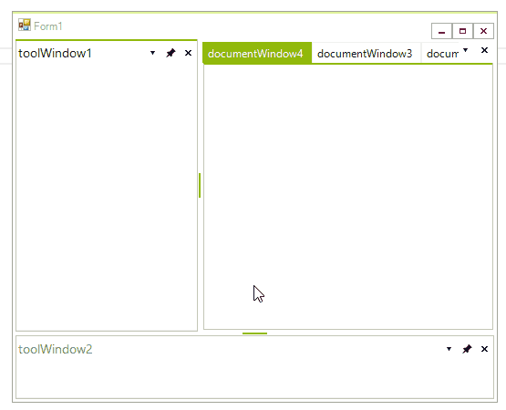
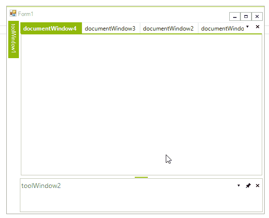

# Auto-Hiding Windows

## Auto-Hide a DockPanel

Un-pin the __ToolWindow__ by clicking the pushpin icon in the title bar. This will cause the __ToolWindow__ to auto-hide at the edge of the __RadDock__.

## Showing and Pinning a Hidden DockPanel

Hover the mouse over the tab at the edge of the __RadDock__ that displays the __ToolWindow__ title. This will cause the __ToolWindow__ to slide out over the other panels. As long as the mouse cursor is over the tab or the panel itself, the panel will stay visible. Moving the mouse away from the tab and panel will cause the panel to collapse again to its un-pinned state. To dock the panel, click the **Pin** button to pin the panel in place.

 
## Understanding AutoHidePosition

When you unpin a **ToolTabStrip** with **ToolWindows**, these windows will collapse against a specific side - Left, Top, Right or Bottom. By default, when you dock a **ToolWindow** in **RadDock**, the **ToolTabStrip** container of this **ToolWindow** has its __AutoHidePosition__ set to *Auto*. The side to which a **ToolWindow** will collapse depends on the docked position of the **ToolTabStrip** in relation to the main **DocumentContainer**. Let's put it simple:

* If you dock a [ToolWindow to the left](), this window will collapse to the left when it is in auto-hidden mode. 
            

* If you dock a [ToolWindow giving another ToolWindow as a target](), let's say **WindowBottomRight** to **WindowBottom**, **WindowBottomRight** window will collapse to bottom, because the target **ToolWindow** (WindowBottom) is docked to Bottom in __RadDock__.

However, this is just the default behavior. If you set the __AutoHidePosition__ to a specific value, the **ToolWindow** will not collapse against its default side, but it will collapse against the direction you have specified. For example, by default a **ToolWindow** may collapse to Bottom, but if you set the __AutoHidePosition__ of the **ToolTabStrip** container to Top, this **ToolWindow** will collapse to the Top. An example is available here: ([Building an advanced layout at runtime]())
 
## Setting the Size of auto-hidden windows

When a **ToolWindow** is auto-hidden, it has a default size of (200, 200). However, if you initially set a different size by the __AutoHideSize__ property, your **ToolWindow** will have a different size when it goes in auto-hidden mode. If a **ToolWindow** is auto-hidden to top, bottom, the **Height** of this size will be taken into consideration. If a **ToolWindow** is auto-hidden to left, right, the width of this size will be taken into consideration. If the user resizes an auto-hidden window, the __AutoHideSize__ property will have a new value and the programmatically set value will be lost. 
 
>note RadDock memorizes the size of an Auto-hide window set by the user at run time. I.e. when a user sets a ToolWindow to Auto-hide, then re-sizes the Auto-hide window by a mouse drag and drop operation, then docks and then sets the ToolWindow back to Auto-hide, the new Auto-hide window will have the size set by the user's mouse drag and drop operation.
>

# See Also

* [Getting Started]()
* [Using the CommandManager]()     
* [Using the ContextMenuService]()
* [Using the DragDropService]() 
* [Document Manager]()   
* [Understanding RadDock]()

