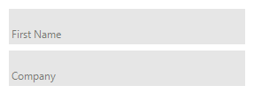

# Properties

|__Property__|__Description__|
|---|---|
|__ListElement__| Gets the auto-complete list element.|
|__UseSystemPasswordChar__|Gets or sets a value indicating whether the text in view should appear as the default password character.|
|__PasswordChar__|Gets or sets the character used to mask characters of a password in a single-line|
|__HideSelection__|Gets or sets a value indicating whether the selected text in the text box control remains highlighted when the element loses focus.|
|__CaretIndex__|Gets or sets the caret position.|
|__SelectionLength__| Gets or sets the number of characters selected in the text box.|
|__TextLength__|The length of the text.|
|__MaxLength__|Gets or sets the maximum number of characters the user can type or paste into the text box element.|
|__Text__|Gets or sets the current text in the text box element.|
|__NullText__|Gets or sets the prompt text that is displayed when the text box contains no text.|
|__NullTextColor__|Gets or sets the color of the null text.|
|__TextAlign__|Gets or sets how the text is horizontally aligned in the element.|
|__Lines__|Gives access to the lines collection|
|__SelectedText__|Gets or sets a value indicating the currently selected text in the text box.|
|__AcceptsTab__|Gets or sets a value indicating whether pressing the TAB key in a multiline text box element types a TAB character in the element instead of moving the focus to the next element in the tab order.|
|__AcceptsReturn__|Gets or sets a value indicating whether pressing ENTER in a multiline TextBox control creates a new line of text in the control or activates the default button for the form.|
|__Multiline__|Gets or sets a value indicating whether this is a multiline text box.|
|__WordWrap__|Indicates whether a multiline text box control automatically wraps words to the beginning of the next line when necessary.|
|__SelectionColor__|Gets or sets the color of the selection.|
|__SelectionOpacity__|Gets or sets the selection opacity.|
|__IsReadOnly__|Gets or sets a value indicating whether text in the text box is read-only.|
|__IsReadOnlyCaretVisible__|Gets or sets a value indicating whether the caret is visible in read only mode.|
|**ShowClearButton**|Gets or sets a value indicating whether the clear button is shown.|
|**ShowNullText**|Gets or sets a value indicating whether the null text will be shown when the control is focused and the text is empty.|
|**ShowEmbeddedLabel**|Gets or sets a value indicating whether the embedded label is shown. It is recommended to set AutoSize to true, when using the embedded label.|
|**EmbeddedLabelText**|Gets or sets the text of the embedded label.|

## ShowClearButton

Since R1 2017 **RadTextBoxControl** can show a clear button when there is some text in the editor. This is controlled by the **ShowClearButton** property.


## NullText

__RadTextBoxControl__ has a **NullText** property that is not shared by the standard Windows Forms text box. This property specifies what text to be displayed when the control has no __Text__ value. By default, when the control receives  focus, this text is automatically removed. This behavior can be controlled by the **ShowNullText** property. If it is set to *true* the **NullText** will be shown even when the text box is focused until you enter some text in the editor.

## Embedded Labels

Since R2 2021 **RadTextBoxControl** supports embedded labels. The embedded label shows a text in the text box field usually to indicate what text should the user enter in the text box. When **RadTextBoxControl** gets focus the embedded label will go up, so the user can type in the text box field. The **ShowEmbeddedLabel** property controls whether the embedded label is shown. You can set the desired text by using the **EmbeddedLabelText** property.

#### Example 1: Setting the embedded label

{{source=..\SamplesCS\Editors\TextBoxControl.cs region=EmbeddedLabels}} 
{{source=..\SamplesVB\Editors\TextBoxControl.vb region=EmbeddedLabels}} 

````C#
this.radTextBoxControl1.ShowEmbeddedLabel = true;
this.radTextBoxControl1.AutoSize = true;
this.radTextBoxControl1.EmbeddedLabelText = "First Name";        

````
````VB.NET
Me.RadTextBoxControl1.ShowEmbeddedLabel = True
Me.RadTextBoxControl1.AutoSize = True
Me.RadTextBoxControl1.EmbeddedLabelText = "First Name"

````

{{endregion}} 



>note In order the embedded label to be shown correctly it is neccessary to autosize the **RadTextBoxControl** by setting **AutoSize=true** or set an appropriate height.

**RadTextBoxControlElement** exposes the following useful properties related to embedded labels. You can access them through the **TextBoxElement** property:

* **EmbeddedLabel** - Gets an instance of the corresponding embedded label. 
* **RepositionEmbeddedLabel** - Gets or set a value to indicate whether to reposition the embedded label, when text box is empty.
* **EmbeddedLabelAnimationSpeed** - Gets or set the animation speed of the embedded label.
The speed is an integer between 1 and 10 (slowest) with default value 8.

>note As of R2 2021 the default **Height** for **RadTextBoxControl** is changed to 22px.

# Events

|__Event__|__Description__|
|---|---|
|__SelectionChanging__|Occurs when text selection is changing.|
|__SelectionChanged__|Occurs when text selection is changed.|
|__TextChanging__|Occurs when the text is changing.|
|__TextBlockFormatting__|Use this event to change the styles of the words.|
|__CreateTextBlock__|Occurs when an instance of ITextBlock instance is created.|
|__ContextMenuOpening__|Occurs before the default context menu is opened.|
 
# See Also

* [AutoComplete]()
* [Caret positioning and selection]()
* [Creating custom blocks]()
* [Structure]()
* [Properties and Events]()
* [Text editing]()