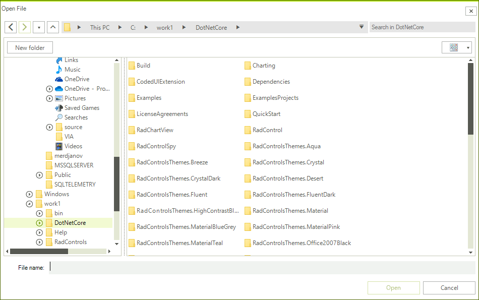
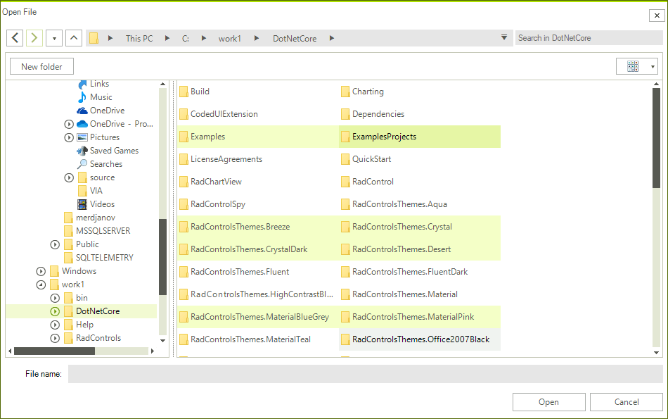
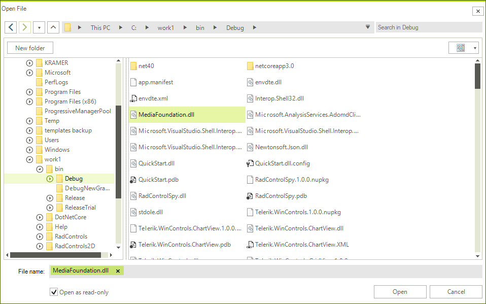

#  RadOpenFileDialog

**RadOpenFileDialog** is a modal dialog box that allows you to specify one or multiple file names to open.

>caption Figure 1: RadOpenFileDialog in single selection mode

 

## Showing the Dialog

To show the dialog call its **ShowDialog** method. If a valid file is opened when you press OK, the **DialogResult** property will return OK and the **FileName**, and **FileNames** properties will be set. You can use **FileName** and **FileNames** to get the names of the selected items.

>important Note that when the **ShowDialog** method is called the UI of the host application will freeze until the dialog closes.


####  Example 1: Show an open file dialog 

````C#

RadOpenFileDialog openFileDialog = new RadOpenFileDialog(); 
DialogResult dr = openFileDialog.ShowDialog(); 
if (dr == System.Windows.Forms.DialogResult.OK) 
{ 
    string fileName = openFileDialog.FileName; 
}

````
````VB.NET

Dim openFileDialog As RadOpenFileDialog = New RadOpenFileDialog()
Dim dr As DialogResult = openFileDialog.ShowDialog()

If dr = System.Windows.Forms.DialogResult.OK Then
     Dim fileName As String = openFileDialog.FileName
End If

````

## Opening the Selected File

You can open a read-only file stream for the selected file using the OpenFile method. Or alternatively you can use the **FileName** and **FileNames** properties and open the file manually.

####  Example 2: Open a file stream 

````C# 

RadOpenFileDialog openFileDialog = new RadOpenFileDialog(); 
DialogResult dr = openFileDialog.ShowDialog(); 
if (dr == System.Windows.Forms.DialogResult.OK) 
{ 
     Stream fileStream = openFileDialog.OpenFile(); 
}

````
````VB.NET

Dim openFileDialog As RadOpenFileDialog = New RadOpenFileDialog()
Dim dr As DialogResult = openFileDialog.ShowDialog()

If dr = System.Windows.Forms.DialogResult.OK Then
   Dim fileStream As Stream = openFileDialog.OpenFile()
End If

````

## Enabling Multiple Selection

The dialog supports single and multiple selection modes. By default, you can select only one file at a time. To alter this you can set the **Multiselect** property of **RadOpenFileDialog** to *True*.

####  Example 3: Enable multiple selection 

````C# 

RadOpenFileDialog openFileDialog = new RadOpenFileDialog();
openFileDialog.MultiSelect  = true;

````
````VB.NET

Dim openFileDialog As RadOpenFileDialog = New RadOpenFileDialog()
openFileDialog.MultiSelect  = True

````

>caption Figure 2: Multiple selection 

 

## Working with the Selected Files

You can get the paths of the selected files via the **FileName** and **FileNames** properties. Note that the properties are empty until the **DialogResult** is valid. When you open file(s) the properties will return the corresponding paths.

You can get only the name of the selected files, without the full path, via the **SafeFileNames** collection property.


####  Example 4: Get the selected file names

````C# 

RadOpenFileDialog openFileDialog = new RadOpenFileDialog();
openFileDialog.MultiSelect = true;
DialogResult dr = openFileDialog.ShowDialog();
if (dr == System.Windows.Forms.DialogResult.OK)
{
    string filePath = openFileDialog.FileName;
    IEnumerable<string> filePaths = openFileDialog.FileNames;
    IEnumerable<string> fileNames = openFileDialog.SafeFileNames;
}


````
````VB.NET

Dim openFileDialog As RadOpenFileDialog = New RadOpenFileDialog()
openFileDialog.MultiSelect = True
Dim dr As DialogResult = openFileDialog.ShowDialog()

If dr = System.Windows.Forms.DialogResult.OK Then
   Dim filePath As String = openFileDialog.FileName
   Dim filePaths As IEnumerable(Of String) = openFileDialog.FileNames
   Dim fileNames As IEnumerable(Of String) = openFileDialog.SafeFileNames
End If

````

The **FileName** property can be set manually. This will change the value displayed in the selected file auto-complete box area. Note that setting this won't change the selected item in the list with the files.

## Saving the Last Used Directory

You can save the last used directory by setting the **RestoreDirectory** property of the **RadOpenFileDialog**. After setting this property to *True* and opening a file the **InitialDirectory** of this **RadOpenFileDialog** instance will be set to the parent folder of the opened file.

####  Example 5: Set RestoreDirectory property

````C# 

RadOpenFileDialog openFileDialog = new RadOpenFileDialog();
openFileDialog.RestoreDirectory = true;

````
````VB.NET

Dim openFileDialog As RadOpenFileDialog = New RadOpenFileDialog()
openFileDialog.RestoreDirectory = True

````

## Enabling ReadOnly CheckBox

You can display a checkbox to control whether the file should be opened in readonly mode with the **ShowReadOnly** property of the **RadOpenFileDialog**. You can control the state of that checkbox by using the **ReadOnlyChecked** property of the **RadOpenFileDialog**.

####  Example 6: Enabling the ReadOnly CheckBox

````C# 

RadOpenFileDialog openFileDialog = new RadOpenFileDialog();
openFileDialog.ShowReadOnly = true;
openFileDialog.ReadOnlyChecked = true;
DialogResult dr = openFileDialog.ShowDialog();

````
````VB.NET

Dim openFileDialog As RadOpenFileDialog = New RadOpenFileDialog()
openFileDialog.ShowReadOnly = True
openFileDialog.ReadOnlyChecked = True
Dim dr As DialogResult = openFileDialog.ShowDialog()

````

>caption Figure 3: RadOpenFileDialog with Checked ReadOnly CheckBox

 

## DereferenceLinks

**RadOpenFileDialog** exposes a **DereferenceLinks** property indicating whether a file dialog returns the location of the file referenced by a shortcut or the location of the actual shortcut file (with the .lnk extension).

####  Example 7: Using the DereferenceLinks property

````C# 

RadOpenFileDialog openFileDialog = new RadOpenFileDialog();
openFileDialog.DereferenceLinks = true; 
DialogResult dr = openFileDialog.ShowDialog();
if (dr == System.Windows.Forms.DialogResult.OK)
{
    string filePath = openFileDialog.FileName;
    // If the selected file was C:\Users\<user>\Desktop\Shortcut.lnk, for example, 
    // the FileName property will now contain the actual location of the file, 
    // for example - C:\Program Files\Program\Shortcut.exe. 
}


````
````VB.NET

    Dim openFileDialog As RadOpenFileDialog = New RadOpenFileDialog()
    openFileDialog.DereferenceLinks = True
    Dim dr As DialogResult = openFileDialog.ShowDialog()

    If dr = System.Windows.Forms.DialogResult.OK Then
        Dim filePath As String = openFileDialog.FileName
    End If

````

>important If in multiple or single selection the first selected item is a link to a directory and **DereferenceLinks** is set to *True*, clicking the `Open` button will actually navigate to this directory.

# See Also

* [Error Handling]()
* [Explorer Control]()
* [RadOpenFolderDialog]()
* [RadSaveFileDialog]()