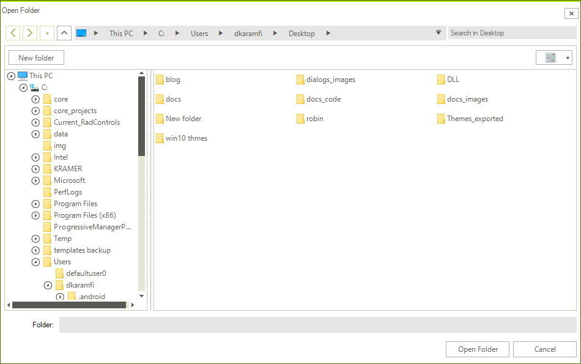
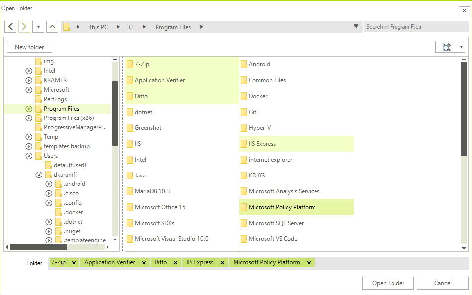

#  RadOpenFolderDialog

**RadOpenFolderDialog** is a modal dialog box that allows you to specify one or multiple folder names to open.

>caption Figure 1: RadOpenFolderDialog in single selection mode

 

## Showing the Dialog

To show the dialog call its **ShowDialog** method. If a valid folder is opened when you press `OK`, the **DialogResult** property will return OK and the **FileName**, and **FileNames** properties will be set. You can use **FileName** and **FileNames** to get the names of the selected folders.

>important Note that when the **ShowDialog** method is called the UI of the host application will freeze until the dialog closes.

####  Example 1: Show a open folder dialog 

````C#

RadOpenFolderDialog openFolderDialog = new RadOpenFolderDialog();
DialogResult dr = openFolderDialog.ShowDialog();
if (dr == System.Windows.Forms.DialogResult.OK)
{
    string folderName = openFolderDialog.FileName; 
}


````
````VB.NET

Dim openFolderDialog As RadOpenFolderDialog = New RadOpenFolderDialog()
Dim dr As DialogResult = openFolderDialog.ShowDialog()

If dr = System.Windows.Forms.DialogResult.OK Then
   Dim folderName As String = openFolderDialog.FileName
End If

````

## Enabling Multiple Selection

The dialog supports single and multiple selection modes. By default, you can select only one folder at a time. To alter this you can set the **Multiselect** property of **RadOpenFolderDialog** to *True*.

####  Example 2: Multiple selection

````C#

RadOpenFolderDialog openFolderDialog = new RadOpenFolderDialog();
openFolderDialog.Multiselect = true;

````
````VB.NET

Dim openFolderDialog As RadOpenFolderDialog = New RadOpenFolderDialog()
openFolderDialog.Multiselect = True

````

>caption Figure 2: Multiple selection

 

## Working with the Selected Folders

You can get the paths of the selected folders via the **FileName** and **FileNames** properties. Note that the properties are empty until the **DialogResult** is valid. When you open folder(s) the properties will return the corresponding directory paths.

You can get only the name of the selected folders, without the full path, via the **SafeFileNames** collection property.

####  Example 3: Get the selected folder names

````C#

RadOpenFolderDialog openFolderDialog = new RadOpenFolderDialog();
openFolderDialog.Multiselect = true;
DialogResult dr = openFolderDialog.ShowDialog();
if (dr == System.Windows.Forms.DialogResult.OK)
{
    string folderPath = openFolderDialog.FileName; 
    IEnumerable<string> folderPaths = openFolderDialog.FileNames; 
    IEnumerable<string> folderNames = openFolderDialog.SafeFileNames; 
}


````
````VB.NET

Dim openFolderDialog As RadOpenFolderDialog = New RadOpenFolderDialog()
openFolderDialog.Multiselect = True
Dim dr As DialogResult = openFolderDialog.ShowDialog()

If dr = System.Windows.Forms.DialogResult.OK Then
   Dim folderPath As String = openFolderDialog.FileName
   Dim folderPaths As IEnumerable(Of String) = openFolderDialog.FileNames
   Dim folderNames As IEnumerable(Of String) = openFolderDialog.SafeFileNames
End If

````

## Saving the Last Used Directory

You can save the last used directory by setting the **RestoreDirectory** property of the **RadOpenFolderDialog**. 

####  Example 4: Set RestoreDirectory property

````C#

RadOpenFolderDialog openFolderDialog = new RadOpenFolderDialog();
openFolderDialog.RestoreDirectory = true; 

````
````VB.NET

Dim openFolderDialog As RadOpenFolderDialog = New RadOpenFolderDialog()
openFolderDialog.RestoreDirectory = True

````

After setting this property to *True* and opening a folder the **InitialDirectory** of this **RadOpenFolderDialog** instance will be set to the parent of the opened folder.

# See Also

* [Error Handling]()
* [Explorer Control]()
* [RadOpenFileDialog]()
* [RadSaveFileDialog]()