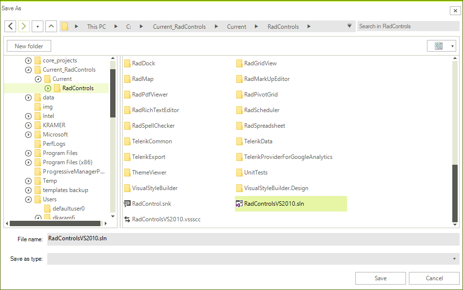
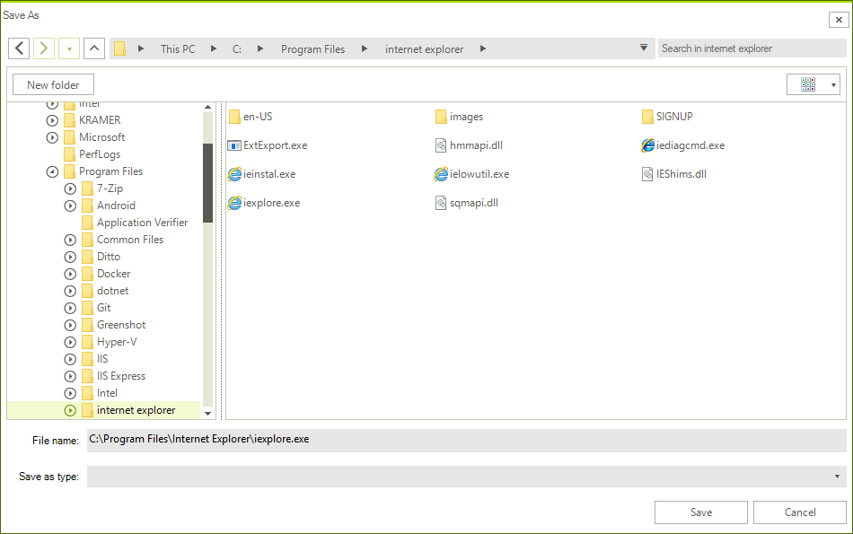

#  RadSaveFileDialog

**RadSaveFileDialog** is a modal dialog box that allows you to specify a file name to save.

>caption Figure 1: RadSaveFileDialog

 

## Showing the dialog

To show the dialog call its **ShowDialog** method. If a valid file is selected when you press `OK`, the **DialogResult** property will return OK and the **FileName** property will be set. You can use **FileName** to get the name of the selected file.

>important Note that when the **ShowDialog** method is called the UI of the host application will freeze until the dialog closes.


####  Example 1: Show a save file dialog

````C#

RadSaveFileDialog saveFileDialog = new RadSaveFileDialog();
DialogResult dr = saveFileDialog.ShowDialog();
if (dr == System.Windows.Forms.DialogResult.OK)
{
    string selectedFileName = saveFileDialog.FileName;
}

````
````VB.NET

Dim saveFileDialog As RadSaveFileDialog = New RadSaveFileDialog()
Dim dr As DialogResult = saveFileDialog.ShowDialog()

If dr = System.Windows.Forms.DialogResult.OK Then
   Dim selectedFileName As String = saveFileDialog.FileName
End If

````

## Creating a stream for the selected file

You can open a read-write file stream for the selected file using the **OpenFile** method. Or alternatively you can use the **FileName** property and open the file manually.

####  Example 2: Open a file stream

````C#

RadSaveFileDialog saveFileDialog = new RadSaveFileDialog(); 
DialogResult dr = saveFileDialog.ShowDialog();
if (dr == System.Windows.Forms.DialogResult.OK)
{
    Stream fileStream = saveFileDialog.OpenFile(); 
}

````
````VB.NET

Dim saveFileDialog As RadSaveFileDialog = New RadSaveFileDialog()
Dim dr As DialogResult = saveFileDialog.ShowDialog()
If dr = System.Windows.Forms.DialogResult.OK Then
    Dim fileStream As Stream = saveFileDialog.OpenFile()
End If

````

## Working with the selected file

You can get the path of the selected file via the **FileName** property (see Example 1). Note that the property is empty until the **DialogResult** is valid. When the dialog closes and if **DialogResult** is OK the property will return the corresponding file path.

The **FileName** property can be set manually. This will change the value displayed in the selected file autocomplete box area. Note that setting this won't change the selected item in the list with the files.

####  Example 3: Set the file name 

````C#
RadSaveFileDialog saveFileDialog = new RadSaveFileDialog();
saveFileDialog.InitialDirectory = @"C:\Program Files\Internet Explorer\";
saveFileDialog.FileName = @"C:\Program Files\Internet Explorer\iexplore.exe";
DialogResult dr = saveFileDialog.ShowDialog();

````
````VB.NET

Dim saveFileDialog As RadSaveFileDialog = New RadSaveFileDialog()
saveFileDialog.InitialDirectory = "C:\Program Files\Internet Explorer\"
saveFileDialog.FileName = "C:\Program Files\Internet Explorer\iexplore.exe"
Dim dr As DialogResult = saveFileDialog.ShowDialog()

````


>caption Figure 2: Setting the file name



# See Also

* [Error Handling]()
* [Explorer Control]()
* [RadOpenFileDialog]()
* [RadOpenFolderDialog]()