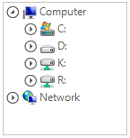

# Events

This article lists the events specific to all of the **RadFileDialog** controls.

* **OpenFileDialogForm.FormClosing**: This event occurs when the dialog is closing. The event arguments are of type **FormClosingEventArgs**. You can use the arguments to cancel the event.

####  Example 1: Cancel dialog closing

````C#
        private void OpenFileDialogForm_FormClosing(object sender, FormClosingEventArgs e)
        {
            e.Cancel = true;
        }


````
````VB.NET

Private Sub OpenFileDialogForm_FormClosing(ByVal sender As Object, ByVal e As FormClosingEventArgs)
    e.Cancel = True
End Sub

````

* **OpenFileDialogForm.FormClosed**: This event occurs when the dialog is closed. The event arguments are of type **FormClosedEventArgs**.

* **ExceptionRaised**: This event occurs when an exception is raised. This event could be raised in different occasions, for example - if the selected folder cannot be accessed or if the file path is too long, or when there is an error while searching, etc.

####  Example 2: Showing an alert when an error appears

````C#

        private void openFileDialog_ExceptionRaised(object sender, FileBrowserExceptionRaisedEventArgs e)
        {
            MessageBox.Show(e.Exception.Message);
        }

````
````VB.NET

Private Sub openFileDialog_ExceptionRaised(ByVal sender As Object, ByVal e As FileBrowserExceptionRaisedEventArgs)
    MessageBox.Show(e.Exception.Message)
End Sub

````

* **DirectoryRequesting**: This event can be used to filter the navigation **RadTreeView**. The following example demonstrates how you can filter out the "D:\" and "K:\" directories:

####  Example 3: Filtering the D and K directories

````C#

        private void openFileDialog_DirectoryRequesting(object sender, DirectoryRequestingEventArgs e)
        {
            if (e.Directory.FullName.StartsWith(@"D:\") || e.Directory.FullName.StartsWith(@"K:\"))
            {
                e.Cancel = true;
            }
        }
           
````
````VB.NET

Private Sub openFileDialog_DirectoryRequesting(ByVal sender As Object, ByVal e As DirectoryRequestingEventArgs)
    If e.Directory.FullName.StartsWith("D:\") OrElse e.Directory.FullName.StartsWith("K:\") Then
        e.Cancel = True
    End If
End Sub

````

>note If the **InitialDirectory** of the **RadFileDialog** is filtered out as in Example 3, the current directory on load will be the default one.
>

>caption Figure 1:  Unfiltered Directories

 

>caption Figure 2: Filtered Directories Based on Example 3  

 

* **OpenFileDialogForm.DirectoryNavigating**: As of R1 2020 SP1, **RadFileDialogs** offer the **DirectoryNavigating** event. It occurs when the current folder is about to change. In the **DirectoryNavigatingEventArgs** you have access to the new directory path to be navigated via the **DirectoryPath** property. This event can be canceled. Hence, if the end-user doesn't have permissions for a specific folder, set the Cancel argument to *true*.

####  Example 4: Cancel navigating to a specific directory

````C#

private void OpenFileDialog_DirectoryNavigating(object sender, Telerik.WinControls.FileDialogs.DirectoryNavigatingEventArgs e)
{
    if (e.DirectoryPath == @"C:\Program Files")
    {
        e.Cancel = true;
    }
}       
           
````
````VB.NET

Private Sub OpenFileDialog_DirectoryNavigating(ByVal sender As Object, ByVal e As Telerik.WinControls.FileDialogs.DirectoryNavigatingEventArgs)
    If e.DirectoryPath = "C:\Program Files" Then
        e.Cancel = True
    End If
End Sub

````

# See Also

* [Network Locations]()
* [Filterng]() 
* [Error Handling]()
* [Explorer Control]()
* [RadOpenFileDialog]()
* [RadOpenFolderDialog]()
* [RadSaveFileDialog]()