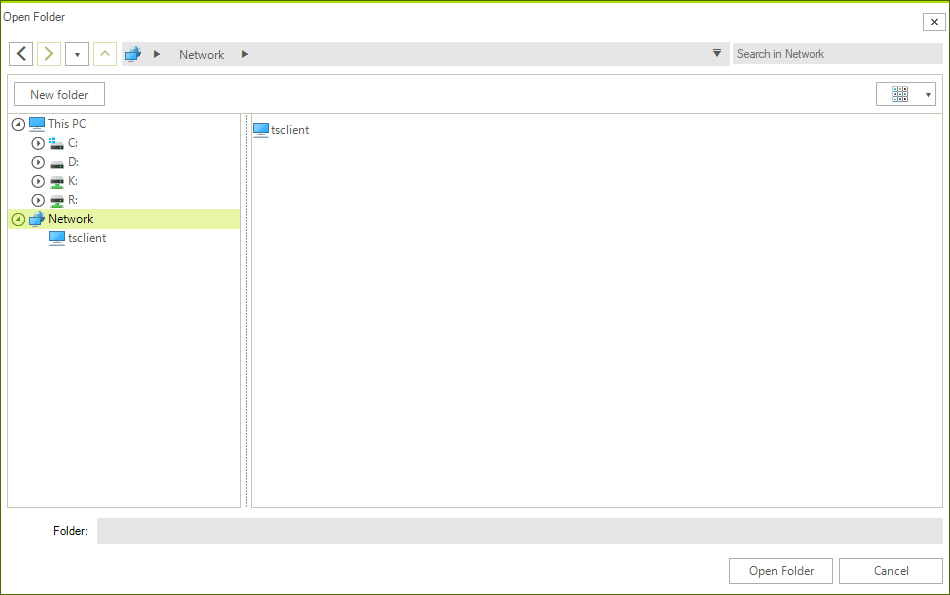

# Network Locations

**RadFileDialogs** as well as the **ExplorerControl** provide out of the box support for Network Locations.

## Enabling Network Locations

In order for the **RadFileDialogs** and **ExplorerControl** to show the Network drive and all of the available network locations, you can set the **ShowNetworkLocations** property to *True*. This is demonstrated in Example 1.

####  Example 1: Showing Network Locations in RadOpenFileDialog

````C#
RadOpenFileDialog openFileDialog = new RadOpenFileDialog();
openFileDialog.ShowNetworkLocations = true;
openFileDialog.ShowDialog();


````
````VB.NET
Dim openFileDialog As RadOpenFileDialog = New RadOpenFileDialog()
openFileDialog.ShowNetworkLocations = True
openFileDialog.ShowDialog()

````

>caption Figure 1:  Result from Example 1 

 

>note **ShowNetworkLocations** does not support run-time change.

## Specifics of Network Nodes

Network nodes differ from normal nodes in some aspects which are described below:

* Network PC nodes as well as network shared folders are not editable. Normal folders which are children of shared folders, on the other hand, are editable.

* Network PC nodes and their shared folders are not draggable as opposed to the normal nodes/folders.

* The context menu for the network nodes differs from the one for normal nodes.

* The New Folder button is available in shared folders, however it is not available in network pc nodes.

## Accessing Network Nodes

Network nodes can be accessed either though the Path Navigation Pane by typing "\\" followed by the name of the network node, or by setting the **InitialDirectory** of the dialog or **CurrentDirectoryPath** of the **ExplorerControl** to a valid node path.

## Opening Server Nodes

The **RadFileDialogs** as well as the **ExplorerControl** also support creating nodes based on a valid server path. They can be opened by typing "\\" followed by the name of the server in the Path Navigation Pane, or by setting the **InitialDirectory** of the dialog or **CurrentDirectoryPath** of the **ExplorerControl** to a valid server path. An example of a valid server path is "*\\localhost*".
