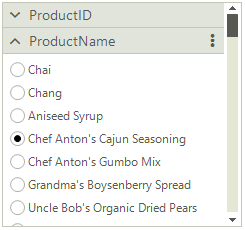

# Changing Default Editors

**RadFilterView** is build of different filter view group elements. The control uses a **FilterViewCategoriesFactory** that creates the necessary category element considering the property data type:

* **FilterViewNumericCategoryElement**: used for numeric types. It generates two RadSpinEditorElements allowing you to specify a range of numeric values. A RadTrackBarElement is also created providing a different user experience for defining a numberic range. 
* **FilterViewDateTimeCategoryElement**: used for DateTime properties. It generates two RadDateTimePickerElements allowing you to specify a date range. 
* **FilterViewBooleanCategoryElement**: used for boolean fields. Two RadCheckBoxElements are created allowing you to easily filter by True/False values. 
* **FilterViewTextCategoryElement**: default category element. It generates a set of check boxes for each string value. 

**RadFilterView** offers a convenient API for customizing the automatically generated editor elements for a certain group. The default category element can be customized either by utilizing the **FilterViewCategoriesFactory** or by handling the **CategoryCreating** event.  

## Using the CategoryCreating Event

For the boolean fields in the applied DataSource, **RadFilterView** generates a **FilterViewBooleanCategoryElement**. It contains a group of two check boxes, true/false:


The **CategoryCreating** event gives you the possibility to replace the default **FilterViewBooleanCategoryElement** with another one, e.g. **FilterViewTextCategoryElement** with radio buttons:

{{source=..\SamplesCS\FilterView\FilterViewGettingStarted.cs region=ReplaceCategory}} 
{{source=..\SamplesVB\FilterView\FilterViewGettingStarted.vb region=ReplaceCategory}} 

````C#

private void RadFilterView_CategoryCreating(object sender, FilterViewCategoryCreatingEventArgs e)
{
    if (e.Category.PropertyName == "Discontinued")
    {
        FilterViewTextCategoryElement textCategory = new FilterViewTextCategoryElement();
        textCategory.PropertyName = e.Category.PropertyName;
        textCategory.ItemType = FilterViewTextCategoryItemType.RadioButton;
        e.Category = textCategory;
    }
}

````
````VB.NET

Private Sub RadFilterView_CategoryCreating(ByVal sender As Object, ByVal e As FilterViewCategoryCreatingEventArgs)
    If e.Category.PropertyName = "Discontinued" Then
        Dim textCategory As FilterViewTextCategoryElement = New FilterViewTextCategoryElement()
        textCategory.PropertyName = e.Category.PropertyName
        textCategory.ItemType = FilterViewTextCategoryItemType.RadioButton
        e.Category = textCategory
    End If
End Sub

````

{{endregion}}   


By default, the **FilterViewTextCategoryElement** auto-generates a set of check boxes for each string value. You can switch to creating a set of radio buttons and thus allowing only a single text value to be selected:

{{source=..\SamplesCS\FilterView\FilterViewGettingStarted.cs region=SwitchToRadioButtons}} 
{{source=..\SamplesVB\FilterView\FilterViewGettingStarted.vb region=SwitchToRadioButtons}} 

````C#

private void RadFilterView1_CategoryCreating(object sender, FilterViewCategoryCreatingEventArgs e)
{
    if (e.Category.PropertyName == "ProductName")
    {
        FilterViewTextCategoryElement textCategory = e.Category as FilterViewTextCategoryElement; 
        textCategory.ItemType = FilterViewTextCategoryItemType.RadioButton; 
    }
}

````
````VB.NET

Private Sub RadFilterView1_CategoryCreating(ByVal sender As Object, ByVal e As FilterViewCategoryCreatingEventArgs)
    If e.Category.PropertyName = "ProductName" Then
        Dim textCategory As FilterViewTextCategoryElement = TryCast(e.Category, FilterViewTextCategoryElement)
        textCategory.ItemType = FilterViewTextCategoryItemType.RadioButton
    End If
End Sub

````

{{endregion}}   



## Using a Custom Factory

Create a derivative of the **FilterViewCategoriesFactory** element and override its **CreateCategory** method. This is the default logic for generating the category elements. It is possible to plug into the creation process and adjust it according to any custom requirements:

{{source=..\SamplesCS\FilterView\FilterViewGettingStarted.cs region=CustomFactory}} 
{{source=..\SamplesVB\FilterView\FilterViewGettingStarted.vb region=CustomFactory}} 

````C#
public class CustomFilterViewCategoriesFactory : Telerik.WinControls.UI.FilterView.FilterViewCategoriesFactory
{
    public override BaseFilterViewCategoryElement CreateCategory(string propertyName, Type propertyType, string displayName = "")
    {
        if (TelerikHelper.IsNumericType(propertyType))
        {
            return new FilterViewNumericCategoryElement(propertyName, propertyType, displayName);
        }
        else if (propertyType == typeof(DateTime))
        {
            return new FilterViewDateTimeCategoryElement(propertyName, propertyType, displayName);
        }
        else if (propertyType == typeof(bool))
        { 
            return new FilterViewBooleanCategoryElement(propertyName, propertyType, displayName);
        }

        return new FilterViewTextCategoryElement(propertyName, propertyType, displayName);
    }
}

````
````VB.NET

Public Class CustomFilterViewCategoriesFactory
    Inherits Telerik.WinControls.UI.FilterView.FilterViewCategoriesFactory

    Public Overrides Function CreateCategory(ByVal propertyName As String, ByVal propertyType As Type,
                                             ByVal Optional displayName As String = "") As BaseFilterViewCategoryElement
        If TelerikHelper.IsNumericType(propertyType) Then
            Return New FilterViewNumericCategoryElement(propertyName, propertyType, displayName)
        ElseIf propertyType = GetType(DateTime) Then
            Return New FilterViewDateTimeCategoryElement(propertyName, propertyType, displayName)
        ElseIf propertyType = GetType(Boolean) Then
            Return New FilterViewBooleanCategoryElement(propertyName, propertyType, displayName)
        End If

        Return New FilterViewTextCategoryElement(propertyName, propertyType, displayName)
    End Function
End Class

````

{{endregion}}  

Then, apply the custom factory: 

{{source=..\SamplesCS\FilterView\FilterViewGettingStarted.cs region=ChangeFactory}} 
{{source=..\SamplesVB\FilterView\FilterViewGettingStarted.vb region=ChangeFactory}} 

````C#

this.radFilterView1.CategoriesFactory = new CustomFilterViewCategoriesFactory();

````
````VB.NET
Me.RadFilterView1.CategoriesFactory = New CustomFilterViewCategoriesFactory()

````

{{endregion}}    
 
# See Also

* [Getting Started]()
* [Structure]()
 
        
