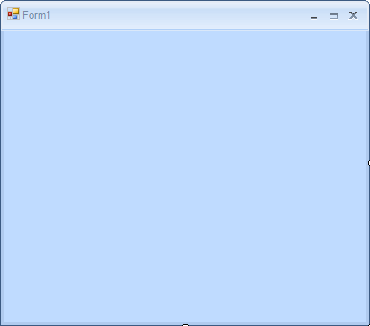

# Getting Started
 
## Adding RadForm to your Project

The following tutorial shows the different ways to utilize the __RadForm__ control.
        

To add a __RadForm__ control to your project you can either choose the __RadForm Template__ from the project's *'Add New Item...'* dialog or create a standard Windows Form and change its base class to __Telerik.WinControls.UI.RadForm__. In the following example we will create a __RadForm__ by manually changing the base class of a standard Windows Form:
        

Changing the base class of a standard Windows Form to RadForm in C#:

1. Create a new Windows Forms Application in Visual Studio

1. Make sure that your project includes references to the following assemblies:

	1. **Telerik.WinControls**
	
	1. **Telerik.WinControls.UI**

1. Right-click the default form created in the project and select the __View Code__ option.
            

1. If you are working in C#: Change the declaration of the form so that it derives from the __Telerik.WinControls.UI.RadForm__ class
            

	````C#
	    partial class Form1 : Telerik.WinControls.UI.RadForm
	````


Changing the base class of a standard Windows Form to **RadForm** in VB.NET:

1. Click the __Show All Files__ button in the Solution Explorer
            

1. Expand the __Form1.vb__ node in the Solution Explorer
            

1. Open the __Form1.Designer.vb__ file by double-clicking it
            

1. Change the declaration in the __Form1.Designer.vb__ file so that it derives from the __Telerik.WinControls.UI.RadForm__ class:

	````VB.NET
		Partial Class Form1
    		Inherits Telerik.WinControls.UI.RadForm
	````

Return to the __Design View__ of the form. Visual Studio will repaint the form and the __ControlDefault (Office2007Blue)__ theme will be applied to the form. __RadForm__ is ready for use:

	

## Applying a Theme to your Form

To apply a theme to RadForm, you should first drag-and-drop the desired Theme Component from the Visual Studio Toolbox onto your form. By doing this, the new theme will automatically become available for all Telerik UI for WinForms controls including __RadForm:__

1. From the Visual Studio Toolbox drag the __Office2007Black__ component and drop it on your __RadForm__ 
	
	

1. In the Properties Window set the __ThemeName__ property of the Form to *'Office2007Black'*
	
	


# See Also 

* [Accessing RadForm Elements]()
* [Properties, Methods and Events]()
