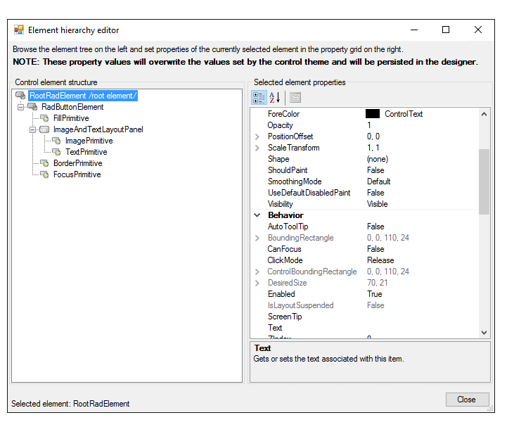
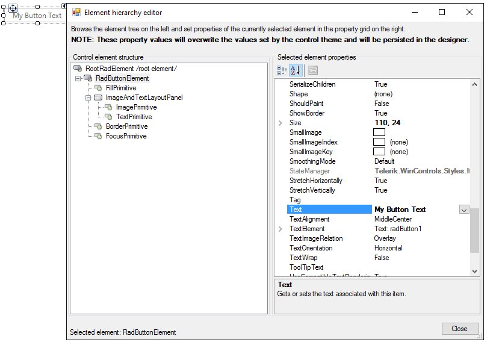
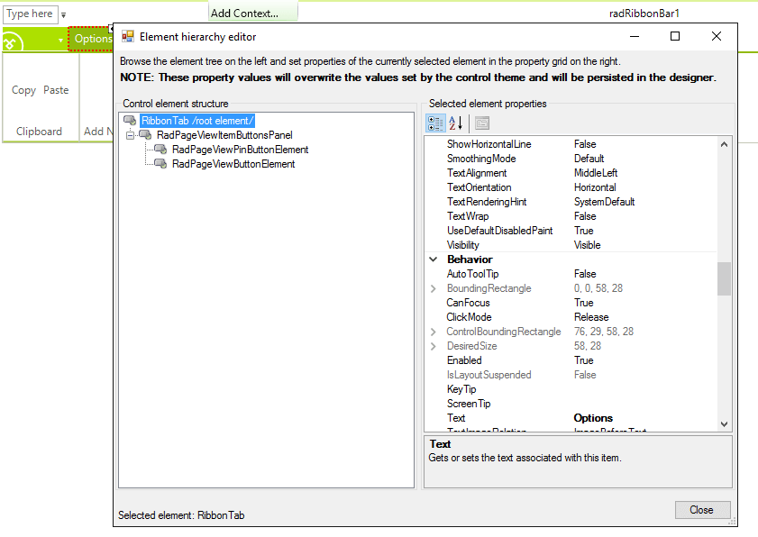

# Forms and Dialogs Overview
 
When dealing with complex control types that have multiple nested elements, such as a __RadRibbonBar__ control, you want the ability to set properties at multiple levels of the class hierarchy. For example, in the case of a __RadRibbonBar__ you can set properties of the __RadRibbonBarElement__ or you can set the properties of one of its __RadTabStripElement__ elements or possibly one of its __RadDropDownButtonElement__ elements.
      

Since all controls inherit from one or more base classes it is also helpful to be able to easily see the classes in the control hierarchy so you can set the properties on the appropriate class. When designing a __RadButton__ control you can set base class properties or any properties of classes that __RadButton__ derives from. The RadButton.__Visibility__ property can be set at the base class level (__RootRadElement__) while the RadButton.__Text__ property can be set at the __RadButtonElement__ class level.
      

The __Element Hierarchy Editor__ allows you to work with complex control types and to navigate the class and element hierarchy.
      

## Opening the Element Hierarchy Editor

Click a __RadControl__ at desing time, open the __Smart Tag__ menu and select __Edit UI elements__. This action will display the __Element Hierarchy Editor__.

To use the __Element Hierarchy Editor__, select items from the element tree on the left. Corresponding properties for the selected item will appear in the properties grid on the right.

## Changing Property Values

Properties can be viewed or changed through the __Element Hierarchy Editor__. You can change one or more properties by editing the value of the selected element’s property in the property grid on the right. After all changes are made through the __Element Hierarchy Editor__ and the dialog is closed, the changes are persisted to the appropriate property settings in the designer. These property values will also overwrite the values set by the control's theme.
        
In the figure below the RadButtonElement.__Text__ property is set to *My Button Text*.

To demonstrate setting multiple properties of multiple elements and persisting them to the designer, you could select the __RadButtonElement__ in the element tree on the left and set the __Text__ of a __RadButton__ to *My Button Text*. Then the __FillPrimitive__ element is selected in the element tree and the BackColor __properties__ are set to various shades of red.

## Editing UI Elements for Complex Control Hierarchies

When you open the __Element Hierarchy Editor__ from a nested element of a control (such as a __RadRibbonBar RadTabStripElement__), the corresponding element in the element tree on the left is automatically selected. The tree displays only the selected element and descendants. You will also be able to navigate the element tree for the control and view and set its properties.  In the figure below, a tab of a __RadRibbonBar__ is selected and the __Element Hierarchy Editor__ is invoked from the tab __Smart Tag__.

        

