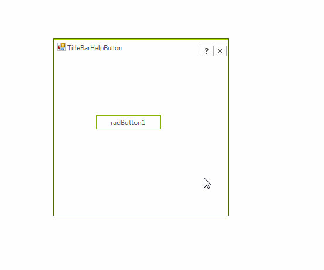

# Help Button

You can display Help on Windows Forms through the Help button, located on the right side of the title bar.

By default, the __HelpButton__ is not shown. Set the __HelpButton__ property to *true* to display a Help button in the form's caption bar. The value of the __HelpButton__ property is ignored if the *Maximize* or *Minimize* buttons are shown.
An alternative solution is to set its Visibility property to ElementVisibility.*Visible* in order to be displayed. The __HelpButtonClicked__ event is fired when Help button in the title bar is clicked. It can be canceled. However, if it is not canceled, the __HelpRequested__ event will be fired when the Help cursor is clicked on any Control.



You can find below a sample code snippet:
#### Customize selected item appearance 

{{source=..\SamplesCS\Forms And Dialogs\TitleBarHelpButton.cs region=HelpButton}} 
{{source=..\SamplesVB\Forms And Dialogs\TitleBarHelpButton.vb region=HelpButton}} 

````C#
        
public TitleBarHelpButton()
{
    InitializeComponent();
    this.HelpButton = true;
    this.MaximizeBox = false;
    this.MinimizeBox = false;
    this.HelpButtonClicked += ShapedForm1_HelpButtonClicked;
    this.radButton1.HelpRequested += radButton1_HelpRequested;
}
        
private void ShapedForm1_HelpButtonClicked(object sender, CancelEventArgs e)
{
    if (RadMessageBox.Show("Do you need help?", "Confirmation", MessageBoxButtons.YesNo) == System.Windows.Forms.DialogResult.No)
    {
        e.Cancel = true;
    }
}
        
private void radButton1_HelpRequested(object sender, HelpEventArgs hlpevent)
{
    RadMessageBox.Show("This is RadButton.");
}

````
````VB.NET
Public Sub New()
    InitializeComponent()
    Me.HelpButton = True
    Me.MaximizeBox = False
    Me.MinimizeBox = False
    AddHandler Me.HelpButtonClicked, AddressOf ShapedForm1_HelpButtonClicked
    AddHandler Me.RadButton1.HelpRequested, AddressOf radButton1_HelpRequested
End Sub
Private Sub ShapedForm1_HelpButtonClicked(sender As Object, e As CancelEventArgs)
    If RadMessageBox.Show("Do you need help?", "Confirmation", MessageBoxButtons.YesNo) = System.Windows.Forms.DialogResult.No Then
        e.Cancel = True
    End If
End Sub
Private Sub radButton1_HelpRequested(sender As Object, hlpevent As HelpEventArgs)
    RadMessageBox.Show("This is RadButton.")
End Sub

````

{{endregion}} 


