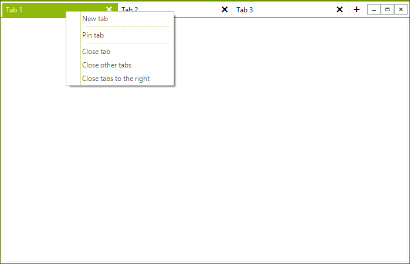

# Context Menu

The default context menu allows you to perform various actions.The menu is opened by right-clicking any of the tabs.



# Accessing and Modifying the Context Menu

The following example demonstrates how one ca use the __ContextMenuOpening__ event in order to modify or disable the default context menu.

#### Using the ContextMenuOpening event

{{source=..\SamplesCS\Forms and Dialogs\TabbedFormCode.cs region=ModifyContextMenu}} 
{{source=..\SamplesVB\Forms and Dialogs\TabbedFormCode.vb region=ModifyContextMenu}}
````C#
private void TabbedFormCode_Load(object sender, EventArgs e)
{
    this.TabbedFormControl.ContextMenuOpening += TabbedFormControl_ContextMenuOpening;
}
private void TabbedFormControl_ContextMenuOpening(object sender, RadTabbedFormControlItemConextMenuOpeningEventArgs e)
{
    if (e.TabItem.Text == "Tab 1")
    {
        //remove first item
        e.ContextMenu.Items[0].Visibility = ElementVisibility.Collapsed;
    }
    else if (e.TabItem.Text == "Tab 2")
    {
        //disable the context menu
        e.Cancel = true;
    }
}

````
````VB.NET
Private Sub TabbedFormCode_Load(ByVal sender As Object, ByVal e As EventArgs)
    AddHandler Me.TabbedFormControl.ContextMenuOpening, AddressOf TabbedFormControl_ContextMenuOpening
End Sub
Private Sub TabbedFormControl_ContextMenuOpening(ByVal sender As Object, ByVal e As RadTabbedFormControlItemConextMenuOpeningEventArgs)
    If e.TabItem.Text = "Tab 1" Then
        'remove first item
        e.ContextMenu.Items(0).Visibility = ElementVisibility.Collapsed
    ElseIf e.TabItem.Text = "Tab 2" Then
        'disable the context menu
        e.Cancel = True
    End If
End Sub

```` 

{{endregion}} 


