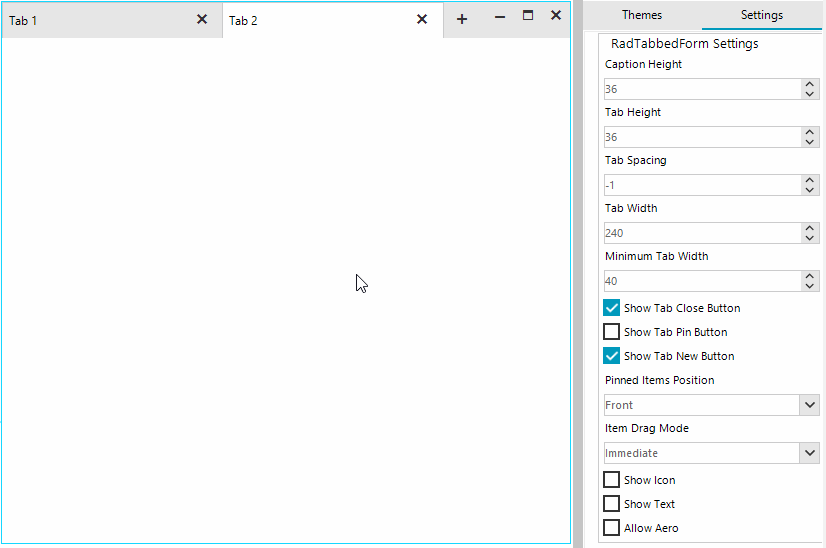

# Tab Settings

The **RadTabbedForm** and the associated tabbed control expose several properties affecting the layout of the tabs in the title bar. The heights of the title bar and the tabs can vary so is the width of the tabs. The tabbed form also exposes properties controlling the visibility of the of elements holding the icon and the text. The title bar can be also customized so that it will not be themed at all, this will result in displaying the default Windows caption.

>caption Figure 1: Tab Settings



**RadTabbedFormControl** properties:

* **CaptionHeight**: Gets or sets the height of the extended title bar.

* **TabHeight**: Gets or sets the default height of the tab.

* **TabSpacing**: Gets or sets the spacing between the tabs.

* **TabWidth**: Gets or sets the default width of the tab.

* **MinimumTabWidth**: Gets or sets the minimum width of the tab.

* **ShowTabCloseButton**: Determines whether the close button will be displayed in the tab.

* **ShowTabPinButton**: Determines whether the pin button will be displayed in the tab.

* **ShowNewTabButton**: Determines whether the new tab button will be displayed.

* **ShowText**: Gets or sets whether the element holding the text is visible.

* **PinnedItemsPosition**: Gets or sets whether the pinned items will be displayed at the front or at the back of the title bar.

* **ItemDragMode**: Defines two modes for dragging, *Immediate* and *Preview*.

**RadTabbedForm** properties:

* **AllowAero**: Gets or sets a boolean value that determines whether the standard title bar will be painted.

* **ShowIcon**: Overridden property determining whether the form`s icon will be displayed or not.
   
>note The total height of the title bar will be also affected by the size of system buttons and also by the height of the elements added to the left and right items containers.

#### Apply Settings

{{source=..\SamplesCS\Forms and Dialogs\TabbedFormCode.cs region=ApplyTabSettings}} 
{{source=..\SamplesVB\Forms and Dialogs\TabbedFormCode.vb region=ApplyTabSettings}}
````C#
this.AllowAero = false;
this.ShowIcon = true;
this.TabbedFormControl.ShowText = true;
this.TabbedFormControl.CaptionHeight = 65;
this.TabbedFormControl.TabHeight = 32;
this.TabbedFormControl.TabWidth = 180;
this.TabbedFormControl.TabSpacing = 12;

````
````VB.NET
Me.AllowAero = False
Me.ShowIcon = True
Me.TabbedFormControl.ShowText = True
Me.TabbedFormControl.CaptionHeight = 65
Me.TabbedFormControl.TabHeight = 32
Me.TabbedFormControl.TabWidth = 180
Me.TabbedFormControl.TabSpacing = 12

````


{{endregion}} 

The below image demonstrates the result after applying the above code in the TelerikMetro theme.

>caption Figure 2: Changed Default Settings

