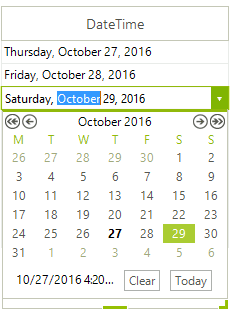

# GridViewDateTimeColumn

__GridViewDateTimeColumn__ provides date entry and formatting for DateTime data types. You may enter the date and time directly into the editor or drop down the calendar to choose a date. The __FormatString__ property sets the format of the date when the date is not currently being edited. The __CustomFormat__ property is used to format the date once the user clicks on the cell to invoke the editor.

>caption Figure 1: GridViewDateTimeColumn in edit mode



#### Formatting the date.

{{source=..\SamplesCS\GridView\Columns\GridViewDateTimeColumn1.cs region=addDateTimeColumn}} 
{{source=..\SamplesVB\GridView\Columns\GridViewDateTimeColumn1.vb region=addDateTimeColumn}} 

````C#
GridViewDateTimeColumn dateTimeColumn = new GridViewDateTimeColumn();
dateTimeColumn.Name = "DateTimeColumn";
dateTimeColumn.HeaderText = "Order date";
dateTimeColumn.FieldName = "OrderDate";
dateTimeColumn.FormatString = "{0:D}";

````
````VB.NET
Dim dateTimeColumn As New GridViewDateTimeColumn()
dateTimeColumn.Name = "DateTimeColumn"
dateTimeColumn.HeaderText = "Order date"
dateTimeColumn.FieldName = "OrderDate"
dateTimeColumn.FormatString = "{0:D}"

````

{{endregion}} 

>note The formatting for date and time values also responds to globalization settings.

{{source=..\SamplesCS\GridView\Columns\GridViewDateTimeColumn2.cs region=settingCurrentCulture}} 
{{source=..\SamplesVB\GridView\Columns\GridViewDateTimeColumn2.vb region=settingCurrentCulture}} 

````C#
System.Threading.Thread.CurrentThread.CurrentCulture = new System.Globalization.CultureInfo("fr-BE");
GridViewDateTimeColumn dateTimeColumn = new GridViewDateTimeColumn();
dateTimeColumn.Name = "DateTimeColumn";
dateTimeColumn.HeaderText = "Order date";
dateTimeColumn.FieldName = "OrderDate";
dateTimeColumn.FormatString = "{0:D}";
radGridView1.MasterTemplate.Columns.Add(dateTimeColumn);

````
````VB.NET
System.Threading.Thread.CurrentThread.CurrentCulture = New System.Globalization.CultureInfo("fr-BE")
        Dim dateTimeColumn As New GridViewDateTimeColumn()
        dateTimeColumn.Name = "DateTimeColumn"
        dateTimeColumn.HeaderText = "Order date"
        dateTimeColumn.FieldName = "OrderDate"
        dateTimeColumn.FormatString = "{0:D}"
        RadGridView1.MasterTemplate.Columns.Add(dateTimeColumn)

````

{{endregion}} 

The code below demonstrates how to change date formatting in edit mode (while the cell is being edited). There are two ways to achieve that - by setting the __Format__ property of the column to *Custom* and the __CustomFormat__ property of the column to a desired format, or by setting the same properties of the editor itself. Please note that we are using the __CellEditorInitialized__ event which is fired when the initialization of an editor is done in order to access the editor:

{{source=..\SamplesCS\GridView\Columns\GridViewDateTimeColumn1.cs region=changeEditorDateFormat}} 
{{source=..\SamplesVB\GridView\Columns\GridViewDateTimeColumn1.vb region=changeEditorDateFormat}} 

````C#
GridViewDateTimeColumn dateTimeColumn1 = new GridViewDateTimeColumn();
dateTimeColumn1.Name = "DateTimeColumn";
dateTimeColumn1.HeaderText = "Order date";
dateTimeColumn1.FieldName = "OrderDate";
dateTimeColumn1.Format = DateTimePickerFormat.Custom;
dateTimeColumn1.CustomFormat = "t";

````
````VB.NET
Private Sub radGridView1_CellEditorInitialized(ByVal sender As Object, ByVal e As GridViewCellEventArgs)
    Dim editor As RadDateTimeEditor = TryCast(Me.RadGridView1.ActiveEditor, RadDateTimeEditor)
    If editor IsNot Nothing Then
        'Pick up one of the default formats
        DirectCast(DirectCast(Me.RadGridView1.ActiveEditor, RadDateTimeEditor).EditorElement, RadDateTimeEditorElement).Format = DateTimePickerFormat.[Short]
        'Or set a custom date format
        DirectCast(DirectCast(Me.RadGridView1.ActiveEditor, RadDateTimeEditor).EditorElement, RadDateTimeEditorElement).CustomFormat = "t"
    End If
End Sub

````

{{endregion}} 


{{source=..\SamplesCS\GridView\Columns\GridViewDateTimeColumn1.cs region=changeEditorDateFormat1}} 
{{source=..\SamplesVB\GridView\Columns\GridViewDateTimeColumn1.vb region=changeEditorDateFormat1}} 

````C#
void radGridView1_CellEditorInitialized(object sender, GridViewCellEventArgs e)
{
    RadDateTimeEditor editor = this.radGridView1.ActiveEditor as RadDateTimeEditor;
    if (editor != null)
    {   
        //Pick up one of the default formats
        ((RadDateTimeEditorElement)((RadDateTimeEditor)this.radGridView1.ActiveEditor).EditorElement).Format = DateTimePickerFormat.Short;
        
        //Or set a custom date format
        ((RadDateTimeEditorElement)((RadDateTimeEditor)this.radGridView1.ActiveEditor).EditorElement).CustomFormat = "t";
    }
}

````
````VB.NET
Private Sub radGridView1_CellEditorInitialized(ByVal sender As Object, ByVal e As GridViewCellEventArgs)
    Dim editor As RadDateTimeEditor = TryCast(Me.RadGridView1.ActiveEditor, RadDateTimeEditor)
    If editor IsNot Nothing Then
        'Pick up one of the default formats
        DirectCast(DirectCast(Me.RadGridView1.ActiveEditor, RadDateTimeEditor).EditorElement, RadDateTimeEditorElement).Format = DateTimePickerFormat.[Short]
        'Or set a custom date format
        DirectCast(DirectCast(Me.RadGridView1.ActiveEditor, RadDateTimeEditor).EditorElement, RadDateTimeEditorElement).CustomFormat = "t"
    End If
End Sub

````

{{endregion}} 


If we do not use the `CellEditorInitialized`, but `CellBeginEdit` (it is fired before `CellEditorInitialized`), our __Format__ setting will be overridden by the initialization of the editor. 

You can also change the way the dates in the column are filtered. This is how the column can be adjusted to filter only by __Dates__.

{{source=..\SamplesCS\GridView\Columns\GridViewDateTimeColumn1.cs region=changeFilteringMode}} 
{{source=..\SamplesVB\GridView\Columns\GridViewDateTimeColumn1.vb region=changeFilteringMode}} 

````C#
dateTimeColumn1.FilteringMode = GridViewTimeFilteringMode.Date;

````
````VB.NET
dateTimeColumn1.FilteringMode = GridViewTimeFilteringMode.Date

````

{{endregion}} 

## DateTimeKind property

This property allows you to transform the date/time values from database to the local time. By default __RadGridView__ supposes that the date/time values are stored in UTC in the database.

| Member Name | Description |
| ------ | ------ |
|Local|If Local is assigned to a column, in this mode, its values will first converted into Local time.|
|Unspecified|Value will not converted.|
|Utc|Value will not converted.|

## EditorType

The __EditorType__ allows you to easily change the editor type. It could be set to three values:       

* __DateTimePicker:__ this is the default value and the editor will be a standard RadDateTimePicker.

* __TimePicker:__ the editor will be a __RadTimePicker__.

* __DateTimePickerSpinMode:__ this type of editor shows up/down buttons instead of a drop down with a calendar.
            
# See Also
* [GridViewBrowseColumn]()

* [GridViewCalculatorColumn]()

* [GridViewCheckBoxColumn]()

* [GridViewColorColumn]()

* [GridViewComboBoxColumn]()

* [GridViewCommandColumn]()

* [GridViewDecimalColumn]()

* [GridViewHyperlinkColumn]()

* [GridViewSparklineColumn]()

