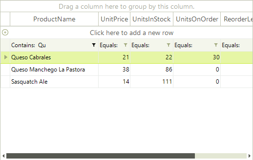
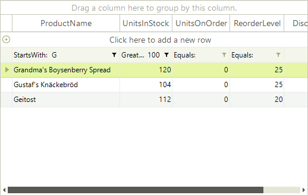

# Setting Filters Programmatically (simple descriptors)

## RadGridView FilterDescriptors

The **RadGridView** control includes __FilterDescriptors__ property of the **GridViewTemplate** which is exposed in the **RadGridView** class. This collection stores filter descriptors used for the filtering operation. The most important classes are:        

* __FilterDescriptor:__ implements filtering property (field) name, filtering operator and value. Used to define simple filtering expressions like __Country = "Germany"__.

* __CompositeFilterDescriptor:__ a collection of multiple filter descriptors with logical operator. Used to define complex filtering expressions like __(Country = "Germany" AND (City = "Berlin" OR City = "Aachen"))__.


>caution Filtering strings not allowed are: " LIKE ", " AND ", " OR ", "\"", ">", "<", "<>", "%", " NULL ", " IS ". Note: the spaces are important (e.g. " LIKE " compared to "LIKE").
>

## Using simple FilterDescriptor:

#### Using simple filter descriptor

{{source=..\SamplesCS\GridView\Filtering\Filtering.cs region=usingSimpleFilterDescriptor}} 
{{source=..\SamplesVB\GridView\Filtering\Filtering.vb region=usingSimpleFilterDescriptor}} 

````C#
FilterDescriptor filter = new FilterDescriptor();
filter.PropertyName = "ProductName";
filter.Operator = FilterOperator.Contains;
filter.Value = "Qu";
filter.IsFilterEditor = true;
this.radGridView1.FilterDescriptors.Add(filter);

````
````VB.NET
Dim filter As New FilterDescriptor()
filter.PropertyName = "ProductName"
filter.[Operator] = FilterOperator.Contains
filter.Value = "Qu"
filter.IsFilterEditor = True
Me.RadGridView1.FilterDescriptors.Add(filter)

````

{{endregion}} 



### FilterDescriptor Properties

|Property|Description|
|----|----|
|**PropertyName**|Defines the property, which values will be filtered.|
|**Operator**|Allows you to define the type of operator. The possible values are: __IsLike, IsNotLike, IsLessThan, IsLessThanOrEqualTo, IsEqualTo, IsNotEqualTo, IsGreaterThanOrEqualTo, IsGreaterThan, StartsWith, EndsWith, Contains, NotContains, IsNull, IsNotNull, IsContainedIn, IsNotContainedIn.__|
|**Value**|The value your data will be compared against.|
|**Expression**|Gets the filter expression.|
|**IsFilterEditor**|Gets a value indicating whether this instance is default filter descriptor of the column.|

When you add a new descriptor to the collection, the data is automatically filtered according to it.

Each data column (represented by [GridViewDataColumn](http://www.telerik.com/help/winforms/grid_gridviewdatacolumn.html)) has a __FilterDescriptor__  property that can be assigned a __FilterDescriptor__ object:

#### Assigning a filter descriptor object

{{source=..\SamplesCS\GridView\Filtering\Filtering.cs region=assingingAFilterDescriptorObject}} 
{{source=..\SamplesVB\GridView\Filtering\Filtering.vb region=assingingAFilterDescriptorObject}} 

````C#
FilterDescriptor filter1 = new FilterDescriptor();
filter1.Operator = FilterOperator.Contains;
filter1.Value = "Qu";
filter1.IsFilterEditor = true;
this.radGridView1.Columns["ProductName"].FilterDescriptor = filter1;

````
````VB.NET
Dim filter1 As New FilterDescriptor()
filter1.[Operator] = FilterOperator.Contains
filter1.Value = "Qu"
filter1.IsFilterEditor = True
Me.RadGridView1.Columns("ProductName").FilterDescriptor = filter1

````

{{endregion}} 

### Setting Multiple Filters

You can add filters to multiple columns by adding a __FilterDescriptor__ for each one of them: 

#### Setting multiple filters

{{source=..\SamplesCS\GridView\Filtering\Filtering.cs region=settingMultipleFilters}} 
{{source=..\SamplesVB\GridView\Filtering\Filtering.vb region=settingMultipleFilters}} 

````C#
FilterDescriptor filterUnitsInStock = new FilterDescriptor();
filterUnitsInStock.PropertyName = "UnitsInStock";
filterUnitsInStock.Operator = FilterOperator.IsGreaterThan;
filterUnitsInStock.Value = 100;
filterUnitsInStock.IsFilterEditor = true;
this.radGridView1.FilterDescriptors.Add(filterUnitsInStock);
FilterDescriptor filterProductName = new FilterDescriptor();
filterProductName.PropertyName = "ProductName";
filterProductName.Operator = FilterOperator.StartsWith;
filterProductName.Value = "G";
filterProductName.IsFilterEditor = true;
this.radGridView1.FilterDescriptors.Add(filterProductName);

````
````VB.NET
Dim filterUnitsInStock As New FilterDescriptor()
filterUnitsInStock.PropertyName = "UnitsInStock"
filterUnitsInStock.[Operator] = FilterOperator.IsGreaterThan
filterUnitsInStock.Value = 100
filterUnitsInStock.IsFilterEditor = True
Me.RadGridView1.FilterDescriptors.Add(filterUnitsInStock)
Dim filterProductName As New FilterDescriptor()
filterProductName.PropertyName = "ProductName"
filterProductName.[Operator] = FilterOperator.StartsWith
filterProductName.Value = "G"
filterProductName.IsFilterEditor = True
Me.RadGridView1.FilterDescriptors.Add(filterProductName)

````

{{endregion}} 


# See Also
* [Basic Filtering]()

* [Customizing composite filter dialog]()

* [Custom Filtering]()

* [Events]()

* [Excel-like filtering]()

* [FilterExpressionChanged Event]()

* [Filtering Row]()

* [Put a filter cell into edit mode programmatically]()

