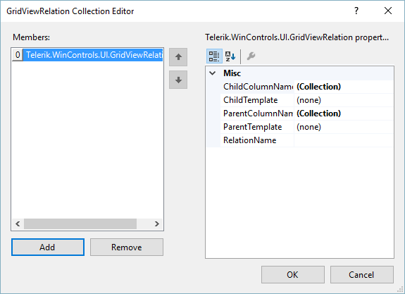
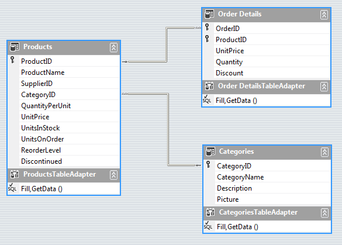
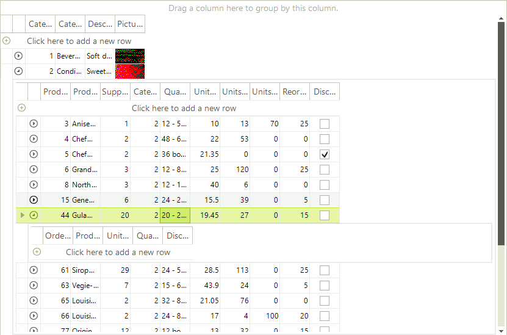

# Binding to Hierarchical Data Programmatically


| RELATED VIDEOS |  |
| ------ | ------ |
|[RadGridView for WinForms Hierarchy Overview](http://tv.telerik.com/watch/winforms/radgrid/radgridview-winforms-hierarchy-overview)<br>In this video you will learn the various ways you can display hierarchical data in a RadGridView. (Runtime: 12:13)||

There are many cases when you wouldn't want to include the whole dataset and hierarchy in your application. In such cases you cannot use the automatically mode for hierarchical data binding and you will need to set up the hierarchy in code manually.

## Setting the hierarchical grid in bound mode

For setting the hierarchy, you will need the special __GridViewRelation__ class, which defines the related field in parent and child tables. Consider the sample below:

{{source=..\SamplesCS\GridView\HierarchicalGrid\BindingToHierarchicalGridProgramatically.cs region=BindingToHierarchicalGridProgramatically}} 
{{source=..\SamplesVB\GridView\HierarchicalGrid\BindingToHierarchicalGridProgramatically.vb region=BindingToHierarchicalGridProgramatically}} 

````C#
        
private void BindingToHierarchicalGridProgramatically_Load(object sender, EventArgs e)
{
    this.productsTableAdapter.Fill(this.nwindDataSet.Products);
    this.suppliersTableAdapter.Fill(this.nwindDataSet.Suppliers);
    
    radGridView1.DataSource = nwindDataSet.Suppliers;
    
    GridViewTemplate template = new GridViewTemplate();
    template.DataSource = nwindDataSet.Products;
    radGridView1.MasterTemplate.Templates.Add(template);
    
    GridViewRelation relation = new GridViewRelation(radGridView1.MasterTemplate);
    relation.ChildTemplate = template;
    relation.RelationName = "SuppliersProducts";
    relation.ParentColumnNames.Add("SupplierID");
    relation.ChildColumnNames.Add("SupplierID");
    radGridView1.Relations.Add(relation);
}

````
````VB.NET
Private Sub BindingToHierarchicalGridProgramatically_Load(ByVal sender As System.Object, ByVal e As System.EventArgs) Handles MyBase.Load
    Me.SuppliersTableAdapter.Fill(Me.NwindDataSet.Suppliers)
    Me.ProductsTableAdapter.Fill(Me.NwindDataSet.Products)
    RadGridView1.DataSource = NwindDataSet.Suppliers

        Dim template As New GridViewTemplate()
        template.DataSource = NwindDataSet.Products
        RadGridView1.MasterTemplate.Templates.Add(template)

        Dim relation As New GridViewRelation(RadGridView1.MasterTemplate)
        relation.ChildTemplate = template
        relation.RelationName = "SuppliersProducts"
        relation.ParentColumnNames.Add("SupplierID")
        relation.ChildColumnNames.Add("SupplierID")
        RadGridView1.Relations.Add(relation)
    End Sub

````

{{endregion}} 

>important The column names specified in the relation must be present in the parent and child templates. If you don't want these columns to be shown, just manage their visibility but make sure that they are present in the respective templates. 


You can also set the relation in design-time, using the provided collection editor as in the figure below:



>important If you generate the columns manually either at design time or run time, note that it is necessary the **FieldName** and **Name** properties of the columns participating in the relation to have equal values. 

## Setting the Multi-Level hierarchy in bound mode

It is possible to manually set up the child templates and the relations between them in order to build a multi-level hierarchy as well. The code snippet below demonstrates the approach, which uses three data tables from the Northwind database:



{{source=..\SamplesCS\GridView\HierarchicalGrid\BindingToHierarchicalGridProgramatically.cs region=creatingMultiLevelHierarchicalGridInUnboundMode}} 
{{source=..\SamplesVB\GridView\HierarchicalGrid\BindingToHierarchicalGridProgramatically.vb region=creatingMultiLevelHierarchicalGridInUnboundMode}} 

````C#
        
private void BindingToMultiLevelHierarchicalGridInBoundMode_Load(object sender, EventArgs e)
{
    this.order_DetailsTableAdapter.Fill(this.nwindDataSet.Order_Details);
    this.productsTableAdapter.Fill(this.nwindDataSet.Products);
    this.categoriesTableAdapter.Fill(this.nwindDataSet.Categories);
    radGridView1.DataSource = nwindDataSet.Categories;
    
    GridViewTemplate firstChildtemplate = new GridViewTemplate();
    firstChildtemplate.DataSource = nwindDataSet.Products;
    radGridView1.MasterTemplate.Templates.Add(firstChildtemplate);
    
    GridViewRelation relation = new GridViewRelation(radGridView1.MasterTemplate);
    relation.ChildTemplate = firstChildtemplate;
    relation.RelationName = "CategoriesProducts";
    relation.ParentColumnNames.Add("CategoryID");
    relation.ChildColumnNames.Add("CategoryID");
    radGridView1.Relations.Add(relation);
    
    GridViewTemplate secondChildtemplate = new GridViewTemplate();
    secondChildtemplate.DataSource = nwindDataSet.Order_Details;
    firstChildtemplate.Templates.Add(secondChildtemplate);
    
    GridViewRelation relation2 = new GridViewRelation(firstChildtemplate);
    relation2.ChildTemplate = secondChildtemplate;
    relation2.RelationName = "ProductsOrderDetails";
    relation2.ParentColumnNames.Add("ProductID");
    relation2.ChildColumnNames.Add("ProductID");
    radGridView1.Relations.Add(relation2);
}

````
````VB.NET
Private Sub BindingToMultiLevelHierarchicalGridInBoundMode_Load(sender As Object, e As EventArgs)
    Me.Order_DetailsTableAdapter.Fill(Me.NwindDataSet.Order_Details)
    Me.CategoriesTableAdapter.Fill(Me.NwindDataSet.Categories)
    Me.ProductsTableAdapter.Fill(Me.NwindDataSet.Products)
    radGridView1.DataSource = nwindDataSet.Categories
    Dim firstChildtemplate As New GridViewTemplate()
    firstChildtemplate.DataSource = nwindDataSet.Products
    radGridView1.MasterTemplate.Templates.Add(firstChildtemplate)
    Dim relation As New GridViewRelation(radGridView1.MasterTemplate)
    relation.ChildTemplate = firstChildtemplate
    relation.RelationName = "CategoriesProducts"
    relation.ParentColumnNames.Add("CategoryID")
    relation.ChildColumnNames.Add("CategoryID")
    radGridView1.Relations.Add(relation)
    Dim secondChildtemplate As New GridViewTemplate()
    secondChildtemplate.DataSource = nwindDataSet.Order_Details
    firstChildtemplate.Templates.Add(secondChildtemplate)
    Dim relation2 As New GridViewRelation(firstChildtemplate)
    relation2.ChildTemplate = secondChildtemplate
    relation2.RelationName = "ProductsOrderDetails"
    relation2.ParentColumnNames.Add("ProductID")
    relation2.ChildColumnNames.Add("ProductID")
    radGridView1.Relations.Add(relation2)
End Sub

````

{{endregion}} 




## Hierarchical Grid in Unbound mode

Setting the hierarchical grid in unbound mode is quite similar to that for the bound mode with only difference is setting the unbound mode itself. First of all you need to create and add the columns you need. After that set up the relation and finally load the data.

>note Note that the GridViewRelation is created by using the GridViewDataColumn.Name, not the FieldName. As in the example below it is best if you create the column and pass the FieldName in the column's constructor. This will automatically set its Name to the same value.
>

{{source=..\SamplesCS\GridView\PopulatingWithData\UnboundMode.cs region=creatingHierarchicalGridInUnboundMode}} 
{{source=..\SamplesVB\GridView\PopulatingWithData\UnboundMode.vb region=creatingHierarchicalGridInUnboundMode}} 

````C#
    
public void creatingHierarchicalGridInUnboundMode()
{
    //setup the master template
    GridViewImageColumn column = new GridViewImageColumn("Photo");
    column.ImageLayout = ImageLayout.Stretch;
    radGridView1.MasterTemplate.Columns.Add(column);
    GridViewTextBoxColumn textColumn = new GridViewTextBoxColumn("Name");
    textColumn.Width = 150;
    radGridView1.MasterTemplate.Columns.Add(textColumn);
    radGridView1.MasterTemplate.Columns.Add(new GridViewDecimalColumn("Salary"));
    GridViewDateTimeColumn dateTimeColumn = new GridViewDateTimeColumn("Hire Date");
    dateTimeColumn.Width = 100;
    dateTimeColumn.TextAlignment = ContentAlignment.MiddleCenter;
    radGridView1.MasterTemplate.Columns.Add(dateTimeColumn);
    textColumn = new GridViewTextBoxColumn("Title");
    textColumn.Width = 150;
    radGridView1.MasterTemplate.Columns.Add(textColumn);
    radGridView1.MasterTemplate.Columns.Add(new GridViewCheckBoxColumn("Active"));
    radGridView1.MasterTemplate.Columns.Add(new GridViewCommandColumn("Action"));
    
    //setup the child template
    GridViewTemplate template = new GridViewTemplate();
    template.AllowAddNewRow = true;
    template.Columns.Add(new GridViewTextBoxColumn("Name"));
    template.Columns.Add(new GridViewTextBoxColumn("Product Number"));
    template.Columns.Add(new GridViewDecimalColumn("Quantity"));
    template.Columns.Add(new GridViewDecimalColumn("Discount"));
    template.Columns.Add(new GridViewDecimalColumn("Total"));
    radGridView1.MasterTemplate.Templates.Add(template);
    
    //create the relation
    GridViewRelation relation = new GridViewRelation(radGridView1.MasterTemplate);
    relation.ChildTemplate = template;
    relation.RelationName = "EmployeesOrders";
    relation.ParentColumnNames.Add("Name");
    relation.ChildColumnNames.Add("Name");
    radGridView1.Relations.Add(relation);
    
    //load data
    LoadUnboundData();
}
    
private void LoadUnboundData()
{
    using (radGridView1.DeferRefresh())
    {
        for (int i = 0; i < nwindDataSet.Employees.Count; i++)
        {
            Random random = new Random((int)DateTime.Now.Ticks);
            NwindDataSet.EmployeesRow row = nwindDataSet.Employees[i];
            string name = row.FirstName + " " + row.LastName;
            radGridView1.MasterTemplate.Rows.Add(GetImageFromData(row.Photo), name, random.Next(45000), row.HireDate, row.Title, (random.Next(100) > 50), "View");
            GridViewTemplate template = radGridView1.MasterTemplate.Templates[0];
            int rowCount = random.Next(20);
            for (int j = 0; j < rowCount; j++)
            {
                template.Rows.Add(name, random.Next(1000), random.Next(50), random.Next(100), random.Next(10000));
            }
        }
    }
}
    
private Image GetImageFromData(byte[] imageData)
{
    const int OleHeaderLength = 78;
    
    MemoryStream memoryStream = new MemoryStream();
    
    if (HasOleContainerHeader(imageData))
    {
        memoryStream.Write(imageData, OleHeaderLength, imageData.Length - OleHeaderLength);
    }
    else
    {
        memoryStream.Write(imageData, 0, imageData.Length);
    }
        
    Bitmap bitmap = new Bitmap(memoryStream);
        
    return bitmap.GetThumbnailImage(55, 65, null, new IntPtr());
}
    
private bool HasOleContainerHeader(byte[] imageByteArray)
{
    const byte OleByte0 = 21;
        
    const byte OleByte1 = 28;
        
    return (imageByteArray[0] == OleByte0) && (imageByteArray[1] == OleByte1);
}

````
````VB.NET
Public Sub creatingHierarchicalGridInUnboundMode()
    'setup the master template
    Dim column As New GridViewImageColumn("Photo")
    column.ImageLayout = ImageLayout.Stretch
    RadGridView1.MasterTemplate.Columns.Add(column)
    Dim textColumn As New GridViewTextBoxColumn("Name")
    textColumn.Width = 150
    RadGridView1.MasterTemplate.Columns.Add(textColumn)
    RadGridView1.MasterTemplate.Columns.Add(New GridViewDecimalColumn("Salary"))
    Dim dateTimeColumn As New GridViewDateTimeColumn("Hire Date")
    dateTimeColumn.Width = 100
    dateTimeColumn.TextAlignment = ContentAlignment.MiddleCenter
    RadGridView1.MasterTemplate.Columns.Add(dateTimeColumn)
    textColumn = New GridViewTextBoxColumn("Title")
    textColumn.Width = 150
    RadGridView1.MasterTemplate.Columns.Add(textColumn)
    RadGridView1.MasterTemplate.Columns.Add(New GridViewCheckBoxColumn("Active"))
    RadGridView1.MasterTemplate.Columns.Add(New GridViewCommandColumn("Action"))
    'setup the child template
    Dim template As New GridViewTemplate()
    template.AllowAddNewRow = True
    template.Columns.Add(New GridViewTextBoxColumn("Name"))
    template.Columns.Add(New GridViewTextBoxColumn("Product Number"))
    template.Columns.Add(New GridViewDecimalColumn("Quantity"))
    template.Columns.Add(New GridViewDecimalColumn("Discount"))
    template.Columns.Add(New GridViewDecimalColumn("Total"))
    RadGridView1.MasterTemplate.Templates.Add(template)
    'create the relation
    Dim relation As New GridViewRelation(RadGridView1.MasterTemplate)
    relation.ChildTemplate = template
    relation.RelationName = "EmployeesOrders"
    relation.ParentColumnNames.Add("Name")
    relation.ChildColumnNames.Add("Name")
    RadGridView1.Relations.Add(relation)
    'load data
    LoadUnboundData()
End Sub
Private Sub LoadUnboundData()
    Using RadGridView1.DeferRefresh()
        For i As Integer = 0 To NwindDataSet.Employees.Count - 1
            Dim now As Long = Date.Now.Ticks
            Dim seed As Integer = CType(now And Integer.MaxValue, Integer)
            Dim random As New Random(seed)
            Dim row As NwindDataSet.EmployeesRow = NwindDataSet.Employees(i)
            Dim name As String = row.FirstName & " " & row.LastName
            RadGridView1.MasterTemplate.Rows.Add(GetImageFromData(row.Photo), name, random.Next(45000), row.HireDate, row.Title, (random.Next(100) > 50), "View")
            Dim template As GridViewTemplate = RadGridView1.MasterTemplate.Templates(0)
            Dim rowCount As Integer = random.Next(20)
            For j As Integer = 0 To rowCount - 1
                template.Rows.Add(name, random.Next(1000), random.Next(50), random.Next(100), random.Next(10000))
            Next j
        Next i
    End Using
End Sub
Private Function GetImageFromData(ByVal imageData() As Byte) As Image
    Const OleHeaderLength As Integer = 78
    Dim memoryStream As New MemoryStream()
    If HasOleContainerHeader(imageData) Then
        memoryStream.Write(imageData, OleHeaderLength, imageData.Length - OleHeaderLength)
    Else
        memoryStream.Write(imageData, 0, imageData.Length)
    End If
    Dim bitmap As New Bitmap(memoryStream)
    Return bitmap.GetThumbnailImage(55, 65, Nothing, New IntPtr())
End Function
Private Function HasOleContainerHeader(ByVal imageByteArray() As Byte) As Boolean
    Const OleByte0 As Byte = 21
    Const OleByte1 As Byte = 28
    Return (imageByteArray(0) = OleByte0) AndAlso (imageByteArray(1) = OleByte1)
End Function

````

{{endregion}} 

## Multi-level hierarchical Grid in Unbound mode

Following the introduced approach in the previous section, the three-level hierarchy can be loaded in unbound mode as follows:

{{source=..\SamplesCS\GridView\PopulatingWithData\UnboundMode.cs region=creatingMultiLevelHierarchicalGridInUnboundMode}} 
{{source=..\SamplesVB\GridView\PopulatingWithData\UnboundMode.vb region=creatingMultiLevelHierarchicalGridInUnboundMode}} 

````C#
    
public void CreatingMultiLevelHierarchicalGridInUnboundMode()
{ 
    this.order_DetailsTableAdapter.Fill(this.nwindDataSet.Order_Details);
    this.categoriesTableAdapter.Fill(this.nwindDataSet.Categories);
    this.productsTableAdapter.Fill(this.nwindDataSet.Products);
    radGridView1.MasterTemplate.Columns.Add(new GridViewDecimalColumn("CategoryID"));
    radGridView1.MasterTemplate.Columns.Add("CategoryName");
    radGridView1.MasterTemplate.Columns.Add("Description");
    
    GridViewTemplate firstChildtemplate = new GridViewTemplate();
    
    firstChildtemplate.Columns.Add(new GridViewDecimalColumn("ProductID"));
    firstChildtemplate.Columns.Add(new GridViewTextBoxColumn("ProductName"));
    firstChildtemplate.Columns.Add(new GridViewDecimalColumn("CategoryID"));
    firstChildtemplate.Columns.Add(new GridViewDecimalColumn("SupplierID"));
    radGridView1.MasterTemplate.Templates.Add(firstChildtemplate);
    
    GridViewRelation relation = new GridViewRelation(radGridView1.MasterTemplate);
    relation.ChildTemplate = firstChildtemplate;
    relation.RelationName = "CategoriesProducts";
    relation.ParentColumnNames.Add("CategoryID");
    relation.ChildColumnNames.Add("CategoryID");
    radGridView1.Relations.Add(relation);
    
    GridViewTemplate secondChildtemplate = new GridViewTemplate();
    
    secondChildtemplate.Columns.Add(new GridViewDecimalColumn("OrderID"));
    secondChildtemplate.Columns.Add(new GridViewDecimalColumn("ProductID"));
    secondChildtemplate.Columns.Add(new GridViewDecimalColumn("UnitPrice"));
    secondChildtemplate.Columns.Add(new GridViewDecimalColumn("Quantity"));
    secondChildtemplate.Columns.Add(new GridViewDecimalColumn("Discount"));
    firstChildtemplate.Templates.Add(secondChildtemplate);
    
    GridViewRelation relation2 = new GridViewRelation(firstChildtemplate);
    relation2.ChildTemplate = secondChildtemplate;
    relation2.RelationName = "ProductsOrderDetails";
    relation2.ParentColumnNames.Add("ProductID");
    relation2.ChildColumnNames.Add("ProductID");
    radGridView1.Relations.Add(relation2);
        
    LoadDataInUnboundMode();
}
    
private void LoadDataInUnboundMode()
{
    using (radGridView1.DeferRefresh())
    {
        GridViewTemplate firstLevelTemplate = radGridView1.MasterTemplate.Templates[0];
        GridViewTemplate secondLevelTemplate = radGridView1.MasterTemplate.Templates[0].Templates[0];
            
        for (int i = 0; i < nwindDataSet.Categories.Count; i++)
        {
            NwindDataSet.CategoriesRow categoryRow = nwindDataSet.Categories[i];
            radGridView1.MasterTemplate.Rows.Add(categoryRow.CategoryID,
                categoryRow.CategoryName, categoryRow.Description);
        }
            
        for (int j = 0; j < nwindDataSet.Products.Count; j++)
        {
            NwindDataSet.ProductsRow productRow = nwindDataSet.Products[j];
            firstLevelTemplate.Rows.Add(productRow.ProductID, productRow.ProductName,
                productRow.CategoryID, productRow.SupplierID);
        }
        for (int k = 0; k < nwindDataSet.Order_Details.Count; k++)
        {
            NwindDataSet.Order_DetailsRow orderDetailsRow = nwindDataSet.Order_Details[k];
            secondLevelTemplate.Rows.Add(orderDetailsRow.OrderID, orderDetailsRow.ProductID,
                orderDetailsRow.UnitPrice, orderDetailsRow.Quantity, orderDetailsRow.Discount);
        }
    }
}

````
````VB.NET
Public Sub CreatingMultiLevelHierarchicalGridInUnboundMode()
    Me.Order_DetailsTableAdapter.Fill(Me.NwindDataSet.Order_Details)
    Me.CategoriesTableAdapter.Fill(Me.NwindDataSet.Categories)
    Me.ProductsTableAdapter.Fill(Me.NwindDataSet.Products)
    radGridView1.MasterTemplate.Columns.Add(New GridViewDecimalColumn("CategoryID"))
    radGridView1.MasterTemplate.Columns.Add("CategoryName")
    radGridView1.MasterTemplate.Columns.Add("Description")
    Dim firstChildtemplate As New GridViewTemplate()
    firstChildtemplate.Columns.Add(New GridViewDecimalColumn("ProductID"))
    firstChildtemplate.Columns.Add(New GridViewTextBoxColumn("ProductName"))
    firstChildtemplate.Columns.Add(New GridViewDecimalColumn("CategoryID"))
    firstChildtemplate.Columns.Add(New GridViewDecimalColumn("SupplierID"))
    radGridView1.MasterTemplate.Templates.Add(firstChildtemplate)
    Dim relation As New GridViewRelation(radGridView1.MasterTemplate)
    relation.ChildTemplate = firstChildtemplate
    relation.RelationName = "CategoriesProducts"
    relation.ParentColumnNames.Add("CategoryID")
    relation.ChildColumnNames.Add("CategoryID")
    radGridView1.Relations.Add(relation)
    Dim secondChildtemplate As New GridViewTemplate()
    secondChildtemplate.Columns.Add(New GridViewDecimalColumn("OrderID"))
    secondChildtemplate.Columns.Add(New GridViewDecimalColumn("ProductID"))
    secondChildtemplate.Columns.Add(New GridViewDecimalColumn("UnitPrice"))
    secondChildtemplate.Columns.Add(New GridViewDecimalColumn("Quantity"))
    secondChildtemplate.Columns.Add(New GridViewDecimalColumn("Discount"))
    firstChildtemplate.Templates.Add(secondChildtemplate)
    Dim relation2 As New GridViewRelation(firstChildtemplate)
    relation2.ChildTemplate = secondChildtemplate
    relation2.RelationName = "ProductsOrderDetails"
    relation2.ParentColumnNames.Add("ProductID")
    relation2.ChildColumnNames.Add("ProductID")
    radGridView1.Relations.Add(relation2)
    LoadDataInUnboundMode()
End Sub
Private Sub LoadDataInUnboundMode()
    Using radGridView1.DeferRefresh()
        Dim firstLevelTemplate As GridViewTemplate = radGridView1.MasterTemplate.Templates(0)
        Dim secondLevelTemplate As GridViewTemplate = radGridView1.MasterTemplate.Templates(0).Templates(0)
        For i As Integer = 0 To nwindDataSet.Categories.Count - 1
            Dim categoryRow As NwindDataSet.CategoriesRow = nwindDataSet.Categories(i)
            radGridView1.MasterTemplate.Rows.Add(categoryRow.CategoryID, categoryRow.CategoryName, categoryRow.Description)
        Next
        For j As Integer = 0 To nwindDataSet.Products.Count - 1
            Dim productRow As NwindDataSet.ProductsRow = nwindDataSet.Products(j)
            firstLevelTemplate.Rows.Add(productRow.ProductID, productRow.ProductName, productRow.CategoryID, productRow.SupplierID)
        Next
        For k As Integer = 0 To nwindDataSet.Order_Details.Count - 1
            Dim orderDetailsRow As NwindDataSet.Order_DetailsRow = nwindDataSet.Order_Details(k)
            secondLevelTemplate.Rows.Add(orderDetailsRow.OrderID, orderDetailsRow.ProductID, orderDetailsRow.UnitPrice, orderDetailsRow.Quantity, orderDetailsRow.Discount)
        Next
    End Using
End Sub

````

{{endregion}} 


# See Also
* [Binding to Hierarchical Data Automatically]()

* [Binding to Hierarchical Data]()

* [Creating hierarchy using an XML data source]()

* [Hierarchy of one to many relations]()

* [Load-On-Demand Hierarchy]()

* [Object Relational Hierarchy Mode]()

* [Self-Referencing Hierarchy]()

* [Tutorial Binding to Hierarchical Data]()

* [How to Change PageViewMode for the Nested Levels in RadGridView]()

