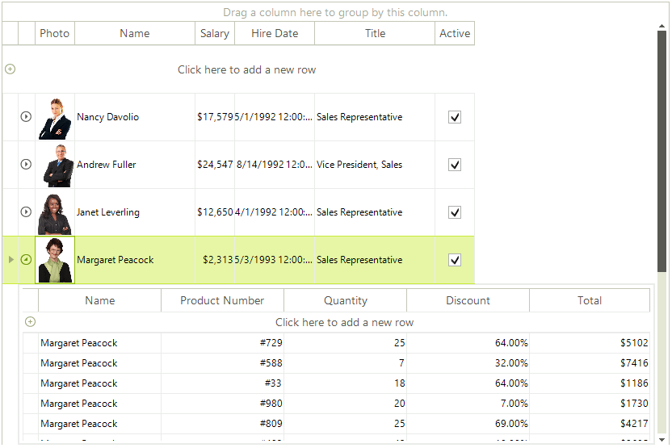

# Binding to Hierarchical Data

| RELATED VIDEOS |  |
| ------ | ------ |
|[RadGridView for WinForms Hierarchy Overview](http://tv.telerik.com/watch/winforms/radgrid/radgridview-winforms-hierarchy-overview) In this video you will learn the various ways you can display hierarchical data in a RadGridView. (Runtime: 12:13)||

RadGridView can display hierarchical, master-detail data to an arbitrary number of levels. The hierarchical schema can be established at run-time or design-time.

At run-time you can use the RadGridView.AutoGenerateHierarchyFromDataSet to [automatically create the hierarchy]().

At design-time the steps are:

1. Configure data source components for each table to be displayed.

1. Using __GridViewTemplate.ChildGridViewTemplates__ collection, create a hierarchy of templates, one for every level of master-detail relations. Each template should be bound to its own data source.

1. Populate the RadGridView.Relations collection with GridViewRelation objects. These objects define the relations between views in the hierarchy. The __ParentTemplate__ and __ChildTemplate__ properties of __GridViewRelation__ object are set to the existing templates. __ParentColumnNames__ and __ChildColumnNames__ collections are filled with the names of the fields of the corresponding data sources. See the topic [Tutorial: Binding to Hierarchical Data]() for step by step instructions.
    
>note Use the __ShowChildViewCaptions__ property to show/hide the table header in the child view. 

# See Also
* [Binding to Hierarchical Data Automatically]()

* [Binding to Hierarchical Data Programmatically]()

* [Creating hierarchy using an XML data source]()

* [Hierarchy of one to many relations]()

* [Load-On-Demand Hierarchy]()

* [Object Relational Hierarchy Mode]()

* [Self-Referencing Hierarchy]()

* [Tutorial Binding to Hierarchical Data]()

