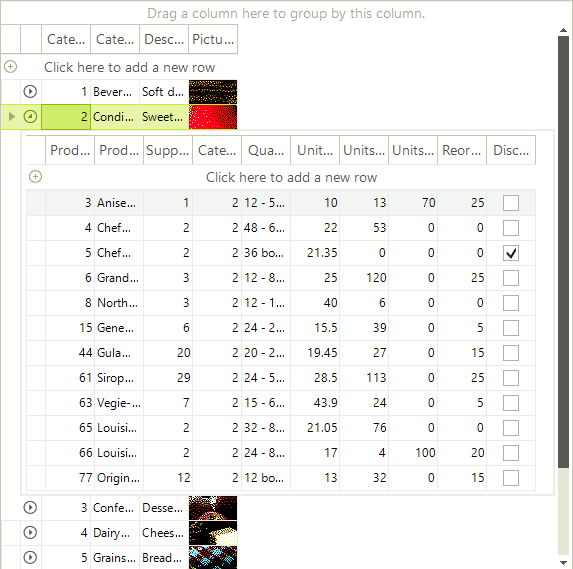
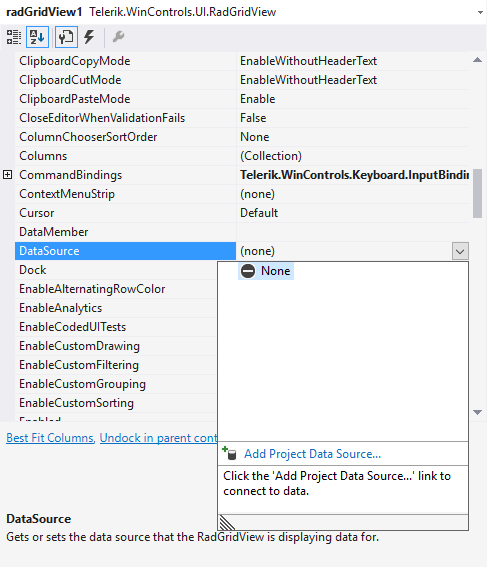
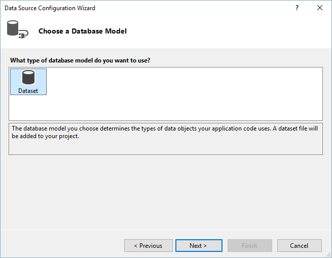
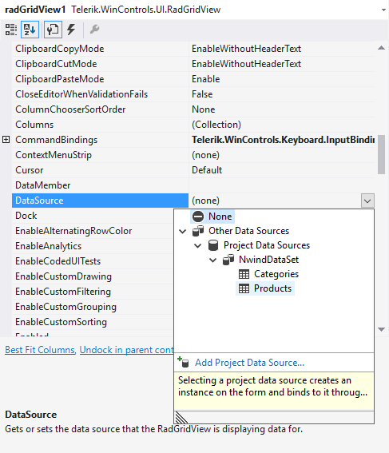
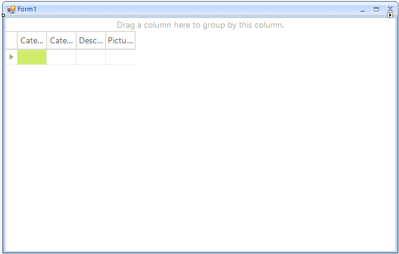
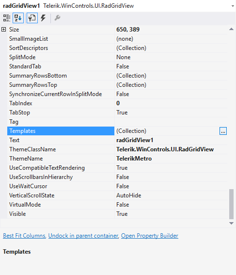
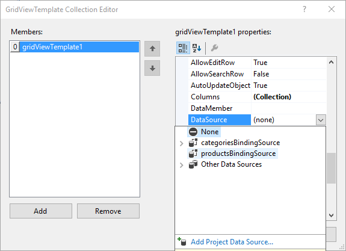
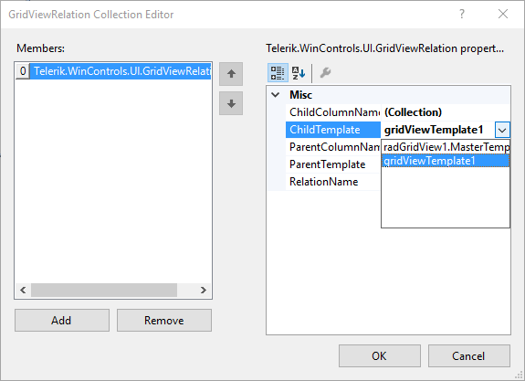
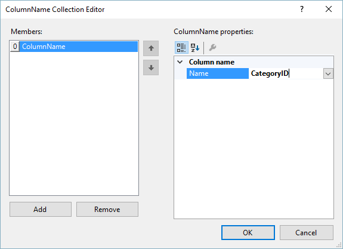

# Tutorial: Binding to Hierarchical Data

| RELATED VIDEOS |  |
| ------ | ------ |
|[RadGridView for WinForms Hierarchy Overview](http://tv.telerik.com/watch/winforms/radgrid/radgridview-winforms-hierarchy-overview) In this video you will learn the various ways you can display hierarchical data in a RadGridView. (Runtime: 12:13)||

The following tutorial demonstrates configuring the grid to display multiple tables in a hierarchy. The example below uses the Northwind `Categories` table as the parent table and lists the appropriate `Product` table records below each category. The tutorial only uses the two tables, but the example can be extended to larger numbers of child tables. 

The task has 3 basic steps:

1. Configure data sources.

1. Define child grid view templates, one for each level in the hierarchy.

1. Define relations between parent and child tables.

## Configure Data Sources

1. Place a RadGridView component on a form. Set the __Dock__ property to *Fill*.

1. In the Properties window locate the __DataSource__ property and click the arrow to open the list. Select the __Add Project Data Source...__ link.  *This step will display the Data Source Configuration Wizard.*
    

1. In the Data Source Configuration Wizard, Choose a Data Source Type page, select the __Database__ icon. Click the __Next__ button.

    

1. In the Database Model page of the Data Source Configuration Wizard choose __Database__ icon. Click the __Next__ button. 
 
    

1. In the `Choose Your data Connection` page click the __New Connection...__ button. *This step will display the Add Connection dialog. * Add the connection and then click __Next__. 

    

1. Click the __Next__ to save the ConnectionString name:
 
    

1. In the Choose Your Database Objects page, select the __"Categories"__ and __"Products"__ checkboxes. Click the __Finish__ button to close the Data Source Configuration Wizard.
 
    

1. In the Visual Studio Properties window for the grid __DataSource__ property select the "Products" table. * This step will create DataSet, BindingSource and TableAdapter objects for the products table.*
 
    

1. In the Visual Studio Properties window for the grid __DataSource__ property select the "Categories" table. * This step will create DataSet, BindingSource and TableAdapter objects for the categories table.*
 
     
          

1. The project design should look similar to the below image. The __DataSource__ property should be left to point at the binding source of the `Categories` table. Note the new data components in the component tray under the design surface.
 
    

## Define Child Templates

1. In the `Properties` window click the ellipses for the __Templates__ property. *This step will display the GridViewTemplate Collection Editor.*
 
    

1. In the GridViewTemplate Collection Editor, click the __Add__ button to add a child grid view template. In the properties for the new grid view template, use the __DataSource__ property drop down to locate and select the binding source of the data table __"Products"__. Click the __OK__ button to close the dialog.
 
    

## Define relations

1. In the `Properties` window click the ellipses for the grid __Relations__ property. *This will display the GridViewRelation Collection Editor.*
 
    

1. In the `GridViewRelation Collection Editor`, click the __Add__ button to add a relation. *The relation will describe the parent/child relationship between the category data (parent table) and the products (child table) for each category.*

1. Set the __RelationName__ property to "CategoryProduct".

1. Set the GridViewRelation __ChildTemplate__ property to the child grid view template (created earlier in the GridViewTemplate Collection Editor) using the drop down list.
 
    

1. Set the __ParentTemplate__ property to the __MasterTemplate__.

1. Click the ellipses for the __ChildColumnName__ property. *This will display the ColumnName Collection Editor.*

1. In the ColumnName Collection Editor click the __Add__ button and set the column __Name__ property to "CategoryID". Click the __OK__ button to close the dialog.
 
    

1. Click the ellipses for the __ParentColumnName__ property. In the ColumnName Collection Editor click the __Add__ button and set the column __Name__ property to "CategoryID". Click the __OK__ button to close the dialog.

1. Press __F5__ to run the application.

# See Also

* [Binding to Hierarchical Data Automatically]()

* [Binding to Hierarchical Data Programmatically]()

* [Binding to Hierarchical Data]()

* [Creating hierarchy using an XML data source]()

* [Hierarchy of one to many relations]()

* [Load-On-Demand Hierarchy]()

* [Object Relational Hierarchy Mode]()

* [Self-Referencing Hierarchy]()

