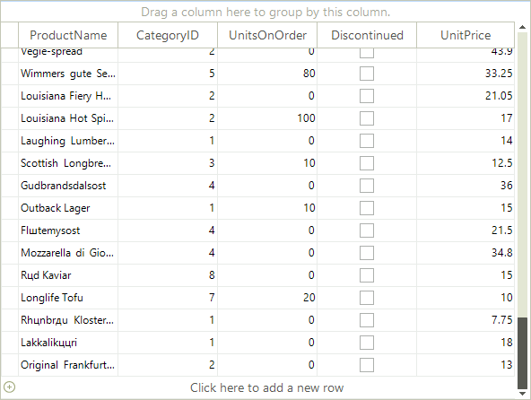
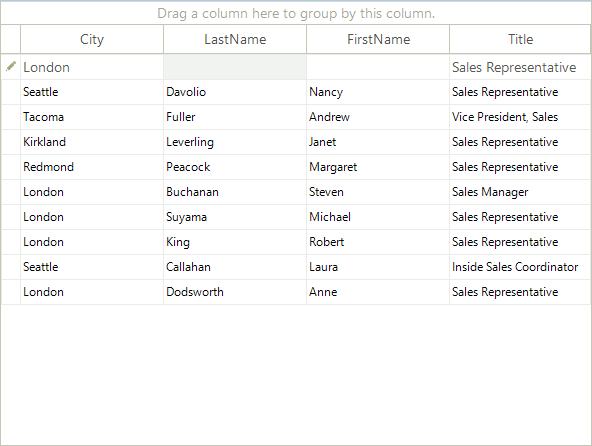

# New Row

**RadGridView** provides the end-users with a special row that allows them to add a new data row. For brevity, we will call this row "new row". The following sections describe useful events and properties which will allow you to achieve different scenarios related to the new row.


## Enabling the New Row

By default, the new row is visible to the end-user. You can explicitly set it to visible by setting the __AllowAddNewRow__ property to *true*:

{{source=..\SamplesCS\GridView\Rows\NewRow.cs region=enablingNewRow}} 
{{source=..\SamplesVB\GridView\Rows\NewRow.vb region=enablingNewRow}} 

````C#
this.radGridView1.AllowAddNewRow = true;

````
````VB.NET
Me.RadGridView1.AllowAddNewRow = True

````

{{endregion}} 

If you want to hide the `New Row`, just set the __AllowAddNewRow__ to *false* and RadGridView will look as shown below:

{{source=..\SamplesCS\GridView\Rows\NewRow.cs region=disablingNewRow}} 
{{source=..\SamplesVB\GridView\Rows\NewRow.vb region=disablingNewRow}} 

````C#
this.radGridView1.AllowAddNewRow = false;

````
````VB.NET
Me.RadGridView1.AllowAddNewRow = False

````

{{endregion}} 


>note The GridViewTemplate.**SelectNewRowAsCurrent** property controls if the new row will be made current if there are no other rows in the grid.

## Setting the new row text

For the text displayed in the new row of __RadGridView__ you have the option to set it directly to the corresponding template. This allows you to have a different text on the new row of each level of your hierarchical grid.

{{source=..\SamplesCS\GridView\Rows\NewRow.cs region=TemplateNewRowText}} 
{{source=..\SamplesVB\GridView\Rows\NewRow.vb region=TemplateNewRowText}} 

````C#
this.radGridView1.MasterTemplate.NewRowText = "Click here to add a new category";
this.radGridView1.MasterTemplate.Templates[0].NewRowText = "Click here to add a new product";

````
````VB.NET
Me.RadGridView1.MasterTemplate.NewRowText = "Click here to add a new category"
Me.RadGridView1.MasterTemplate.Templates(0).NewRowText = "Click here to add a new product"

````

{{endregion}} 

## New Row position

The `New Row` can be pinned to top or bottom. By default, the new row is pinned to top. You can explicitly set its position to top by setting the __AddNewRowPosition__ to *Top*:

{{source=..\SamplesCS\GridView\Rows\NewRow.cs region=positionTop}} 
{{source=..\SamplesVB\GridView\Rows\NewRow.vb region=positionTop}} 

````C#
this.radGridView1.AddNewRowPosition = SystemRowPosition.Top;

````
````VB.NET
Me.RadGridView1.AddNewRowPosition = SystemRowPosition.Top

````

{{endregion}} 

In order to pin the new row to bottom, you should set the __AddNewRowPosition__ to *Bottom*:

{{source=..\SamplesCS\GridView\Rows\NewRow.cs region=positionBottom}} 
{{source=..\SamplesVB\GridView\Rows\NewRow.vb region=positionBottom}} 

````C#
this.radGridView1.AddNewRowPosition = SystemRowPosition.Bottom;

````
````VB.NET
Me.RadGridView1.AddNewRowPosition = SystemRowPosition.Bottom

````

{{endregion}} 



## Accessing the new row

If you, for some reason, want to access the `New Row`, you can do it by getting the __TableAddNewRow__ object from the *view* you are in. Let's say that you want to programmatically make the `New Row` current. Here is how to do that for the main view:

{{source=..\SamplesCS\GridView\Rows\NewRow.cs region=makingNewRowCurrent}} 
{{source=..\SamplesVB\GridView\Rows\NewRow.vb region=makingNewRowCurrent}} 

````C#
this.radGridView1.CurrentRow = this.radGridView1.MasterView.TableAddNewRow;

````
````VB.NET
Me.RadGridView1.CurrentRow = Me.RadGridView1.MasterView.TableAddNewRow

````

{{endregion}} 

In case your RadGridView is data-bound, it will try to set the CurrentRow to the first data row after it is filled with data.Therefore, you have to set the CurrentRow to TableAddNewRow after you bind the grid (after the Fill call of the TableAdapter in case you are following the ADO.NET approach for data-binding).

## DefaultValuesNeeded event

__DefaultValuesNeeded__ is one of the events that you will probably use in your application. When you click the new row, the new row becomes current, the prompt text ("Click here to add a new row") is removed, and RadGridView enters its edit mode. This is the moment when the DefaultValuesNeeded event is fired. As the name of the event implies, it allows you to set the default values for the new row which, if unchanged by the end-user, are saved in the row when the new row is committed by the end-user.

Let's have a RadGridView instance bound to the Employees table of the Northwind database. We assume that most of the employees that will be added in the future will be "Sales Representative". Moreover, the headquarters of the company is located in London, so most probably the new employees will have London as their city. Taking these assumptions into considerations, we will subscribe to the DefaultValuesNeeded event and will set the "Sales Representative" for the Title column and London for the City column:

{{source=..\SamplesCS\GridView\Rows\NewRow.cs region=defaultValuesNeeded}} 
{{source=..\SamplesVB\GridView\Rows\NewRow.vb region=defaultValuesNeeded}} 

````C#
void radGridView1_DefaultValuesNeeded(object sender, GridViewRowEventArgs e)
{
    e.Row.Cells["Title"].Value = "Sales Representative";
    e.Row.Cells["City"].Value = "London";
}

````
````VB.NET
Private Sub RadGridView1_DefaultValuesNeeded(ByVal sender As Object, ByVal e As Telerik.WinControls.UI.GridViewRowEventArgs) Handles RadGridView1.DefaultValuesNeeded
    e.Row.Cells("Title").Value = "Sales Representative"
    e.Row.Cells("City").Value = "London"
End Sub

````

{{endregion}} 

As a result, when the end-user clicks the new row, the following values will be filled in for him:



### Adding with default values only

It is possible to add default values in all of the fields. However, by default you cannot add the row if no cells are changed. Since **R2 2017 SP1** this can be achieved by setting the __AddWithDefaultValues__ property. The following code snippet demonstrates how you can access and set this property:

{{source=..\SamplesCS\GridView\Rows\NewRow.cs region=AddOnlyDefault}} 
{{source=..\SamplesVB\GridView\Rows\NewRow.vb region=AddOnlyDefault}}
````C#
private void RadGridView1_DefaultValuesNeeded(object sender, GridViewRowEventArgs e)
{
    var args = e as DefaultValesNeeedEventArgs;
    args.AddWithDefaultValues = true;
}

````
````VB.NET
Private Sub RadGridView1_DefaultValuesNeeded1(ByVal sender As Object, ByVal e As GridViewRowEventArgs)
    Dim args = TryCast(e, DefaultValesNeeedEventArgs)
    args.AddWithDefaultValues = True
End Sub

```` 

 
{{endregion}} 

## Adding rows to the underlying data source

In some cases, you may need RadGridView to create a record in the underlying data source after the end-user commits the new row. In other cases, you may want to have a new record created immediately after the end-user starts editing the new row. RadGridView supports both modes. The behavior of RadGridView in this situation is determined by the __AddNewBoundRowBeforeEdit__property:

{{source=..\SamplesCS\GridView\Rows\NewRow.cs region=addNewBoundRowBeforeEdit}} 
{{source=..\SamplesVB\GridView\Rows\NewRow.vb region=addNewBoundRowBeforeEdit}} 

````C#
this.radGridView1.MasterTemplate.AddNewBoundRowBeforeEdit = true;

````
````VB.NET
Me.RadGridView1.MasterTemplate.AddNewBoundRowBeforeEdit = True

````

{{endregion}} 

As you can see in the code snippet above, __AddNewBoundRowBeforeEdit__ is a boolean property and here is what RadGridView does depending on its values:

* __False:__ RadGridView creates a new record in the underlying data source only after the new row is committed (validated). This is the default behavior.            

* __True:__ RadGridView creates a new record in the underlying data source right after the end-user starts editing the new row. If the end-user presses Escape to cancel the editing operation of the new row and goes to another row, the newly created record is deleted.
            

## Enter key mode

The `Enter` key may behave differently in the new row depending on the value of the __NewRowEnterKeyMode__ property. By default, when the end-user presses `Enter` while being in the new row, the new row is committed, and the row next to the new row becomes current. Here is how the default value can be set explicitly:

{{source=..\SamplesCS\GridView\Rows\NewRow.cs region=enterMovesToNextRow}} 
{{source=..\SamplesVB\GridView\Rows\NewRow.vb region=enterMovesToNextRow}} 

````C#
this.radGridView1.NewRowEnterKeyMode = RadGridViewNewRowEnterKeyMode.EnterMovesToNextRow;

````
````VB.NET
Me.RadGridView1.NewRowEnterKeyMode = RadGridViewNewRowEnterKeyMode.EnterMovesToNextRow

````

{{endregion}} 


The rest of the values available to the __NewRowEnterKeyMode__ property are:

* __EnterMovesToLastAddedRow__: When the end-user press the Enter key, the new row is committed and becomes are regular data row. After that RadGridView sets it as CurrentRow.

* __EnterMovesToNextCell__: When the end-user presses the Enter key, the next cell in the new row receives the focus and becomes the currently edited cell. If the end-user is at the last cell of the new row and he\she presses the Enter key, the new row is committed and RadGridView exits its edit mode.
            
* __None__: If RadGridView has an opened editor in the new row and the end-user presses the Enter key, the value that is in the editor is saved in the respective cell in the new row and RadGridView exists its edit mode. The current cell is not changed in this situation.

## User events

RadGridView exposes several end-user events two of which you will find useful in the context of the new row: __UserAddingRow__ and __UserAddedRow__. These events are fired when the user commits the new row (by pressing the Enter key or by clicking somewhere in the grid). As the name of the UserAddingRow implies, it allows for preventing the new row from being committed as a data row. This may be useful in case some of the data entered by the end-user is invalid according to some custom requirements.

In the examples below we will demonstrate what you can do by using the UserAddingRow and UserAddedRow events.
        

__UserAddingRow__ Let's say that the Address column should allow no more than 30 characters per cell. If the end-user types 40 characters in the Address cell of the new row and tries to commit this row, he will get a warning message box that the length of his input exceeds the allowed one, and the new row will not be committed. This can be achieved with the following code snippet:

{{source=..\SamplesCS\GridView\Rows\NewRow.cs region=userAddingRow}} 
{{source=..\SamplesVB\GridView\Rows\NewRow.vb region=userAddingRow}} 

````C#
void radGridView1_UserAddingRow(object sender, GridViewRowCancelEventArgs e)
{
    if (e.Rows[0].Cells["Address"].Value != null)
    {
        if (e.Rows[0].Cells["Address"].Value.ToString().Length > 30)
        {
            RadMessageBox.Show("The text in the Address field is long. Please provide shorter address.");
            e.Cancel = true;
        }
    }
}

````
````VB.NET
Private Sub RadGridView1_UserAddingRow(ByVal sender As Object, ByVal e As Telerik.WinControls.UI.GridViewRowCancelEventArgs) Handles RadGridView1.UserAddingRow
    If e.Rows(0).Cells("Address").Value IsNot Nothing Then
        If e.Rows(0).Cells("Address").Value.ToString().Length > 30 Then
            RadMessageBox.Show("The text in the Address field is long. Please provide shorter address.")
            e.Cancel = True
        End If
    End If
End Sub

````

{{endregion}} 

__UserAddedRow__ This event comes in handy when you want to update your data base right after the end-user has added a new row. Assuming that we are following the standard ADO.NET approach (DataTable\TableAdapter), in the following example we take the row that the end-user has just added, and we process it to the data base, by passing the row to the Update method of the TableAdapter:

{{source=..\SamplesCS\GridView\Rows\NewRow.cs region=userAddedRow}} 
{{source=..\SamplesVB\GridView\Rows\NewRow.vb region=userAddedRow}} 

````C#
void radGridView1_UserAddedRow(object sender, GridViewRowEventArgs e)
{
    DataRow[] rows = new DataRow[e.Rows.Length];
    for (int i = 0; i < e.Rows.Length; i++)
    {
        DataRowView dataRowView = e.Rows[i].DataBoundItem as DataRowView;
        if (dataRowView != null)
        {
            rows[i] = dataRowView.Row;
        }
    }
    this.employeesTableAdapter.Update(rows);    
}

````
````VB.NET
Private Sub RadGridView1_UserAddedRow(ByVal sender As Object, ByVal e As Telerik.WinControls.UI.GridViewRowEventArgs) Handles RadGridView1.UserAddedRow
    Dim rows(e.Rows.Length - 1) As DataRow
    For i As Integer = 0 To e.Rows.Length - 1
        Dim dataRowView As DataRowView = TryCast(e.Rows(i).DataBoundItem, DataRowView)
        If dataRowView IsNot Nothing Then
            rows(i) = dataRowView.Row
        End If
    Next i
    Me.EmployeesTableAdapter.Update(rows)
End Sub

````

{{endregion}} 


# See Also
* [Adding and Inserting Rows]()

* [Conditional Formatting Rows]()

* [Creating custom rows]()

* [Drag and Drop]()

* [Formatting Rows]()

* [GridViewRowInfo]()

* [Iterating Rows]()

* [Painting Rows]()

