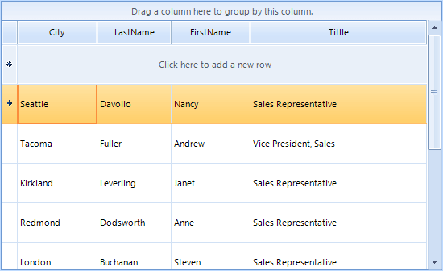
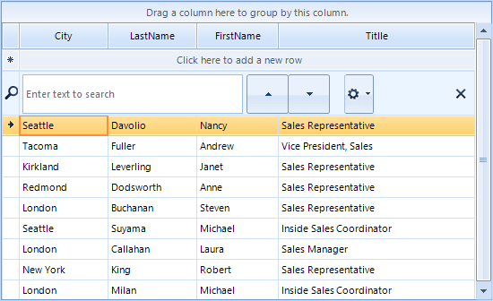
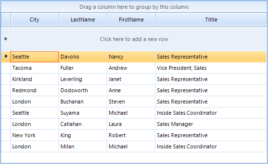
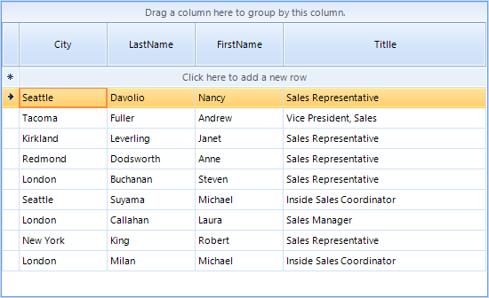
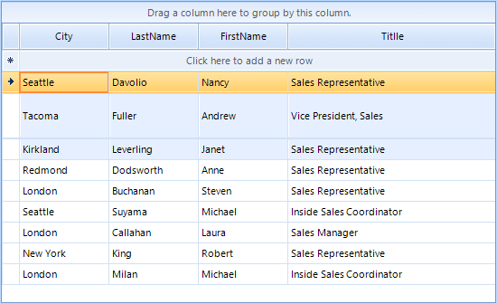
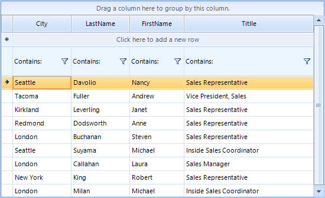
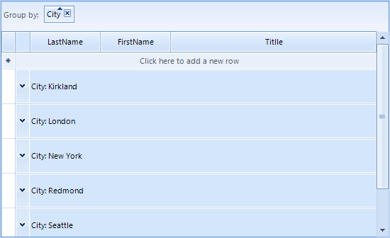
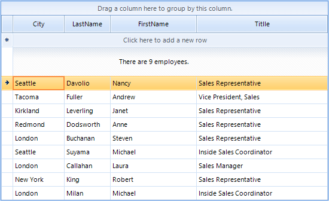

# Resizing Rows

**RadGridView** provides the end-users with the opportunity to change the height of the rows within the grid. The following sections describe how to change different row heights.

#### GridTableElement Height

````C#
 this.radGridView1.TableElement.RowHeight = 50;

````
````VB.NET
Me.RadGridView1.TableElement.RowHeight = 50

````

{{endregion}} 



>note **GridViewRowInfo** offers three properties that allow you specifying the height of an individual data row: **Height**, **MinHeight**, **MaxHeight**. It controls the current height of the row, its minimum and maximum height respectively.

#### Search Row Height

````C#
this.radGridView1.AllowSearchRow = true; 
this.radGridView1.TableElement.SearchRowHeight = 50;

````
````VB.NET
 Me.RadGridView1.AllowSearchRow = true
 Me.RadGridView1.TableElement.SearchRowHeight = 50

````

{{endregion}} 



#### New Row Height

````C#
this.radGridView1.MasterView.TableAddNewRow.Height = 50;

````
````VB.NET
Me.RadGridView1.MasterView.TableAddNewRow.Height = 50

````

{{endregion}} 



#### TableHeader Height

````C#
this.radGridView1.TableElement.TableHeaderHeight = 50;

````
````VB.NET
Me.RadGridView1.TableElement.TableHeaderHeight = 50

````

{{endregion}} 



#### Pinned Row Height

````C#
this.radGridView1.Rows[0].IsPinned = true;
this.radGridView1.Rows[1].IsPinned = true;
this.radGridView1.Rows[2].IsPinned = true;
this.radGridView1.MasterView.PinnedRows[1].Height = 50;

````
````VB.NET
Me.RadGridView1.Rows(0).IsPinned = True
Me.RadGridView1.Rows(1).IsPinned = True
Me.RadGridView1.Rows(2).IsPinned = True
Me.RadGridView1.MasterView.PinnedRows(1).Height = 50

````

{{endregion}} 



#### Filtering Row Height

````C#
this.radGridView1.MasterTemplate.EnableFiltering = true;
this.radGridView1.TableElement.FilterRowHeight = 50;

````
````VB.NET
Me.RadGridView1.MasterTemplate.EnableFiltering = True
Me.RadGridView1.TableElement.FilterRowHeight = 50

````

{{endregion}} 



#### Group Header Height

````C#
this.radGridView1.TableElement.GroupHeaderHeight = 50;

````
````VB.NET
Me.RadGridView1.TableElement.GroupHeaderHeight = 50

````

{{endregion}} 



#### Summary Row Height
````C#
this.radGridView1.MasterView.SummaryRows[0].Height = 50;

````
````VB.NET
Me.RadGridView1.MasterView.SummaryRows(0).Height = 50

````

{{endregion}} 


