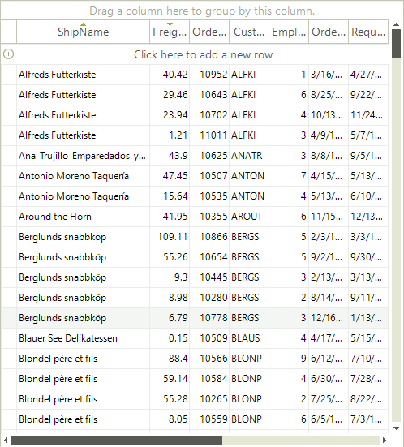

# Setting Sorting Programmatically

Sorting can be performed programmatically by adding descriptors to the RadGridView.**SortDescriptors** collection. 

## Overview

**RadGridView** includes __SortDescriptors__ property at the __GridViewTemplate__ level which is exposed in the RadGridView class for __MasterTemplate__ instance. This collection allows you to use descriptors which define the sorting property and the sorting direction for the data that is bound to the RadGridView. As this is a collection, you are able not only to add, but to remove or clear its entries as well. When you add a new descriptor to the collection, the data is automatically sorted according to it.

## Using SortDescriptor 

To enable sorting you need to set the __EnableSorting__ property of the desired template.

#### Enable Sorting

{{source=..\SamplesCS\GridView\Sorting\Sorting.cs region=enableSorting}} 
{{source=..\SamplesVB\GridView\Sorting\Sorting.vb region=enableSorting}} 

````C#
this.radGridView1.MasterTemplate.EnableSorting = true;

````
````VB.NET
Me.RadGridView1.MasterTemplate.EnableSorting = True

````

{{endregion}} 

Here is how to create and add new __SortDescriptor__.

#### Using SortDescriptor

{{source=..\SamplesCS\GridView\Sorting\Sorting.cs region=usingSortDescriptor}} 
{{source=..\SamplesVB\GridView\Sorting\Sorting.vb region=usingSortDescriptor}} 

````C#
            
SortDescriptor descriptor = new SortDescriptor();
descriptor.PropertyName = "ShipCountry";
descriptor.Direction = ListSortDirection.Ascending;
this.radGridView1.MasterTemplate.SortDescriptors.Add(descriptor);

````
````VB.NET
Dim descriptor As New SortDescriptor()
descriptor.PropertyName = "ShipCountry"
descriptor.Direction = ListSortDirection.Ascending
Me.RadGridView1.MasterTemplate.SortDescriptors.Add(descriptor)

````

{{endregion}} 

The __PropertyName__ property defines the property, by which the data will be sorted, and the __SortDirection__ property allows you to define the sort direction.

## Sorting by Two or More Columns

**RadGridView** supports sorting by one or more columns. The bellow example shows how you can sort by 2 columns.

#### Sorting by Two Columns

{{source=..\SamplesCS\GridView\Sorting\Sorting.cs region=sortingByTwoOrMoreColumns}} 
{{source=..\SamplesVB\GridView\Sorting\Sorting.vb region=sortingByTwoOrMoreColumns}} 

````C#
            
SortDescriptor descriptorShipName = new SortDescriptor();
descriptorShipName.PropertyName = "ShipName";
descriptorShipName.Direction = ListSortDirection.Ascending;
SortDescriptor descriptorFreight = new SortDescriptor();
descriptorFreight.PropertyName = "Freight";
descriptorFreight.Direction = ListSortDirection.Descending;
this.radGridView1.SortDescriptors.Add(descriptorShipName);
this.radGridView1.SortDescriptors.Add(descriptorFreight);

````
````VB.NET
Dim descriptorShipName As New SortDescriptor()
descriptorShipName.PropertyName = "ShipName"
descriptorShipName.Direction = ListSortDirection.Ascending
Dim descriptorFreight As New SortDescriptor()
descriptorFreight.PropertyName = "Freight"
descriptorFreight.Direction = ListSortDirection.Descending
Me.RadGridView1.SortDescriptors.Add(descriptorShipName)
Me.RadGridView1.SortDescriptors.Add(descriptorFreight)

````

{{endregion}} 

>caption Figure 1: Sorting by Two Columns



>note The order of adding the sort expressions to the SortDescriptors collections matters. In the example above, the grid will be first sorted by the `ShipName` column and then each group will be sorted according to the `Freight` column.
>

# See Also

* [Basic Sorting]()

* [Custom Sorting]()

* [Events]()

* [Sorting Expressions]()

