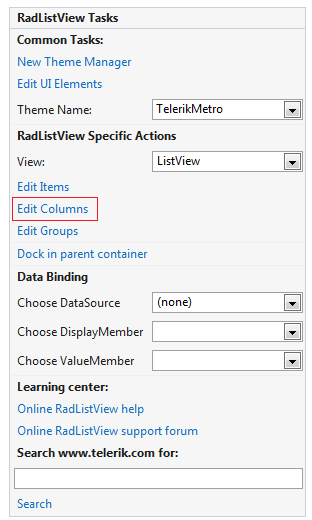
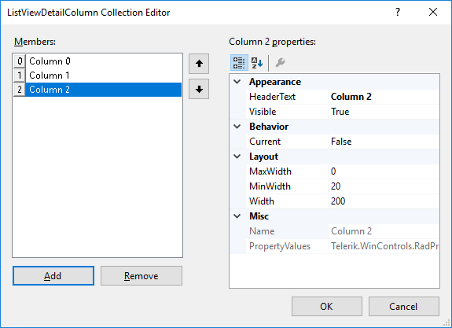
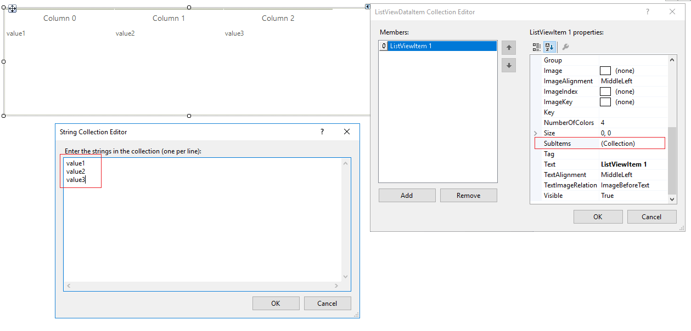

# Adding columns

When the RadListView.**ViewType** property is set to *DetailsView*, the data can be displayed in columns view. Adding columns to the control at design time, is done by populating the **Columns** collection of **RadListView**. This collection can be accessed either through the __Columns__ property in the property grid of the control or through the __Smart Tag__ of **RadListView**.        

>caption Figure 1: Columns option in Smart Tag

>caption Figure 2: Columns option in Properties section

Once __ListViewDetailColumn Collection Editor__ is opened, you can add as many columns as you need, and also, you can modify their properties in the property grid.

>caption Figure 3: ListViewDetailColumn Collection Editor

Once the __Columns__ collection is populated, you can assign values for each column of each **ListViewDataItem**, by making use of the __SubItems__ property (this property is available in design-time only):

>caption Figure 4: Fill cells' values

Here is the result of the explained operations:

> Note if you assign a DataSource programmatically, this will use the default column widths. To handle this scenario, use the **ColumnCreating** event to access column by field name and set the desired width there.

# See Also

* [Design Time Basics]()	
* [Adding groups]()	
* [Adding items]()	 
