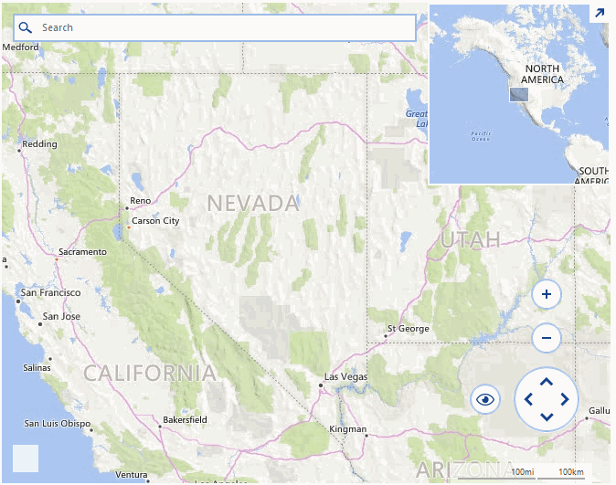

# Drawing Markers and Regions

A common requirement for applications utilizing a map control is to allow the end users add pins on the map and draw regions on it. **RadMap** exposes the necessary API and it can be easily extended with such functionalities. The example in this how-to article will handle a scenario in which pins are being added on the map after double clicking on it. As soon as the count of the markers increases to three so that they form a figure a region will be created. 

>caption Figure 1: RadMap Pins and Regions 



**RadMap** is handling the mouse, keyboard, and gestures by a special input behavior class. This class can be inherited and further extended to handle custom scenarios. In our example we will override its **OnDoubleClick** method and execute our special logic for adding the pins and the regions. The custom provider class can be assigned to the map by simply setting its **InputBehavior** property.

>note This example uses the **BingRestMapProvider** and the control is initially setup according to [this]() article.

#### Setup Provider

{{source=..\SamplesCS\Map\DrawRegionsForm.cs region=SetupProvider}} 
{{source=..\SamplesVB\Map\DrawRegionsForm.vb region=SetupProvider}}
````C#
BingRestMapProvider bingProvider = new BingRestMapProvider();
bingProvider.ImagerySet = ImagerySet.Road;
bingProvider.UseSession = true;
bingProvider.BingKey = this.bingKey;
bingProvider.InitializationComplete += delegate (object sender, EventArgs e)
{
    this.radMap1.BringIntoView(new PointG(40d, -99d), 4);
};
LocalFileCacheProvider cache = new LocalFileCacheProvider(Path.Combine(Path.GetTempPath(), "cache"));
bingProvider.CacheProvider = cache;
this.radMap1.MapElement.Providers.Add(bingProvider);
MapLayer pinsLayer = new MapLayer("Pins");
this.radMap1.Layers.Add(pinsLayer);
this.radMap1.InputBehavior = new CustomMapInputBehavior();

````
````VB.NET
Dim bingProvider As New BingRestMapProvider()
bingProvider.ImagerySet = ImagerySet.Road
bingProvider.UseSession = True
bingProvider.BingKey = Me.bingKey
AddHandler bingProvider.InitializationComplete, Sub(sender As Object, e As EventArgs) Me.radMap1.BringIntoView(New PointG(40.0, -99.0), 4)
Dim cache As New LocalFileCacheProvider(Path.Combine(Path.GetTempPath(), "cache"))
bingProvider.CacheProvider = cache
Me.radMap1.MapElement.Providers.Add(bingProvider)
Dim pinsLayer As New MapLayer("Pins")
Me.radMap1.Layers.Add(pinsLayer)
Me.radMap1.InputBehavior = New CustomMapInputBehavior()

````


{{endregion}}

In our custom implementation, we will add pins as long as their count is less than three, from then on each double click on the map while holding the *Ctrl* key will result in drawing a region enclosing all of the added points. 

#### CustomMapInputBehavior Implementation

{{source=..\SamplesCS\Map\DrawRegionsForm.cs region=CustomMapInputBehaviorImplementation}} 
{{source=..\SamplesVB\Map\DrawRegionsForm.vb region=CustomMapInputBehaviorImplementation}}
````C#
public class CustomMapInputBehavior : MapInputBehavior
{
    public override void OnDoubleClick(EventArgs e)
    {
        MouseEventArgs args = e as MouseEventArgs;
        if (args.Button == MouseButtons.Left && Control.ModifierKeys == Keys.Control)
        {
            PointL point = new PointL(args.X - this.MapElement.PanOffset.Width, args.Y - this.MapElement.PanOffset.Height);
            PointG location = MapTileSystemHelper.PixelXYToLatLong(point.X, point.Y, this.MapElement.ZoomLevel);
            while (location.Longitude > 180)
            {
                location.Longitude -= 360;
            }
            if (this.MapElement.Layers[0].Overlays.Count > 1 || (this.MapElement.Layers[0].Overlays.Count > 0 && this.MapElement.Layers[0].Overlays[0] is MapPolygon))
            {
                List<PointG> points = new List<PointG>();
                foreach (MapVisualElement element in this.MapElement.Layers[0].Overlays)
                {
                    MapPin pin = element as MapPin;
                    if (pin != null)
                    {
                        points.Add(element.Location);
                    }
                    MapPolygon pol = element as MapPolygon;
                    if (pol != null)
                    {
                        points.AddRange(pol.Points);
                    }
                }
                points.Add(location);
                this.MapElement.Layers[0].Clear();
                MapPolygon polygon = new MapPolygon(points);
                polygon.BackColor = Color.FromArgb(125, Color.LightGreen);
                this.MapElement.Layers[0].Add(polygon);
            }
            else
            {
                MapPin pin = new MapPin(location);
                this.MapElement.Layers[0].Add(pin);
            }
        }
        else
        {
            base.OnDoubleClick(e);
        }
    }
}

````
````VB.NET
Public Class CustomMapInputBehavior
    Inherits MapInputBehavior
    Public Overrides Sub OnDoubleClick(e As EventArgs)
        Dim args As MouseEventArgs = TryCast(e, MouseEventArgs)
        If args.Button = MouseButtons.Left AndAlso Control.ModifierKeys = Keys.Control Then
            Dim point As New PointL(args.X - Me.MapElement.PanOffset.Width, args.Y - Me.MapElement.PanOffset.Height)
            Dim location As PointG = MapTileSystemHelper.PixelXYToLatLong(point.X, point.Y, Me.MapElement.ZoomLevel)
            While location.Longitude > 180
                location.Longitude -= 360
            End While
            If Me.MapElement.Layers(0).Overlays.Count > 1 OrElse (Me.MapElement.Layers(0).Overlays.Count > 0 AndAlso TypeOf Me.MapElement.Layers(0).Overlays(0) Is MapPolygon) Then
                Dim points As New List(Of PointG)()
                For Each element As MapVisualElement In Me.MapElement.Layers(0).Overlays
                    Dim pin As MapPin = TryCast(element, MapPin)
                    If pin IsNot Nothing Then
                        points.Add(element.Location)
                    End If
                    Dim pol As MapPolygon = TryCast(element, MapPolygon)
                    If pol IsNot Nothing Then
                        points.AddRange(pol.Points)
                    End If
                Next
                points.Add(location)
                Me.MapElement.Layers(0).Clear()
                Dim polygon As New MapPolygon(points)
                polygon.BackColor = Color.FromArgb(125, Color.LightGreen)
                Me.MapElement.Layers(0).Add(polygon)
            Else
                Dim pin As New MapPin(location)
                Me.MapElement.Layers(0).Add(pin)
            End If
        Else
            MyBase.OnDoubleClick(e)
        End If
    End Sub
End Class

````


{{endregion}}

# See Also

* [Layers]()
* [BingRestMapProvider]()
* [How to Create Rectangle and Ellipse Shapes in RadMap]()
