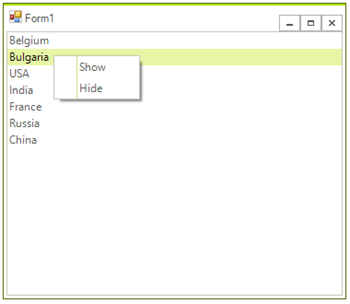

# Add Context menu in the code

This article demonstrates how you can add RadContextMenu in the code and attach it to a specific control. 

1\.	Adding a RadContextMenu at runtime. To programmatically add a RadContextMenu to a form, create a new instance of a RadContextMenu

{{source=..\SamplesCS\Menus\ContextMenu\ContextMenuCode2.cs region=AddMenu}} 
{{source=..\SamplesVB\Menus\ContextMenu\ContextMenuCode2.vb region=AddMenu}}
````C#
RadContextMenu radContextmenu = new RadContextMenu();

````
````VB.NET
```` 


{{endregion}} 

2\. Add  RadMenuItems to RadContextMenu.


{{source=..\SamplesCS\Menus\ContextMenu\ContextMenuCode2.cs region=AddItems}} 
{{source=..\SamplesVB\Menus\ContextMenu\ContextMenuCode2.vb region=AddItems}}
````C#
RadMenuItem menuItem1 = new RadMenuItem();
menuItem1.Text = "Show";
radContextmenu.Items.Add(menuItem1);
RadMenuItem menuItem2 = new RadMenuItem();
menuItem2.Text = "Hide";
radContextmenu.Items.Add(menuItem2);

````
````VB.NET
```` 


{{endregion}} 

3\.	Subscribe to МouseClick event of the control and call the RadContextMenu.Show() method:


{{source=..\SamplesCS\Menus\ContextMenu\ContextMenuCode2.cs region=AttachToControl}} 
{{source=..\SamplesVB\Menus\ContextMenu\ContextMenuCode2.vb region=AttachToControl}}
````C#
private void RadListControl1_Click(object sender, EventArgs e)
{
    var args = e as MouseEventArgs;
    if (args.Button == MouseButtons.Right)
    {
        radContextmenu.Show(radListControl1, args.Location);
    }
}

````
````VB.NET
```` 


{{endregion}} 

4\.	Here is the result:




