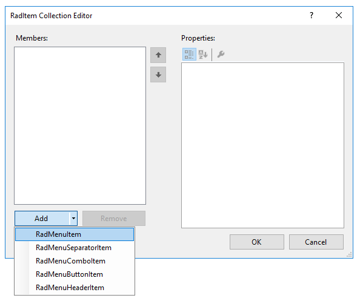
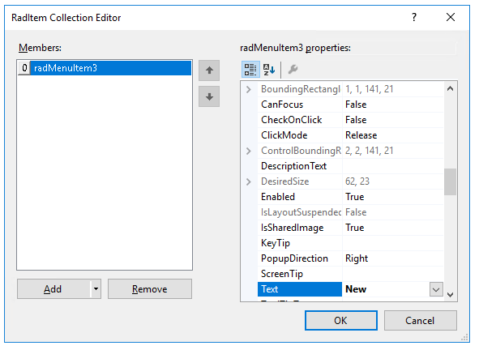
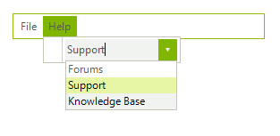

# Getting Started 

The following tutorial demonstrates creating a **RadMenu** with standard **RadMenuItems** with shortcuts and **RadMenuComboItems**.

1\. Drag a __RadMenu__ control from the toolbox and drop it onto the form.
            

2\. Click in the area labeled __Type Here__ and type *File*.
              

3\. Press `Enter`.

 

4\. Click in the area labeled __Type Here__ and type *Help*.
            

5\. Press `Enter`.
            

6\. Select the **File** menu item.
            

7\. In the __Properties__ window, click in the __Items__ property.
            

8\. Click the ellipsis button.
            

9\. In the __RadItem Collection Editor__, click the drop-down arrow on the __Add__ button. Select the __RadMenuItem__.


            

10\. Set the __Text__ property of the new __RadMenuItem__ to *New*.



11\. Add two more **RadMenuItems**. Set their __Text__ properties to *Open* and *Save*.
            

12\. Click __OK__.
            

13\. Select the **Help** menu item.
            

14\. In the __Properties__ window, click in the __Items__ property.
            

15\. Click the ellipsis button.
            

16\. In the __RadItem Collection Editor__, click the drop-down arrow on the __Add__ button. Select the __RadMenuComboItem__.
            

17\. Clear the __Text__ property of the new **RadMenuComboItem**.
            

18\. Expand the __ComboBoxElement__ property of the **RadMenuComboItem**.
            

19\. Click in the __Items__ property of the **ComboBoxElement**.
            

20\. Click the ellipsis button.
            

21\. In the __RadListDataItem Collection Editor__, click the __Add__ button.
            

22\. Set the __Text__ property of the new **RadListDataItem** to *Forums*.
 
23\. Add two more **RadListDataItems**. Set their __Text__ properties to *Support* and *Knowledge Base*.


24\. Click __OK__ to close the **RadListDataItem Collection Editor**.
            

25\. Click __OK__ to close the **RadItem Collection Editor**.
            

26\. In order to assign a shortcut to a **RadMenuItem**, go to the Code View of the form and set the Ctrl+N shortcut to the **New** menu item. 

#### Assigning shortcuts

{{source=..\SamplesCS\Menus\Menu\MenuGettingStarted.cs region=shortcut}} 
{{source=..\SamplesVB\Menus\Menu\MenuGettingStarted.vb region=shortcut}} 

````C#
radMenuItem3.Shortcuts.Add(new Telerik.WinControls.RadShortcut(Keys.Control, Keys.N));

````
````VB.NET
RadMenuItem3.Shortcuts.Add(New Telerik.WinControls.RadShortcut(Keys.Control, Keys.N))

````

{{endregion}} 

27\. Go to the Design View of the form and select the **New** menu item.
            

28\. In the __Properties__ window, click the events toolbar button.
            

29\. Double-click the __Click__ event.
            

30\. Replace the automatically-generated event handler with this code:

{{source=..\SamplesCS\Menus\Menu\MenuGettingStarted.cs region=clickHandler}} 
{{source=..\SamplesVB\Menus\Menu\MenuGettingStarted.vb region=clickHandler}} 

````C#
private void radMenuItem3_Click(object sender, EventArgs e)
{
    MessageBox.Show("New File");
}

````
````VB.NET
Private Sub RadMenuItem3_Click(ByVal sender As System.Object, ByVal e As System.EventArgs) Handles RadMenuItem3.Click
    MessageBox.Show("New File")
End Sub

````

{{endregion}} 

31\. Return to the Design View of the form.

32\. Press __F5__ to run the project. Notice the menu styling, the use of Ctrl+N to trigger the message box, and the combo box in the Help menu. 




# See Also

* [Structure]()	
* [Menu Designer]()	