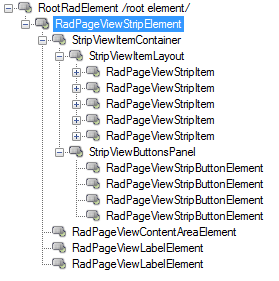
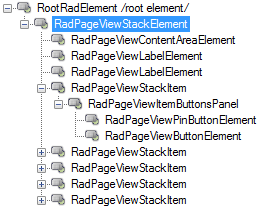
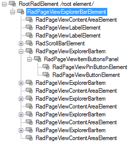
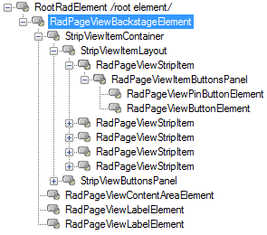
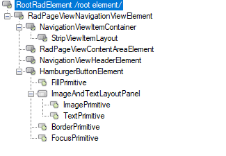
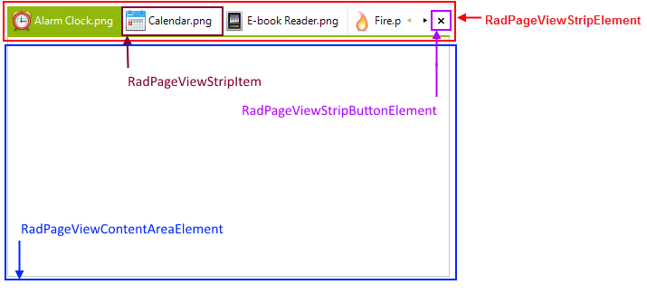
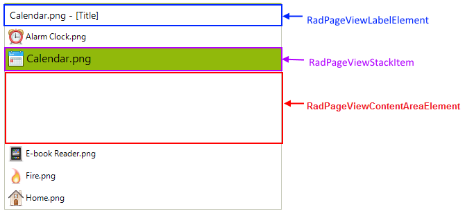
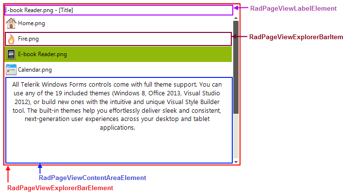
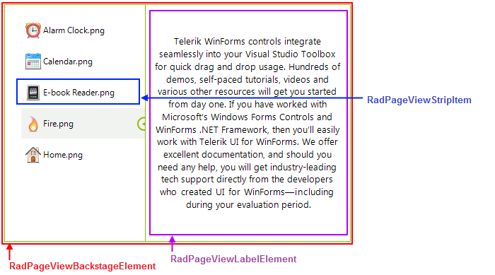
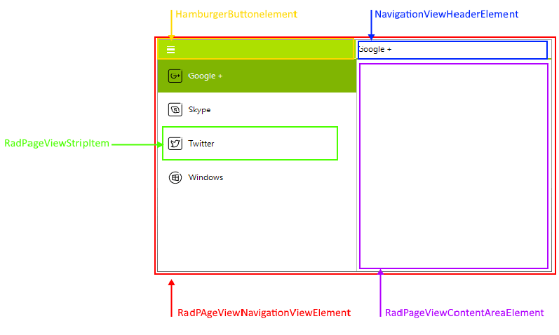

# Architecture

**RadPageView** aims to provide a full replacement for the currently existing **RadTabStrip** and **RadPanelBar** controls by shipping the same functionality with a simpler approach and improved performance. This new control is based on a very flexible and extensible platform that is fully compatible with the Telerik Presentation Framework, and allows implementing different layout scenarios as quick as never before.

The architecture of this control is pretty simple. It consists of pages which have associated items that can be used to show the corresponding page. A specific layout strategy arranges the pages and the items so that the end look and feel is achieved. The diagram below conceptually illustrates the **RadPageView**’s structure whereby the names of the diagram elements correspond to the actual Telerik types:

>caption Figure 1: Architecture

## View Modes

Currently, we ship the following modes of this control which implement different layout strategies and thus achieve the functionality of the **RadTabStrip** and **RadPanelBar** controls all in one:

* *Strip Mode*: equivalent to the **RadTabStrip** control.
* *Stack Mode*: equivalent to the **RadPanelBar**’s *ListBar* mode.
* *Outlook Mode*: equivalent to the **RadPanelBar**’s *OutlookNavPane* mode.
* *Explorer Mode*: designed to display multiple visible pages at once.
* *Backstage Mode*: designed after the Office 2010 backstage mode.
* *Navigation Mode*: designed to change the strip width depending of the available space. 

The following tables show the internal elements hierarchy and structure of **RadPageView** considering the view mode:

>caption Elements Hierarchy

|View Mode|Elements Hierarchy|
|----|----|
|**Strip**||
|**Stack**||
|**Outlook**||
|**ExplorerBar**||
|**Backstage**||
|**NavigationView**||

>caption Structure

|View Mode|Structure|
|----|----|
|**Strip**||
|**Stack**||
|**Outlook**||
|**ExplorerBar**||
|**Backstage**||
|**NavigationView**||

# See Also

* [RadControlSpy]()

