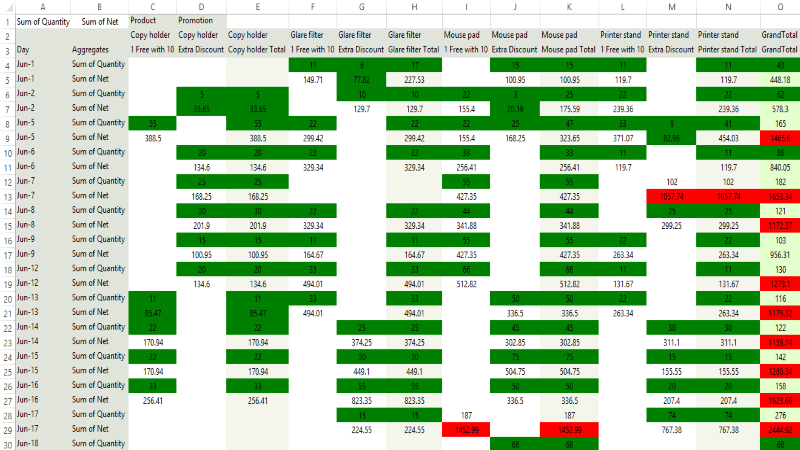

# Export to Excel

This method offers exporting functionality and does not require MS Office installation on users' machines. The __PivotExcelML__ format can be read by MS Excel 2002 (MS Office XP) and above.

>caption Figure 1: RadPivotGrid Export to Excel



## Exporting Data

Before running export to ExcelML, you have to initialize the PivotExportToExcelML class. The constructor takes one parameter: the **RadPivotGrid** that will be exported:

{{source=..\SamplesCS\PivotGrid\PivotGridExport.cs region=ExportToExcelIMLInitialization}} 
{{source=..\SamplesVB\PivotGrid\PivotGridExport.vb region=ExportToExcelIMLInitialization}} 

````C#
PivotExportToExcelML exporter = new PivotExportToExcelML(this.radPivotGrid1);

````
````VB.NET
Dim exporter As PivotExportToExcelML = New PivotExportToExcelML(Me.radPivotGrid1)

````

{{endregion}} 

## Exporting Visual Settings

Using the PivotExcelML method allows you to export the visual settings (themes) to the Excel file. ExcelML has also a visual representation of the alternating column color. The row height is exported with the default DPI transformation (60pixels = 72points). You can enable exporting visual settings through the ExportVisualSettings property. By default the value of this property is true:

{{source=..\SamplesCS\PivotGrid\PivotGridExport.cs region=SettingExportVisualSettings}} 
{{source=..\SamplesVB\PivotGrid\PivotGridExport.vb region=SettingExportVisualSettings}} 

````C#
exporter.ExportVisualSettings = true;

````
````VB.NET
exporter.ExportVisualSettings = True

````

{{endregion}}

## Setting the sheet name

You can specify the sheet name through __SheetName__ property. If your data is large enough to be split on more than one sheet, then the export method adds index to the names of the next sheets.

{{source=..\SamplesCS\PivotGrid\PivotGridExport.cs region=SettingTheSheetName}} 
{{source=..\SamplesVB\PivotGrid\PivotGridExport.vb region=SettingTheSheetName}} 

````C#
exporter.SheetName = "Sheet";

````
````VB.NET
exporter.SheetName = "Sheet"

````

{{endregion}} 

## RunExport method

Exporting data to Excel is done through the __RunExport__ method of  __PivotExportToExcelML__ object. The RunExport method accepts a string parameter with a valid file path. Consider the code sample below:

{{source=..\SamplesCS\PivotGrid\PivotGridExport.cs region=ExportToExcelInExcelMLFormat}} 
{{source=..\SamplesVB\PivotGrid\PivotGridExport.vb region=ExportToExcelInExcelMLFormat}} 

````C#
string fileName = "c:\\Sheet1.xls";
exporter.RunExport(fileName);

````
````VB.NET
Dim fileName As String = "c:\Sheet1.xls"
exporter.RunExport(fileName)

````

{{endregion}}

## Events

__ExcelCellFormating__ event: It gives an access to a single cell’s __SingleStyleElement__ that allows you to make additional formatting (adding border, setting alignment, text font, colors, changing cell value, etc.) for every excel cell related to the exported RadPivotGrid:

{{source=..\SamplesCS\PivotGrid\PivotGridExport.cs region=ExcelCellFormating}} 
{{source=..\SamplesVB\PivotGrid\PivotGridExport.vb region=ExcelCellFormating}} 

````C#
void exporter_PivotExcelCellFormatting(object sender, Telerik.WinControls.UI.Export.ExcelPivotCellExportingEventArgs e)  
{   
    decimal value = 0;        
    if (decimal.TryParse(e.Cell.Text, out value))           
    {
        if(value>1000)                   
            e.Cell.BackColor = System.Drawing.Color.Red;    
        if (value < 100)                   
            e.Cell.BackColor = System.Drawing.Color.Green;         
    } 
}

````
````VB.NET
Private Sub exporter_PivotExcelCellFormatting(sender As Object, e As Telerik.WinControls.UI.Export.ExcelPivotCellExportingEventArgs)
    Dim value As Decimal = 0
    If Decimal.TryParse(e.Cell.Text, value) Then
        If value > 1000 Then
            e.Cell.BackColor = System.Drawing.Color.Red
        End If
        If value < 100 Then
            e.Cell.BackColor = System.Drawing.Color.Green
        End If
    End If
End Sub

````

{{endregion}}

# See Also

* [Spread Expot]()