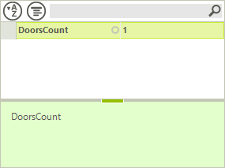
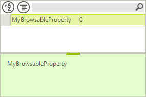
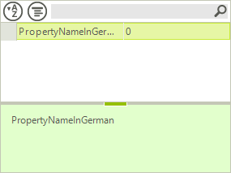
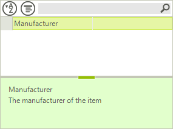
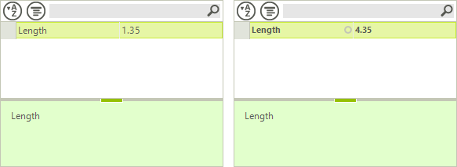
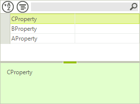
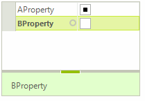

# Attributes

This article contains a list of some of the more important and more commonly used attributes used with RadPropertyGrid.

## EditorAttribute

With the editor attribute you can specify __UITypeEditor__ as well as __BaseInputEditor__ to be used for a given property.

{{source=..\SamplesCS\PropertyGrid\PropertyGridAttributes.cs region=EditorAttribute}} 
{{source=..\SamplesVB\PropertyGrid\PropertyGridAttributes.vb region=EditorAttribute}} 

````C#
        
[Editor(typeof(PropertyGridBrowseEditor), typeof(BaseInputEditor))] 
public string FileLocation { get; set; }

````
````VB.NET
<Editor(GetType(PropertyGridBrowseEditor), GetType(BaseInputEditor))> _
Public Property FileLocation() As String
    Get
        Return m_FileLocation
    End Get
    Set(value As String)
        m_FileLocation = value
    End Set
End Property
Private m_FileLocation As String

````

{{endregion}} 

>caption Figure 1: EditorAttribute


## RadRangeAttribute 

The range attribute allows you to set a minimum and maximum value to be used for a property that is edited with a RadSpinEditor.

{{source=..\SamplesCS\PropertyGrid\PropertyGridAttributes.cs region=RadRangeAttribute}} 
{{source=..\SamplesVB\PropertyGrid\PropertyGridAttributes.vb region=RadRangeAttribute}} 

````C#
        
[RadRange(1, 5)]
public byte DoorsCount { get; set; }

````
````VB.NET
<RadRange(1, 5)> _
Public Property DoorsCount() As Byte
    Get
        Return m_DoorsCount
    End Get
    Set(value As Byte)
        m_DoorsCount = value
    End Set
End Property
Private m_DoorsCount As Byte

````

{{endregion}}

>caption Figure 2: RadRangeAttribute



## BrowsableAttribute  

Determines whether the property will be included in the collection of properties RadPropertyGridSHows.

{{source=..\SamplesCS\PropertyGrid\PropertyGridAttributes.cs region=BrowsableAttribute}} 
{{source=..\SamplesVB\PropertyGrid\PropertyGridAttributes.vb region=BrowsableAttribute}} 

````C#
        
[Browsable(false)]
public int MyHiddenProperty { get; set; }
    
public int MyBrowsableProperty { get; set; }

````
````VB.NET
<Browsable(False)> _
Public Property MyHiddenProperty() As Integer
    Get
        Return m_MyHiddenProperty
    End Get
    Set(value As Integer)
        m_MyHiddenProperty = value
    End Set
End Property
Private m_MyHiddenProperty As Integer
Public Property MyBrowsableProperty() As Integer
    Get
        Return m_MyBrowsableProperty
    End Get
    Set(value As Integer)
        m_MyBrowsableProperty = value
    End Set
End Property
Private m_MyBrowsableProperty As Integer

````

{{endregion}} 

>caption Figure 3: BrowsableAttribute



## ReadOnlyAttribute   

Determines whether a property can be edited in RadPropertyGrid or not.

{{source=..\SamplesCS\PropertyGrid\PropertyGridAttributes.cs region=ReadOnlyAttribute}} 
{{source=..\SamplesVB\PropertyGrid\PropertyGridAttributes.vb region=ReadOnlyAttribute}} 

````C#
    
[ReadOnly(true)]
public int Count { get; set; }

````
````VB.NET
<[ReadOnly](True)> _
Public Property Count() As Integer
    Get
        Return m_Count
    End Get
    Set(value As Integer)
        m_Count = value
    End Set
End Property
Private m_Count As Integer

````

{{endregion}} 

## DisplayNameAttribute

Determines the text that will be show for a given property. You can also alter the text for a property by setting its Label.

{{source=..\SamplesCS\PropertyGrid\PropertyGridAttributes.cs region=DisplayNameAttribute}} 
{{source=..\SamplesVB\PropertyGrid\PropertyGridAttributes.vb region=DisplayNameAttribute}} 

````C#
        
[DisplayName("PropertyNameInGerman")]
public double PropertyName { get; set; }

````
````VB.NET
<DisplayName("PropertyNameInGerman")> _
Public Property PropertyName() As Double
    Get
        Return m_PropertyName
    End Get
    Set(value As Double)
        m_PropertyName = value
    End Set
End Property
Private m_PropertyName As Double

````

{{endregion}} 

>caption Figure 4: DisplayNameAttribute



## DescriptionAttribute

Defines the text that is displayed for a given property in the help bar of RadPropertyGrid.

{{source=..\SamplesCS\PropertyGrid\PropertyGridAttributes.cs region=DescriptionAttribute}} 
{{source=..\SamplesVB\PropertyGrid\PropertyGridAttributes.vb region=DescriptionAttribute}} 

````C#
        
[Description("The manufacturer of the item")] 
public string Manufacturer { get; set; }

````
````VB.NET
<Description("The manufacturer of the item")> _
Public Property Manufacturer() As String
    Get
        Return m_Manufacturer
    End Get
    Set(value As String)
        m_Manufacturer = value
    End Set
End Property
Private m_Manufacturer As String

````

{{endregion}} 

>caption Figure 5: DisplayNameAttribute



## PasswordPropertyTextAttribute

Determines whether a text property will be edited as a password.

{{source=..\SamplesCS\PropertyGrid\PropertyGridAttributes.cs region=PasswordPropertyTextAttribute}} 
{{source=..\SamplesVB\PropertyGrid\PropertyGridAttributes.vb region=PasswordPropertyTextAttribute}} 

````C#
        
public string Username { get; set; }
[PasswordPropertyText(true)]
public string Password { get; set; }

````
````VB.NET
Public Property Username() As String
    Get
        Return m_Username
    End Get
    Set(value As String)
        m_Username = value
    End Set
End Property
Private m_Username As String
<PasswordPropertyText(True)> _
Public Property Password() As String
    Get
        Return m_Password
    End Get
    Set(value As String)
        m_Password = value
    End Set
End Property
Private m_Password As String

````

{{endregion}} 

>caption Figure 6: PasswordPropertyTextAttribute


## DefaultValueAttribute

Defines the default value to which the property will reset. When the property value is set to something different that the default value, it will be marked as modified.

{{source=..\SamplesCS\PropertyGrid\PropertyGridAttributes.cs region=DefaultValueAttribute}} 
{{source=..\SamplesVB\PropertyGrid\PropertyGridAttributes.vb region=DefaultValueAttribute}} 

````C#
[DefaultValue(1.35)]
public double Length { get; set; }

````
````VB.NET
<DefaultValue(1.35)> _
Public Property Length() As Decimal
    Get
        Return m_Length
    End Get
    Set(value As Decimal)
        m_Length = value
    End Set
End Property
Private m_Length As Decimal

````

{{endregion}}

>caption Figure 7: DefaultValueAttribute



## CategoryAttribute

Defines the category to which the property will be grouped when properties are shown categorized. Any property that does not have this attribute will be categorized in the Misc category.

{{source=..\SamplesCS\PropertyGrid\PropertyGridAttributes.cs region=CategoryAttribute}} 
{{source=..\SamplesVB\PropertyGrid\PropertyGridAttributes.vb region=CategoryAttribute}} 

````C#
        
[Category("CategoryName")]
public string CategorizedProperty { get; set; }
    
public string UncategorizedProperty { get; set; }

````
````VB.NET
<Category("CategoryName")> _
Public Property CategorizedProperty() As String
    Get
        Return m_CategorizedProperty
    End Get
    Set(value As String)
        m_CategorizedProperty = value
    End Set
End Property
Private m_CategorizedProperty As String
Public Property UncategorizedProperty() As String
    Get
        Return m_UncategorizedProperty
    End Get
    Set(value As String)
        m_UncategorizedProperty = value
    End Set
End Property
Private m_UncategorizedProperty As String

````

{{endregion}} 

>caption Figure 8: CategoryAttribute


## RadSortOrderAttribute

Defines the order in which items would be ordered when no other ordering is applied (Alphabetical or Categorical alphabetical). The order can also be manipulated through the SortOrder property of PropertyGridItem. Setting the property would override the value from the attribute.

{{source=..\SamplesCS\PropertyGrid\PropertyGridAttributes.cs region=RadSortOrderAttribute}} 
{{source=..\SamplesVB\PropertyGrid\PropertyGridAttributes.vb region=RadSortOrderAttribute}} 

````C#
        
[RadSortOrder(2)]
public string AProperty { get; set; }
[RadSortOrder(1)]
public string BProperty { get; set; }
[RadSortOrder(0)]
public string CProperty { get; set; }

````
````VB.NET
<RadSortOrder(2)> _
Public Property AProperty() As String
    Get
        Return m_AProperty
    End Get
    Set(value As String)
        m_AProperty = value
    End Set
End Property
Private m_AProperty As String
<RadSortOrder(1)> _
Public Property BProperty() As String
    Get
        Return m_BProperty
    End Get
    Set(value As String)
        m_BProperty = value
    End Set
End Property
Private m_BProperty As String
<RadSortOrder(0)> _
Public Property CProperty() As String
    Get
        Return m_CProperty
    End Get
    Set(value As String)
        m_CProperty = value
    End Set
End Property
Private m_CProperty As String

````

{{endregion}}

>caption Figure 9: RadSortOrderAttribute



## RadCheckBoxThreeStateAttribute

The **RadCheckBoxThreeStateAttribute** determines whether properties inside **RadPropertyGrid**, for which a **PropertyGridCheckBoxItemElement** is created, will have a three state check box editor or a two state one.

{{source=..\SamplesCS\PropertyGrid\PropertyGridAttributes.cs region=RadCheckBoxThreeStateAttribute}} 
{{source=..\SamplesVB\PropertyGrid\PropertyGridAttributes.vb region=RadCheckBoxThreeStateAttribute}} 

````C#
[RadCheckBoxThreeState(true)]
public bool? AProperty { get; set; }
[RadCheckBoxThreeState(false)]
public ToggleState BProperty { get; set; }

````
````VB.NET
<RadCheckBoxThreeState(True)>
Public Property AProperty() As Nullable(Of Boolean)
    Get
        Return m_AProperty
    End Get
    Set(value As Nullable(Of Boolean))
        m_AProperty = value
    End Set
End Property
Private m_AProperty As Nullable(Of Boolean)
<RadCheckBoxThreeState(False)>
Public Property BProperty() As ToggleState
    Get
        Return m_BProperty
    End Get
    Set(value As ToggleState)
        m_BProperty = value
    End Set
End Property
Private m_BProperty As ToggleState

````

{{endregion}}

>caption Figure 10: RadCheckBoxThreeStateAttribute



# See Also

* [Binding to Multiple Objects]()
* [RadPropertyStore - Adding Custom Properties]()
* [Type Converters]()
* [How to Show Nested Collections in RadPropertyGrid]()