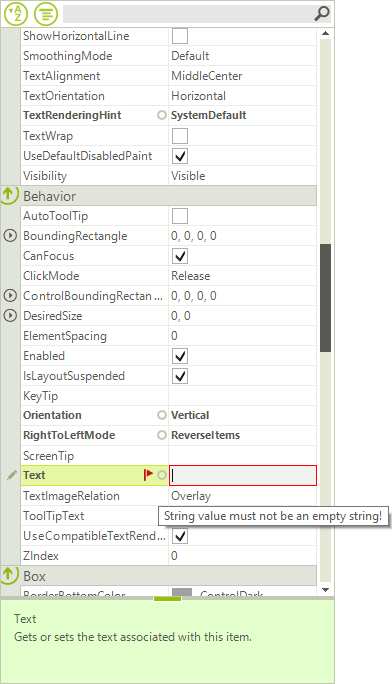

# Validation

**RadPropertyGrid** provides a convenient way to perform validation before data is committed. You can validate data by handling __PropertyValidating__ event which is raised by RadPropertyGrid when the current item changes or when the item loses input focus (when pressing the *Enter* key). Canceling this event prevents the user from exiting the item until a valid editor value is entered or the edit process is canceled.

Here is a list of all validation events:

* __PropertyValidating__: Fires when an item loses input focus, enabling content validation.

* __PropertyValidated__: Fires after the item has finished validating.

You can use the error indicator of the item to visualize error when such occurs.

>caption Figure 1: RadPropertyGrid Validation 



The code snippet below demonstrates simple data validation scenario. It is performed on a string property to do not allow entering an empty string. In the __PropertyValidating__ event we check if an empty string is entered, if this is the case the validation fails, the error indicator is shown and the event is canceled. If the value entered is valid in the __Edited__ event we reset the error text and the error indicator is hidden:

#### Property validation

{{source=..\SamplesCS\PropertyGrid\Editors\PropertyGridValidation.cs region=PropertyValidating}} 
{{source=..\SamplesVB\PropertyGrid\Editors\PropertyGridValidation.vb region=PropertyValidating}} 

````C#
void radPropertyGrid1_PropertyValidating(object sender, PropertyValidatingEventArgs e)
{
    PropertyGridItem item = e.Item as PropertyGridItem;
    if (item.PropertyType == typeof(string))
    {
        if (string.IsNullOrEmpty(e.NewValue.ToString()))
        {
            item.ErrorMessage = "String value must not be an empty string!";
            e.Cancel = true;
        }
    }
}
void radPropertyGrid1_Edited(object sender, PropertyGridItemEditedEventArgs e)
{
    PropertyGridItem item = e.Item as PropertyGridItem;
    item.ErrorMessage = "";
}

````
````VB.NET
Private Sub radPropertyGrid1_PropertyValidating(ByVal sender As Object, ByVal e As PropertyValidatingEventArgs)
    Dim item As PropertyGridItem = TryCast(e.Item, PropertyGridItem)
    If item.PropertyType Is GetType(String) Then
        If String.IsNullOrEmpty(e.NewValue.ToString()) Then
            item.ErrorMessage = "String value must not be an empty string!"
            e.Cancel = True
        End If
    End If
End Sub
Private Sub radPropertyGrid1_Edited(ByVal sender As Object, ByVal e As PropertyGridItemEditedEventArgs)
    Dim item As PropertyGridItem = TryCast(e.Item, PropertyGridItem)
    item.ErrorMessage = ""
End Sub

````

{{endregion}}

# See Also

* [API]()
* [Validation]()
* [Custom Editors]()
