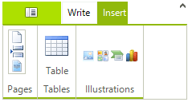

# Using Large and Small Images

Elements on a **RadRibbonBar** (such as buttons, check boxes, and repeat buttons) can each be assigned two images. In addition to the regular set of image properties (__Image__, __ImageIndex__, and __ImageKey__), there is a second set of image properties (__SmallImage__, __SmallImageIndex__, and __SmallImageKey__) that are used to designate an alternative, small, image for the element. This small image is only displayed when the user resizes the form on which the **RadRibbonBar** control is displayed and using small images enables the control to display more elements.

For example, here is a **RadRibbonBar** control with adequate space to display all of its default images.

>caption Figure 1: RibbonBar with Enough Space

As the user resizes the form containing the control, the labels in the __Text__ group are first eliminated to save space.

>caption Figure 2: RibbonBar with Smaller Width

>note Usually, the small images are with size 16x16, while the bigger images are at least 32x32.

Continued resizing switches the elements in the __Insert__ group from their large images to their small images (in addition to eliminating their labels):

>caption Figure 3: Collapsed Groups

## See Also

* [Design Time]()
* [Structure]()
* [Getting Started]()
* [Backstage View]()
* [Themes]()