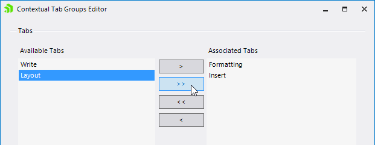

# Managing Contextual Tab Groups

The Contextual Tab Groups can be used to group tabs in a context and thus improve the usability of your UI.

## Using the Designer to Add Contextual Tab Groups

You can add contextual tab groups to __RadRibbonBar__ using the designer in either of the following two ways:

1. Using in-place editing: Click on __Add New Group__, type in the desired name for the contextual tab group, and press __Enter__.

2. Using the collection editor: Select the __ContextualTabGroups__ property of __RadRibbonBar__ and open the property collection editor. In the collection editor, click __Add__. In the contextual tab group __Text__ property, enter the desired name for the contextual tab group and then click __OK__.

## Using the Designer to Assign Tabs to a Contextual Tab Group

You can assign tabs to contextual tab groups using the designer in either of the following two ways: 

1. Using drag-and-drop: Click on the tab that you want to be placed in a particular contextual tab group and then drag it to the desired contextual tab group.

2. Select a Contextual Tab Group and open the __Properties__ window of Visual Studio. Find the __TabItems__ property and open its Collection Editor. You will see the available Ribbon Tabs which can be placed in the Contextual Tab Group. Use the controls on the dialog to place tabs in the group:

>caption Figure 1: Contextual Tab Groups Editor



## Using Contextual Tabs programmatically

The following code snippet shows how to add contextual tab groups and assign tabs to them programmatically:

#### Creating ContextualTabGroups

{{source=..\SamplesCS\RibbonBar\ProgrammingRadRibbonBar\ManagingContextualTabGroups.cs region=managingContextualTabGroups}} 
{{source=..\SamplesVB\RibbonBar\ProgrammingRadRibbonBar\ManagingContextualTabGroups.vb region=managingContextualTabGroups}} 

````C#
private Telerik.WinControls.UI.RibbonTab ribbonTab1;
private Telerik.WinControls.UI.RibbonTab ribbonTab2;
private Telerik.WinControls.UI.RibbonTab ribbonTab3;
private Telerik.WinControls.UI.RibbonTab ribbonTab4;
private Telerik.WinControls.UI.RibbonTab ribbonTab5;
private Telerik.WinControls.UI.ContextualTabGroup contextualTabGroup1;
private Telerik.WinControls.UI.ContextualTabGroup contextualTabGroup2;
void Form1_Load(object sender, EventArgs e)
{
    // The "this" variable refers to the form that contains the ribbonbar
    // Declare variables for tabs and contextual tab groups
    //Create the tabs
    this.ribbonTab1 = new Telerik.WinControls.UI.RibbonTab();
    this.ribbonTab2 = new Telerik.WinControls.UI.RibbonTab();
    this.ribbonTab3 = new Telerik.WinControls.UI.RibbonTab();
    this.ribbonTab4 = new Telerik.WinControls.UI.RibbonTab();
    this.ribbonTab5 = new Telerik.WinControls.UI.RibbonTab();
    ribbonTab1.Text = "Tab one";
    ribbonTab2.Text = "Tab two";
    ribbonTab3.Text = "Tab three";
    ribbonTab4.Text = "Tab four";
    ribbonTab5.Text = "Tab five";
    // Create the contextual tab groups
    this.contextualTabGroup1 = new Telerik.WinControls.UI.ContextualTabGroup();
    this.contextualTabGroup2 = new Telerik.WinControls.UI.ContextualTabGroup();
    // Add the command tabs to the ribbon bar's command tabs collection by accessing the
    // ribbon bar's CommandTabs property and using its AddRange method
    this.radRibbonBar1.CommandTabs.AddRange(new Telerik.WinControls.UI.RibbonTab[] { ribbonTab1, ribbonTab2, ribbonTab3, ribbonTab4, ribbonTab5 });
    // Add the contextual tab groups to the ribbon bar's contextual tab groups collection by
    // accessing the ribbon bar's ContextualTabGroups property and using its AddRange method
    this.radRibbonBar1.ContextualTabGroups.AddRange(new Telerik.WinControls.RadItem[] { this.contextualTabGroup1, this.contextualTabGroup2 });
    //Assign some tabs to the contextual tab groups.
    this.contextualTabGroup1.TabItems.Add(this.ribbonTab1);
    this.contextualTabGroup1.TabItems.Add(this.ribbonTab2);
    this.contextualTabGroup2.TabItems.Add(this.ribbonTab3);
    this.contextualTabGroup2.TabItems.Add(this.ribbonTab4);
}

````
````VB.NET
' The "Me" variable refers to the form that contains the RibbonBar
' Declare variables for tabs and contextual tab groups
Private RibbonTab1 As New Telerik.WinControls.UI.RibbonTab()
Private RibbonTab2 As New Telerik.WinControls.UI.RibbonTab()
Private RibbonTab3 As New Telerik.WinControls.UI.RibbonTab()
Private RibbonTab4 As New Telerik.WinControls.UI.RibbonTab()
Private RibbonTab5 As New Telerik.WinControls.UI.RibbonTab()
Private ContextualTabGroup1 As New Telerik.WinControls.UI.ContextualTabGroup()
Private ContextualTabGroup2 As New Telerik.WinControls.UI.ContextualTabGroup()
Private Sub ManagingContextualTabGroups_Load(ByVal sender As System.Object, ByVal e As System.EventArgs) Handles MyBase.Load
    RibbonTab1.Text = "Tab one"
    RibbonTab2.Text = "Tab two"
    RibbonTab3.Text = "Tab three"
    RibbonTab4.Text = "Tab four"
    RibbonTab5.Text = "Tab five"
    'Add the tabs to the ribbon bar
    Me.RadRibbonBar1.CommandTabs.AddRange(New Telerik.WinControls.UI.RibbonTab() {Me.RibbonTab1, Me.RibbonTab2, Me.RibbonTab3, Me.RibbonTab4, Me.RibbonTab5})
    'Add the contextual tab groups to the ribbon bar
    Me.RadRibbonBar1.ContextualTabGroups.AddRange(New Telerik.WinControls.RadItem() {Me.ContextualTabGroup1, Me.ContextualTabGroup2})
    'Associate the groups with some tabs
    Me.ContextualTabGroup1.TabItems.Add(Me.RibbonTab1)
    Me.ContextualTabGroup1.TabItems.Add(Me.RibbonTab2)
    Me.ContextualTabGroup2.TabItems.Add(Me.RibbonTab3)
    Me.ContextualTabGroup2.TabItems.Add(Me.RibbonTab4)
End Sub

````

{{endregion}} 

## See Also

* [Design Time]()
* [Structure]()
* [Getting Started]()
* [Backstage View]()
* [Themes]() 


