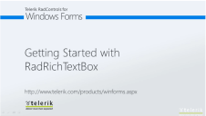

# Getting started

| RELATED VIDEOS |  |
| --- | ------ |
|[ Getting started with RadRichTextBox ](http://tv.telerik.com/watch/winforms/getting-started-with-teleriks-radrichtextbox)<br>In this video, we are going to see what it takes to get started with the RadRichTextBox. The RichTextBox control offers broad editing and formatting capabilities with true Word-like experience. You can load XAML, HTML, DOCX, RTF, or plain text document into the WinForms RichTextBox control. Each of these formats will allow you to edit and format the document, which can then be exported to/saved as any of the above mentioned supported formats, plus PDF. RadRichTextBox can also be used with RadRibbonBar for Windows Forms to give an Microsoft Office style look to your WinForms application. Also included is SpellChecking, Multi-region Selection and Editing and much much more.||

RadRichTextBox is a control that allows you to display rich text content including sections, paragraphs, spans, italic text, bold text, in-line images etc. This topic will help you to quickly get started using the control.

## Formatting at design time

There are cases when you want to display a non-editable content that has been defined and formatted as far back as design time. In most of the cases the __TextBlock__	control is used, but it doesn't provide you with a way to format your text in the same control instance. Although the RadRichTextBox is a rich text input control, it can also be used as a richtext viewer. In order to format the text inside it you can use the following classes:

* Section

* Paragraph

* Span

* InlineImage

As you can see the text is still editable. To make it read only you have to set the __IsReadOnly__ property of the RadRichTextBox to *True*.

#### Read only mode 

{{source=..\SamplesCS\RichTextBox\RichTextBoxGettingStarted.cs region=ReadOnly}} 
{{source=..\SamplesVB\RichTextBox\RichTextBoxGettingStarted.vb region=ReadOnly}} 

````C#
radRichTextBox1.IsReadOnly = true;

````
````VB.NET
RadRichTextBox1.IsReadOnly = True

````

{{endregion}}

## Formatting via a sample UI

If you want to allow the user to edit and format the content of the RadRichTextBox, you have tocreate a UI and use the API exposed by the RadRichTextBox. The API exposes methods (like ToggleBold(), ToggleItalic() etc.) that modify the text in the control when called. Here is an example of creating a UI for making the text bold, italic and underlined.

#### Bold, Italic, Underline 

{{source=..\SamplesCS\RichTextBox\RichTextBoxGettingStarted.cs region=BoldItalicUnderline}} 
{{source=..\SamplesVB\RichTextBox\RichTextBoxGettingStarted.vb region=BoldItalicUnderline}} 

````C#
private void boldButton_Click(object sender, EventArgs e)
{
    this.radRichTextBox1.ToggleBold();
}
private void italicButton_Click(object sender, EventArgs e)
{
    this.radRichTextBox1.ToggleItalic();
}
private void underlineButton_Click(object sender, EventArgs e)
{
    this.radRichTextBox1.ToggleUnderline();
}

````
````VB.NET
Private Sub boldButton_Click(ByVal sender As System.Object, ByVal e As System.EventArgs) Handles boldButton.Click
    Me.RadRichTextBox1.ToggleBold()
End Sub
Private Sub italicButton_Click(ByVal sender As System.Object, ByVal e As System.EventArgs) Handles italicButton.Click
    Me.RadRichTextBox1.ToggleItalic()
End Sub
Private Sub unserlineButton_Click(ByVal sender As System.Object, ByVal e As System.EventArgs) Handles underlineButton.Click
    Me.RadRichTextBox1.ToggleUnderline()
End Sub

````

{{endregion}}

The UI should also response, when the caret is on a position where the text is modified. For example, the __boldButton__ should be toggled if the caret is on a bold text. This can be done by handling the __CurrentSpanStyleChanged__ event. It is raised every time when the span, over which the caret is, gets changed. In the event handler you can use the __CurrentEditingStyle__ property in order to get the desired information for the style of the current Span. This property is of type __StyleDefinition__ and by using its __GetPropertyValue()__ method and passing the appropriate DependancyProperty, you can get the desired information. This makes the __StylesDefinition__ class universal for __Span__ and __Paragraph__ elements. Here is an example:

>note The same approach can be used for the __CurrentParagraphStyleChanged__ event
>

#### CurrentSpanStyleChanged and CurrentParagraphStyleChanged event handling

{{source=..\SamplesCS\RichTextBox\RichTextBoxGettingStarted.cs region=CurrentSpanStyleChanged}} 
{{source=..\SamplesVB\RichTextBox\RichTextBoxGettingStarted.vb region=CurrentSpanStyleChanged}} 

````C#
void radRichTextBox1_CurrentSpanStyleChanged(object sender, EventArgs e)
{
    StyleDefinition style = this.radRichTextBox1.CurrentEditingStyle;
    TextStyle fontStyle = (TextStyle)style.GetPropertyValue(Span.FontStyleProperty);
    UnderlineType underlineDecoration = (UnderlineType)style.GetPropertyValue(Span.UnderlineTypeProperty);
    this.boldButton.IsChecked = fontStyle.HasFlag(TextStyle.Bold);
    this.italicButton.IsChecked = fontStyle.HasFlag(TextStyle.Italic);
    this.underlineButton.IsChecked = underlineDecoration != UnderlineType.None;
}

````
````VB.NET
Private Sub radRichTextBox1_CurrentSpanStyleChanged(ByVal sender As Object, ByVal e As EventArgs)
    Dim style As StyleDefinition = Me.RadRichTextBox1.CurrentEditingStyle
    Dim fontStyle As TextStyle = DirectCast(style.GetPropertyValue(Span.FontStyleProperty), TextStyle)
    Dim underlineDecoration As UnderlineType = DirectCast(style.GetPropertyValue(Span.UnderlineTypeProperty), UnderlineType)
    Me.boldButton.IsChecked = fontStyle.HasFlag(TextStyle.Bold)
    Me.italicButton.IsChecked = fontStyle.HasFlag(TextStyle.Italic)
    Me.underlineButton.IsChecked = underlineDecoration <> UnderlineType.None
End Sub

````

{{endregion}}