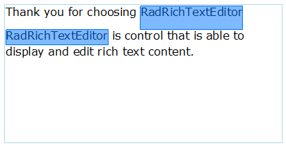

# Selection

__RadRichTextEditor__ supports not only selection via the UI, but also selection via code. This topic will explain you how to:      

* [Use UI Selection](#ui-selection)

* [Implement Programmatic Selection](#programmatic-selection)

* [Implement Multi-range Selection](#multi-range-selection)

## UI Selection

The user is able to select the content of the __RadRichTextEditor__ in the same way as in MS Word. This is done by clicking on the desired position and dragging to the desired end of the selection. A multiple ranges selection is also allowed. This one is done by holding the `Ctrl` key while selecting the different ranges.
        
## Programmatic Selection

The developer is allowed to work with the selection programmatically. This can be used when having a __Find__ functionality in your  __RadRichTextEditor__ and you want to select the found string. Examples that involve the programmatic selection can be found in the *How To* section.
        
The programmatic selection gets implemented via the __DocumentSelection__ class. The instance of the class gets associated with the  __RadDocument__ of __RadRichTextEditor__ and allows you to specify selection starts and ends, selection ranges and other. You can manage the selection by either using the __Selection__ property of the __RadDocument__ or by creating an instance of the __DocumentSelection__ class.
        
Here is an example of how to select the current word.

>tip To learn more about the __DocumentPosition__ read the [Positioning]() topic.
>

{{source=..\SamplesCS\RichTextEditor\Features\Selection.cs region=position}} 
{{source=..\SamplesVB\RichTextEditor\Features\Selection.vb region=position}} 

````C#
            
DocumentPosition startPosition = this.radRichTextEditor1.Document.CaretPosition; //new DocumentPosition( this.radRichTextBox.Document );
DocumentPosition endPosition = new DocumentPosition(startPosition);
startPosition.MoveToCurrentWordStart();
endPosition.MoveToCurrentWordEnd();
this.radRichTextEditor1.Document.Selection.AddSelectionStart(startPosition);
this.radRichTextEditor1.Document.Selection.AddSelectionEnd(endPosition);

````
````VB.NET
Dim _startPosition As DocumentPosition = Me.radRichTextEditor1.Document.CaretPosition 'new DocumentPosition( this.radRichTextBox.Document );
Dim endPosition As New DocumentPosition(_startPosition)
_startPosition.MoveToCurrentWordStart()
endPosition.MoveToCurrentWordEnd()
Me.radRichTextEditor1.Document.Selection.AddSelectionStart(_startPosition)
Me.radRichTextEditor1.Document.Selection.AddSelectionEnd(endPosition)

````

{{endregion}} 

## Multi-Range Selection

You can implement Multi-Range Selection by either calling multiple times the __AddSelectionStart()__ and   __AddSelectionEnd()__ methods or by working with the __Ranges__ collection.
        
Here is an example of selecting each "*RadRichTextEditor*" word in the text. This example uses the first approach.

{{source=..\SamplesCS\RichTextEditor\Features\Selection.cs region=multiselect}} 
{{source=..\SamplesVB\RichTextEditor\Features\Selection.vb region=multiselect}} 

````C#
    
DocumentPosition position = new DocumentPosition(this.radRichTextEditor1.Document);
do
{
    //GetCurrentSpan().Text returns the word at the position
    string word = position.GetCurrentSpanBox().Text;
    if (word.Contains("RadRichTextBox"))
    {
        DocumentPosition wordEndPosition = new DocumentPosition(position);
        wordEndPosition.MoveToCurrentWordEnd();
        this.radRichTextEditor1.Document.Selection.AddSelectionStart(position);
        this.radRichTextEditor1.Document.Selection.AddSelectionEnd(wordEndPosition);
    }
}
while (position.MoveToNextWordStart());

````
````VB.NET
Dim position As New DocumentPosition(Me.radRichTextEditor1.Document)
Do
    'GetCurrentSpan().Text returns the word at the position
    Dim word As String = position.GetCurrentSpanBox().Text
    If word.Contains("RadRichTextEditor") Then
        Dim wordEndPosition As New DocumentPosition(position)
        wordEndPosition.MoveToCurrentWordEnd()
        Me.radRichTextEditor1.Document.Selection.AddSelectionStart(position)
        Me.radRichTextEditor1.Document.Selection.AddSelectionEnd(wordEndPosition)
    End If
Loop While position.MoveToNextWordStart()

````

{{endregion}} 



# See Also

 * [Positioning]()

 * [History]()

 * [Clipboard Support]()
