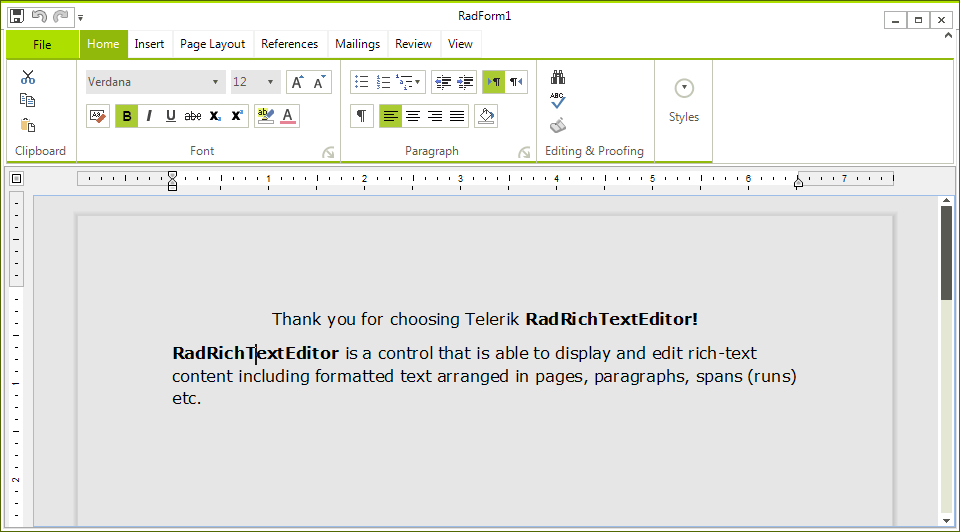
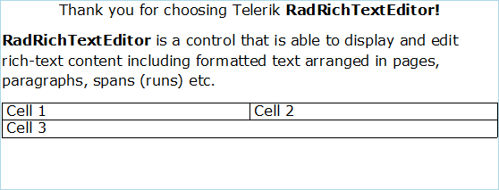

# Getting Started

**RadRichTextEditor** is a control that allows you to display and edit rich text content including sections, paragraphs, spans, italic text, bold text, inline images, tables etc. This topic will help you to quickly get started using the control. It will focus on the following:

* [Creating a RadRichTextEditor](#creating-a-radrichtexteditor)

* [Formatting the text via sample UI](#formatting-via-a-sample-ui)

* [Creating a Document at run time](#creating-a-document-at-run-time)

## Creating a RadRichTextEditor

You can declare a new __RadRichTextEditor__ as any normal WinForms control.

{{source=..\SamplesCS\RichTextEditor\GettingStarted\Main.cs region=declare}} 
{{source=..\SamplesVB\RichTextEditor\GettingStarted\Main.vb region=declare}} 

````C#
private RadRichTextEditor radRichTextEditor1 = new RadRichTextEditor();

````
````VB.NET
Private radRichTextEditor1 As New RadRichTextEditor()

````

{{endregion}} 

## Formatting via a sample UI

If you want to allow the user to edit and format the content of __RadRichTextEditor__, you have to create UI and use the API exposed  by __RadRichTextEditor__. The __API__ exposes methods (like __ToggleBold()__,           __ToggleItalic()__ etc.) that modify the text in the control when called. Here is an example of using the API for making the text bold, italic and underlined.

{{source=..\SamplesCS\RichTextEditor\GettingStarted\Main.cs region=API}} 
{{source=..\SamplesVB\RichTextEditor\GettingStarted\Main.vb region=API}} 

````C#
private void BoldButton_Click(object sender, RoutedEventArgs e)
{
    this.radRichTextEditor1.ToggleBold();
    this.radRichTextEditor1.Focus(); //return focus to the control
}
private void ItalicButton_Click(object sender, RoutedEventArgs e)
{
    this.radRichTextEditor1.ToggleItalic();
    this.radRichTextEditor1.Focus(); //return focus to the control
}
private void UnderlineButton_Click(object sender, RoutedEventArgs e)
{
    this.radRichTextEditor1.ToggleUnderline();
    this.radRichTextEditor1.Focus(); //return focus to the control
}

````
````VB.NET
Private Sub BoldButton_Click(ByVal sender As Object, ByVal e As RoutedEventArgs)
    Me.radRichTextEditor1.ToggleBold()
    Me.radRichTextEditor1.Focus() 'return focus to the control
End Sub
Private Sub ItalicButton_Click(ByVal sender As Object, ByVal e As RoutedEventArgs)
    Me.radRichTextEditor1.ToggleItalic()
    Me.radRichTextEditor1.Focus() 'return focus to the control
End Sub
Private Sub UnderlineButton_Click(ByVal sender As Object, ByVal e As RoutedEventArgs)
    Me.radRichTextEditor1.ToggleUnderline()
    Me.radRichTextEditor1.Focus() 'return focus to the control
End Sub

````

{{endregion}}

The UI should also respond when the caret is on a document position where the text is modified. For example, the BoldButton should be toggled if the caret is on bold text. This can be done by handling the **ToggleStateChanged** event. Here is an example:

{{source=..\SamplesCS\RichTextEditor\GettingStarted\Main.cs region=commands}} 
{{source=..\SamplesVB\RichTextEditor\GettingStarted\Main.vb region=commands}} 

````C#
void Main_Load(object sender, EventArgs e)
{
    this.radRichTextEditor1.Commands.ToggleBoldCommand.ToggleStateChanged += new EventHandler<Telerik.WinForms.Documents.RichTextBoxCommands.StylePropertyChangedEventArgs<bool>>(this.ToggleBoldCommand_ToggleStateChanged);
    this.radRichTextEditor1.Commands.ToggleItalicCommand.ToggleStateChanged += new EventHandler<Telerik.WinForms.Documents.RichTextBoxCommands.StylePropertyChangedEventArgs<bool>>(this.ToggleItalicCommand_ToggleStateChanged);
    this.radRichTextEditor1.Commands.ToggleUnderlineCommand.ToggleStateChanged += new EventHandler<Telerik.WinForms.Documents.RichTextBoxCommands.StylePropertyChangedEventArgs<bool>>(this.ToggleUnderlineCommand_ToggleStateChanged);
}
private void ToggleBoldCommand_ToggleStateChanged(object sender, Telerik.WinForms.Documents.RichTextBoxCommands.StylePropertyChangedEventArgs<bool> e)
{
    this.BoldButton.IsChecked = e.NewValue;
}
private void ToggleUnderlineCommand_ToggleStateChanged(object sender, Telerik.WinForms.Documents.RichTextBoxCommands.StylePropertyChangedEventArgs<bool> e)
{
    this.UnderlineButton.IsChecked = e.NewValue;
}
private void ToggleItalicCommand_ToggleStateChanged(object sender, Telerik.WinForms.Documents.RichTextBoxCommands.StylePropertyChangedEventArgs<bool> e)
{
    this.ItalicButton.IsChecked = e.NewValue;
}

````
````VB.NET
Private Sub Main_Load(ByVal sender As Object, ByVal e As EventArgs)
    AddHandler radRichTextEditor1.Commands.ToggleBoldCommand.ToggleStateChanged, AddressOf ToggleBoldCommand_ToggleStateChanged
    AddHandler radRichTextEditor1.Commands.ToggleItalicCommand.ToggleStateChanged, AddressOf ToggleItalicCommand_ToggleStateChanged
    AddHandler radRichTextEditor1.Commands.ToggleUnderlineCommand.ToggleStateChanged, AddressOf ToggleUnderlineCommand_ToggleStateChanged
End Sub
Private Sub ToggleBoldCommand_ToggleStateChanged(ByVal sender As Object, ByVal e As Telerik.WinForms.Documents.RichTextBoxCommands.StylePropertyChangedEventArgs(Of Boolean))
    Me.BoldButton.IsChecked = e.NewValue
End Sub
Private Sub ToggleUnderlineCommand_ToggleStateChanged(ByVal sender As Object, ByVal e As Telerik.WinForms.Documents.RichTextBoxCommands.StylePropertyChangedEventArgs(Of Boolean))
    Me.UnderlineButton.IsChecked = e.NewValue
End Sub
Private Sub ToggleItalicCommand_ToggleStateChanged(ByVal sender As Object, ByVal e As Telerik.WinForms.Documents.RichTextBoxCommands.StylePropertyChangedEventArgs(Of Boolean))
    Me.ItalicButton.IsChecked = e.NewValue
End Sub

````

{{endregion}} 




## Creating a Document at run time

One of the common uses of __RadRichTextEditor__ is to create a document programatically and show it in the editor. The root element - [RadDocument]() can contain several other elements:

* [Section]()

* [Paragraph]()

* [Span]()

* [InlineImage]()

* [Hyperlink]()

* [Table]()

The whole hierarchy of the elements can be found [here]().

Here is an example of a document created from code-behind:

{{source=..\SamplesCS\RichTextEditor\GettingStarted\Main.cs region=code}} 
{{source=..\SamplesVB\RichTextEditor\GettingStarted\Main.vb region=code}} 

````C#
RadDocument document = new RadDocument();
Section section = new Section();
Paragraph paragraph1 = new Paragraph();
paragraph1.TextAlignment = Telerik.WinForms.Documents.Layout.RadTextAlignment.Center;
Span span1 = new Span("Thank you for choosing Telerik");
paragraph1.Inlines.Add(span1);
Span span2 = new Span();
span2.Text = " RadRichTextEditor!";
span2.FontWeight = Telerik.WinControls.RichTextEditor.UI.FontWeights.Bold;
paragraph1.Inlines.Add(span2);
section.Blocks.Add(paragraph1);
Paragraph paragraph2 = new Paragraph();
Span span3 = new Span("RadRichTextEditor");
span3.FontWeight = Telerik.WinControls.RichTextEditor.UI.FontWeights.Bold;
paragraph2.Inlines.Add(span3);
Span span4 = new Span(" is a control that is able to display and edit rich-text content including formatted text arranged in pages, paragraphs, spans (runs) etc.");
paragraph2.Inlines.Add(span4);
section.Blocks.Add(paragraph2);
Table table = new Table();
table.LayoutMode = TableLayoutMode.AutoFit;
table.StyleName = RadDocumentDefaultStyles.DefaultTableGridStyleName;
TableRow row1 = new TableRow();
TableCell cell1 = new TableCell();
Paragraph p1 = new Paragraph();
Span s1 = new Span();
s1.Text = "Cell 1";
p1.Inlines.Add(s1);
cell1.Blocks.Add(p1);
row1.Cells.Add(cell1);
TableCell cell2 = new TableCell();
Paragraph p2 = new Paragraph();
Span s2 = new Span();
s2.Text = "Cell 2";
p2.Inlines.Add(s2);
cell2.Blocks.Add(p2);
row1.Cells.Add(cell2);
table.Rows.Add(row1);
TableRow row2 = new TableRow();
TableCell cell3 = new TableCell();
cell3.ColumnSpan = 2;
Paragraph p3 = new Paragraph();
Span s3 = new Span();
s3.Text = "Cell 3";
p3.Inlines.Add(s3);
cell3.Blocks.Add(p3);
row2.Cells.Add(cell3);
table.Rows.Add(row2);
section.Blocks.Add(table);
section.Blocks.Add(new Paragraph());
document.Sections.Add(section);
this.radRichTextEditor1.Document = document;

````
````VB.NET
Dim document As New RadDocument()
Dim section As New Section()
Dim paragraph1 As New Paragraph()
paragraph1.TextAlignment = Telerik.WinForms.Documents.Layout.RadTextAlignment.Center
Dim span1 As New Span("Thank you for choosing Telerik")
paragraph1.Inlines.Add(span1)
Dim span2 As New Span()
span2.Text = " radRichTextEditor1!"
span2.FontWeight = Telerik.WinControls.RichTextEditor.UI.FontWeights.Bold
paragraph1.Inlines.Add(span2)
section.Blocks.Add(paragraph1)
Dim paragraph2 As New Paragraph()
Dim span3 As New Span("radRichTextEditor1")
span3.FontWeight = Telerik.WinControls.RichTextEditor.UI.FontWeights.Bold
paragraph2.Inlines.Add(span3)
Dim span4 As New Span(" is a control that is able to display and edit rich-text content including formatted text arranged in pages, paragraphs, spans (runs) etc.")
paragraph2.Inlines.Add(span4)
section.Blocks.Add(paragraph2)
Dim table As New Table()
table.LayoutMode = TableLayoutMode.AutoFit
table.StyleName = RadDocumentDefaultStyles.DefaultTableGridStyleName
Dim row1 As New TableRow()
Dim cell1 As New TableCell()
Dim p1 As New Paragraph()
Dim s1 As New Span()
s1.Text = "Cell 1"
p1.Inlines.Add(s1)
cell1.Blocks.Add(p1)
row1.Cells.Add(cell1)
Dim cell2 As New TableCell()
Dim p2 As New Paragraph()
Dim s2 As New Span()
s2.Text = "Cell 2"
p2.Inlines.Add(s2)
cell2.Blocks.Add(p2)
row1.Cells.Add(cell2)
table.Rows.Add(row1)
Dim row2 As New TableRow()
Dim cell3 As New TableCell()
cell3.ColumnSpan = 2
Dim p3 As New Paragraph()
Dim s3 As New Span()
s3.Text = "Cell 3"
p3.Inlines.Add(s3)
cell3.Blocks.Add(p3)
row2.Cells.Add(cell3)
table.Rows.Add(row2)
section.Blocks.Add(table)
section.Blocks.Add(New Paragraph())
document.Sections.Add(section)
Me.radRichTextEditor1.Document = document

````

{{endregion}} 



This document is editable. To make it read only you have to set the __IsReadOnly__ property of the __RadRichTextEditor__ to *true*.

>tip To learn more about the read only feature read [this topic]().
>

# See Also

 * [Import/Export]()

 * [Events]()


